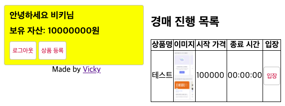

# 경매시스템 구조 잡기

### NodeAuction 프로젝트

- node-auction 폴더를 만든 후 그 안에 `package.json` 작성

  - npm i로 필요한 패키지 설치
  - 시퀄라이즈 설치 및 기본 디렉토리 만듦

    ```bash
    $ npm i sequelize sequelize-cli mysql2
    $ npx sequelize init
    ```

    ```json
    {
      "name": "node-auction",
      "version": "1.0.0",
      "description": "",
      "main": "index.js",
      "scripts": {
        "start": "nodemon app"
      },
      "author": "Vicky",
      "license": "MIT",
      "dependencies": {
        "cookie-parser": "^1.4.5",
        "dotenv": "^10.0.0",
        "express": "^4.17.1",
        "express-session": "^1.17.2",
        "morgan": "^1.10.0",
        "multer": "^1.4.2",
        "mysql2": "^2.2.5",
        "nunjucks": "^3.2.3",
        "sequelize": "^6.6.4",
        "sequelize-cli": "^6.2.0"
      },
      "devDependencies": {
        "nodemon": "^2.0.9"
      }
    }
    ```

### 모델 작성하기

- model/user.js, models/good.js, models/auctions.js 작성

  - user.js: 사용자 이메일, 닉네임, 비밀번호와 자금(money)

    ```jsx
    const Sequelize = require("sequelize");

    module.exports = class User extends Sequelize.Model {
      static init(sequelize) {
        return super.init(
          {
            email: {
              type: Sequelize.STRING(40),
              allowNull: false,
              unique: true,
            },
            nick: {
              type: Sequelize.STRING(15),
              allowNull: false,
            },
            password: {
              type: Sequelize.STRING(100),
              allowNull: true,
            },
            money: {
              type: Sequelize.INTEGER,
              allowNull: false,
              defaultValue: 0,
            },
          },
          {
            sequelize,
            timestamps: true,
            paranoid: true, // 나중에 회원정보 복구를 위해
            modelName: "User",
            tableName: "users",
            charset: "utf8",
            collate: "utf8_general_ci",
          }
        );
      }
      static associate(db) {
        db.User.hasMany(db.Auction);
        db.User.hasMany(db.Good, { as: "Owner" });
        db.User.hasMany(db.Good, { as: "Sold" });
      }
    };
    ```

  - good.js: 상품의 이름과 사진, 시작 가격

    ```jsx
    const Sequelize = require("sequelize");

    module.exports = class Good extends Sequelize.Model {
      static init(sequelize) {
        return super.init(
          {
            name: {
              type: Sequelize.STRING(40),
              allowNull: false,
            },
            img: {
              type: Sequelize.STRING(200),
              allowNull: true,
            },
            price: {
              type: Sequelize.INTEGER,
              allowNull: false,
              defaultValue: 0,
            },
          },
          {
            sequelize,
            timestamps: true,
            paranoid: true,
            modelName: "Good",
            tableName: "goods",
            charset: "utf8",
            collate: "utf8_general_ci",
          }
        );
      }

      static associate(db) {
        db.Good.belongsTo(db.User, { as: "Owner" });
        db.Good.belongsTo(db.User, { as: "Sold" });
        db.Good.hasMany(db.Auction);
      }
    };
    ```

  - auction.js: 입찰가(bid)와 msg(입찰 시 전달할 메시지)

    ```jsx
    const Sequelize = require("sequelize");

    module.exports = class Aution extends Sequelize.Model {
      static init(sequelize) {
        return super.init(
          {
            bid: {
              type: Sequelize.INTEGER,
              allowNull: false,
              defaultValue: 0,
            },
            msg: {
              type: Sequelize.STRING(100),
              allowNull: true,
            },
          },
          {
            sequelize,
            timestamps: true,
            paranoid: true,
            modelName: "Auction",
            tableName: "auctions",
            charset: "utf8",
            collate: "utf8_general_ci",
          }
        );
      }

      static associate(db) {
        db.Auction.belongsTo(db.User); // 경매는 사람에 속해있다.
        db.Auction.belongsTo(db.Good); // 경매는 상품에 속해있다.
      }
    };
    ```

  - config/config.json에 MySQL 데이터베이스 설정 작성

    `config/config.json`

    ```json
    {
      "development": {
        "username": "root",
        "password": "1234!",
        "database": "nodeauction",
        "host": "127.0.0.1",
        "dialect": "mysql"
      }
      // ...
    }
    ```

### 데이터 베이스 생성하기

- `npx sequelize db:create` 로 데이터베이스 생성하기

  ```bash
  $ npx sequelize db:create

  Sequelize CLI [Node: 16.2.0, CLI: 6.2.0, ORM: 6.6.4]

  Loaded configuration file "config/config.json".
  Using environment "development".
  Database nodeauction created.
  ```

### DB 관계 설정하기

- `models/index.js` 수정

  ```jsx
  const Sequelize = require("sequelize");
  const User = require("./user");
  const Good = require("./good");
  const Auction = require("./auction");

  const env = process.env.NODE_ENV || "development";
  const config = require("../config/config")[env];
  const db = {};

  const sequelize = new Sequelize(config.database, config.username, config.password, config);

  db.sequelize = sequelize;
  db.User = User;
  db.Good = Good;
  db.Auction = Auction;

  User.init(sequelize);
  Good.init(sequelize);
  Auction.init(sequelize);

  User.associate(db);
  Good.associate(db);
  Auction.associate(db);

  module.exports = db;
  ```

  - 한 사용자가 여러 상품을 등록 가능(user-good, as: owner);
  - 한 사용자가 여러 상품을 낙찰 가능(user-good, as: sold);
  - 한 사용자가 여러 번 경매 입찰 가능(user-auction)
  - 한 상품에 대해 여러 번 경매 입찰 가능(good-auction)
  - as로 설정한 것은 OwnerId, SoldId로 상품 모델에 컬럼이 추가된다.

### passport 세팅하기

- passport와 passport-local, bcrypt 설치

  ```bash
  $ npm i passport passport-local bcrypt
  ```

- passport/localStrategy.js, passport/index.js 작성

  `passport/localStrategy.js`

  ```jsx
  const passport = require("passport");
  const LocalStrategy = require("passport-local").Strategy;
  const bcrypt = require("bcrypt");

  const User = require("../models/user");

  module.exports = () => {
    passport.use(
      new LocalStrategy(
        {
          usernameField: "email",
          passwordField: "password",
        },
        async (email, password, done) => {
          try {
            const exUser = await User.findOne({ where: { email } });
            if (exUser) {
              const result = await bcrypt.compare(password, exUser.password);
              if (result) {
                done(null, exUser);
              } else {
                done(null, false, { message: "비밀번호가 일치하지 않습니다." });
              }
            } else {
              done(null, false, { message: "가입되지 않은 회원입니다." });
            }
          } catch (error) {
            console.error(error);
            done(error);
          }
        }
      )
    );
  };
  ```

  `passport/index.js`

  ```jsx
  const passport = require("passport");

  const local = require("./localStrategy");
  const User = require("../models/user");

  module.exports = () => {
    passport.serializeUser((user, done) => {
      done(null, user.id);
    });

    passport.deserializeUser((id, done) => {
      User.findOne({ where: { id } })
        .then((user) => done(null, user))
        .catch((err) => done(err));
    });

    local();
  };
  ```

- 카카오 로그인은 나중에..
- 로그인을 위한 미들웨어인 routes/auth.js, routes/middleware.js도 작성

  `routes/auth.js`

  ```jsx
  const express = require("express");
  const passport = require("passport");
  const bcrypt = require("bcrypt");

  const { isLoggedIn, isNotLoggedIn } = require("./middlewares");
  const User = require("../models/user");

  const router = express.Router();

  router.post("/join", isNotLoggedIn, async (req, res, next) => {
    const { email, nick, password, money } = req.body;
    try {
      const exUser = await User.findOne({ where: { email } });
      if (exUser) {
        return res.redirect("/join?joinError=이미 가입된 이메일입니다.");
      }
      const hash = await bcrypt.hash(password, 12);
      await User.create({
        email,
        nick,
        password: hash,
        money,
      });
      return res.redirect("/");
    } catch (error) {
      console.error(error);
      return next(error);
    }
  });

  router.post("/login", isNotLoggedIn, (req, res, next) => {
    passport.authenticate("local", (authError, user, info) => {
      if (authError) {
        console.error(authError);
        return next(authError);
      }
      if (!user) {
        return res.redirect(`/?loginError=${info.message}`);
      }
      return req.login(user, (loginError) => {
        if (loginError) {
          console.error(loginError);
          return next(loginError);
        }
        return res.redirect("/");
      });
    })(req, res, next);
  });

  router.get("/logout", isLoggedIn, (req, res) => {
    req.logout();
    req.session.destroy();
    res.redirect("/");
  });

  module.exports = router;
  ```

  `routes/middleware.js`

  ```jsx
  exports.isLoggedIn = (req, res, next) => {
    if (req.isAuthenticated()) {
      next();
    } else {
      res.redirect("/?loginError=로그인이 필요합니다.");
    }
  };

  exports.isNotLoggedIn = (req, res, next) => {
    if (!req.isAuthenticated()) {
      next();
    } else {
      res.redirect("/");
    }
  };
  ```

### .env와 app.js 작성하기

- .env와 app.js 작성

  `.env`

  ```
  COOKIE_SECRET=1234
  ```

### views 파일 작성하기

- views 폴더에 layout.html, main.html,. join.html, good.html 작성
  - layout.html: 전체 화면의 레이아웃(로그인 폼)
  - main.html: 메인 화면을 담당(경매 목록이 있음)
  - join.html: 회원가입 폼
  - good.html: 상품을 업로드하는 화면(이미지 업로드 폼)
  - public/main.css도 추가

### routes/index.js

- routes/index.js 작성

  - GET /는 메인 페이지(경매 리스트) 렌더링
  - GET /join은 회원가입 페이지
  - GET /good 상품 등록 페이지
  - GET /good 상품 등록 라우터

  ```jsx
  const express = require("express");
  const multer = require("multer");
  const path = require("path");
  const fs = require("fs");

  const { Good, Auction, User } = require("../models");
  const { isLoggedIn, isNotLoggedIn } = require("./middlewares");

  const router = express.Router();

  router.use((req, res, next) => {
    res.locals.user = req.user;
    next();
  });

  router.get("/", async (req, res, next) => {
    try {
      const goods = await Good.findAll({ where: { SoldId: null } });
      res.render("main", {
        title: "NodeAuction",
        goods,
      });
    } catch (error) {
      console.error(error);
      next(error);
    }
  });

  router.get("/join", isNotLoggedIn, (req, res) => {
    res.render("join", {
      title: "회원가입 - NodeAuction",
    });
  });

  router.get("/good", isLoggedIn, (req, res) => {
    res.render("good", { title: "상품 등록 - NodeAuction" });
  });

  try {
    fs.readdirSync("uploads");
  } catch (error) {
    console.error("uploads 폴더가 없어 uploads 폴더를 생성합니다.");
    fs.mkdirSync("uploads");
  }
  const upload = multer({
    storage: multer.diskStorage({
      destination(req, file, cb) {
        cb(null, "uploads/");
      },
      filename(req, file, cb) {
        const ext = path.extname(file.originalname);
        cb(null, path.basename(file.originalname, ext) + new Date().valueOf() + ext);
      },
    }),
    limits: { fileSize: 5 * 1024 * 1024 },
  });
  router.post("/good", isLoggedIn, upload.single("img"), async (req, res, next) => {
    try {
      const { name, price } = req.body;
      await Good.create({
        OwnerId: req.user.id,
        name,
        img: req.file.filename,
        price,
      });
      res.redirect("/");
    } catch (error) {
      console.error(error);
      next(error);
    }
  });

  module.exports = router;
  ```

### 서버 실행하기

- localhost:8010에 서버 실행해보기(npm start)
- 회원가입, 로그인, 상품 등록해보기

  
