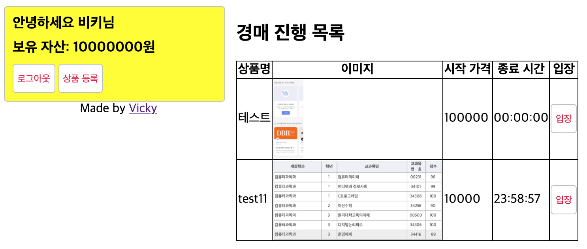
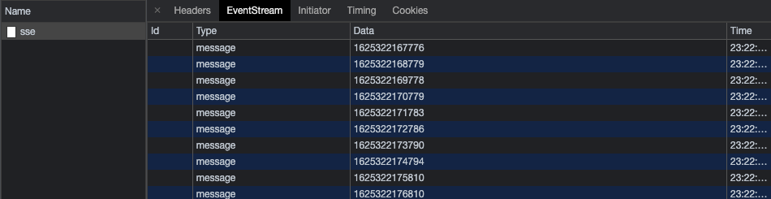

# 서버센트 이벤트 사용하기

### 경매는 시간이 생명이다!

- 모든 사람이 같은 시간에 경매가 종료되어야 한다.
- 모든 사람에게 같은 시간이 표시되어야 한다.
- 클라이언트 시간은 믿을 수 없다.(조작이 가능하다.)
- 따라서 서버 시간을 주기적으로 클라이언트로 내려보내준다.
- 이 때 서버에서 클라이언트로 단방향 통신을 하기 때문에 서버센트 이벤트(Server Sent Events, SSE, 서버 쪽에서만 데이터를 내려받도록 하는 이벤트)가 적합하다.
- 웹 소켓은 실시간으로 입찰할 대 사용한다.

  ```bash
  $ npm i sse socket.io
  ```

### 서버에 서버센트 이벤트 연결

- app.js에 SSE (sse.js 작성 후) 연결

  - `sse.on('connection')`은 서버와 연결되었을 때 호출되는 이벤트
  - `client.send`로 클라이언트에 데이터 전송 가능(책에서는 서버 시각 전송)

    `app.js`

    ```jsx
    // ..
    const webSocket = require("./socket");
    const sse = require("./sse");

    // ..
    const server = app.listen(app.get("port"), () => {
      console.log(app.get("port"), "번 포트에서 대기중");
    });

    webSocket(server, app);
    sse(server);
    ```

    `sse.js`

    ```jsx
    const SSE = require("sse");

    module.exports = (server) => {
      const sse = new SSE(server);
      // 서버센트 이벤트 연결 - 매 초마다 서버 시간을 보내준다.
      sse.on("connection", (client) => {
        setInterval(() => {
          client.send(Date.now().toString());
        }, 1000);
      });
    };
    ```

    `socket.js`

    ```jsx
    const SocketIO = require("socket.io");

    module.exports = (server, app) => {
      const io = SocketIO(server, { path: "/socket.io" });
      app.set("io", io);
      // 웹 소켓 연결 시
      io.on("connection", (socket) => {
        const req = socekt.request;
        const {
          headers: { referer },
        } = req;
        const roomId = referer.split("/")[referer.split("/").length - 1]; // roomId는 Good 테이블의 row ID가 된다.
        socket.join(roomId);
        socekt.on("disconnect", () => {
          socket.leave(roomId);
        });
      });
    };
    ```

### EventSource polyfill

- SSE는 EventSource라는 객체로 사용
  - IE에서는 EventSource가 지원되지 않음
  - EventSource polyfill을 넣어줌(첫 번째 스크립트)
  - `new EventSource('/sse')`로 서버와 연결
  - `es.onmessage`로 서버에서 내려오는 데이터를 받음(e.data에 들어있다.)
  - 아랫부분은 서버 시간과 경매 종료 시간을 계산해 카운트다운을 하는 코드. 24시간 카운트된다.
- `views/main.html`

  ```html
   
  <div class="timeline">
    <h2>경매 진행 목록</h2>
    <table id="good-list">
      <!-- codes.. -->
    </table>
    <script src="https://unpkg.com/event-source-polyfill/src/eventsource.min.js"></script>
    <script>
      const es = new EventSource("/sse");
      es.onmessage = function (e) {
        document.querySelectorAll(".time").forEach((td) => {
          const end = new Date(td.dataset.start); // 경매 시작 시간
          const server = new Date(parseInt(e.data, 10));
          end.setDate(end.getDate() + 1); // 경매 종료 시간
          if (server >= end) {
            // 경매가 종료되었으면
            return (td.textContent = "00:00:00");
          } else {
            const t = end - server; // 경매 종료까지 남은 시간
            const seconds = ("0" + Math.floor((t / 1000) % 60)).slice(-2);
            const minutes = ("0" + Math.floor((t / 1000 / 60) % 60)).slice(-2);
            const hours = ("0" + Math.floor((t / (1000 * 60 * 60)) % 24)).slice(-2);
            return (td.textContent = hours + ":" + minutes + ":" + seconds);
          }
        });
      };
    </script>
  </div>
  
  ```

  

  카운트다운 화면

### EventSource 확인해보기

- 개발자 도구 Network 탭 내 sse EventStream을 확인해보면 아래와 같다.

  

  개발자도구에서 확인할 수 있는 sse EventStream

---
