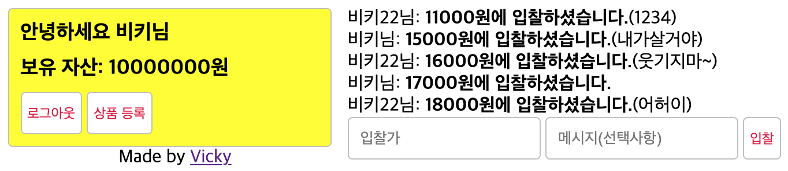

# 경매 진행하기

### 클라이언트에 웹소켓, SSE 연결하기

- auction.html에 서버 시간과 실시간 입찰 기능 추가
  - 서버 시간을 받아와서 카운트 다운하는 부분은 이전과 동일하다.
  - 세 번째 스크립트 태그는 입찰 시 POST /good/:id/bid로 요청을 보내는 것을 의미
  - 다른 사람이 입찰했을 때 Socket.IO로 입찰 정보를 렌더링한다.

### 상품정보, 입찰 라우터 작성하기

- `GET /good/:id`

  - 해당 상품과 기존 입찰 정보들을 불러온 뒤 렌더링
  - 상품 모델에 사용자 모델을 include할 때 as 속성 사용한다. (owner와 sold 중 어떤 관계를 사용할지 밝혀주는 것)

  ```jsx
  // ...
  router.get("/good/:id", isLoggedIn, async (req, res, next) => {
    try {
      const [good, auction] = await Promise.all([
        Good.findOne({
          where: { id: req.params.id },
          include: {
            model: User,
            as: "Owner",
          },
        }),
        Auction.findAll({
          where: { GoodId: req.params.id },
          include: { model: User },
          order: [["bid", "ASC"]],
        }),
      ]);
      res.render("auction", {
        title: `${good.name} - NodeAuction`,
        good,
        auction,
      });
    } catch (error) {
      console.error(error);
      next(error);
    }
  });
  // ...
  ```

- `POST /good/:id/bid`

  - 클라이언트로부터 받은 입찰정보를 저장한다.
  - 시작 가격보다 낮게 입찰했거나, 경매 종료시간이 지났거나, 이전 입찰가보다 낮은 입찰가가 들어왔다면 반려한다.
  - 정상 입찰가가 들어왔다면 저장 후 해당 경매방의 모든 사람에게 입찰자, 입찰 가격, 입찰 메시지 등을 웹 소켓으로 전달
  - Good.find 메서드의 order 속성은 include될 모델의 컬럼을 정렬하는 방법이다. (Auction 모델의 bid를 내림차순으로 정렬한다.)

  ```jsx
  // ...
  router.post("/good/:id/bid", isLoggedIn, async (req, res, next) => {
    try {
      const { bid, msg } = req.body;
      const good = await Good.findOne({
        where: { id: req.params.id },
        include: { model: Auction },
        order: [[{ model: Auction }, "bid", "DESC"]],
      });
      if (good.price >= bid) {
        return res.status(403).send("시작 가격보다 높게 입찰해야 합니다.");
      }
      if (new Date(good.createdAt).valueOf() + 24 * 60 * 60 * 1000 < new Date()) {
        return res.status(403).send("경매가 이미 종료되었습니다");
      }
      if (good.Auctions[0] && good.Auctions[0].bid >= bid) {
        return res.status(403).send("이전 입찰가보다 높아야 합니다");
      }
      const result = await Auction.create({
        bid,
        msg,
        UserId: req.user.id,
        GoodId: req.params.id,
      });
      // 실시간으로 입찰 내역 전송
      req.app.get("io").to(req.params.id).emit("bid", {
        bid: result.bid,
        msg: result.msg,
        nick: req.user.nick,
      });
      return res.send("ok");
    } catch (error) {
      console.error(error);
      return next(error);
    }
  });
  // ...
  ```

### 경매 진행해보기

- 서버 연결 후 경매 시작

  - 브라우저를 두 개 띄워 각자 다른 아이디로 로그인하면 두 개의 클라이언트가 동시 접속한 효과를 얻을 수 있다.

    
