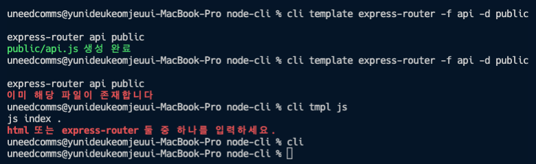

# commander 사용하기

### 라이브러리 설치하기

```bash
% cd NodeJS/lecture/node-cli
% npm i commander inquirer chalk
```

### template.js를 commander로 전환하기

- `command.js` 수정

  - template.js를 붙여 넣은 후 첫 require 부분과 끝 program 부분만 수정하면 된다.

  ```jsx
  #!/usr/bin/env node
  const { program } = require("commander");
  const fs = require("fs");
  const path = require("path");
  const { version } = require("./package.json");

  const htmlTemplate = `
  <!DOCTYPE html>
  <html>
    <head>
      <meta charset="utf-8" />
      <title>Template</title>
    </head>
    <body>
      <h1>Hello</h1>
      <p>CLI</p>
    </body>
  </html>
  `;

  const routerTemplate = `
  const express = require('express');
  const router = express.Router();
   
  router.get('/', (req, res, next) => {
     try {
       res.send('ok');
     } catch (error) {
       console.error(error);
       next(error);
     }
  });
   
  module.exports = router;
  `;

  // 폴더 존재 확인 함수
  const exist = (dir) => {
    try {
      fs.accessSync(dir, fs.constants.F_OK | fs.constants.R_OK | fs.constants.W_OK);
      return true;
    } catch (e) {
      return false;
    }
  };

  // 경로 생성 함수
  const mkdirp = (dir) => {
    const dirname = path
      .relative(".", path.normalize(dir))
      .split(path.sep)
      .filter((p) => !!p);
    dirname.forEach((d, idx) => {
      const pathBuilder = dirname.slice(0, idx + 1).join(path.sep);
      if (!exist(pathBuilder)) {
        fs.mkdirSync(pathBuilder);
      }
    });
  };

  const makeTemplate = (type, name, directory) => {
    // 템플릿 생성 함수
    mkdirp(directory);
    if (type === "html") {
      const pathToFile = path.join(directory, `${name}.html`);
      if (exist(pathToFile)) {
        console.error("이미 해당 파일이 존재합니다");
      } else {
        fs.writeFileSync(pathToFile, htmlTemplate);
        console.log(pathToFile, "생성 완료");
      }
    } else if (type === "express-router") {
      const pathToFile = path.join(directory, `${name}.js`);
      if (exist(pathToFile)) {
        console.error("이미 해당 파일이 존재합니다");
      } else {
        fs.writeFileSync(pathToFile, routerTemplate);
        console.log(pathToFile, "생성 완료");
      }
    } else {
      console.error("html 또는 express-router 둘 중 하나를 입력하세요.");
    }
  };

  // cli -v(--version) :: 버전
  // cli -h(--help) :: 도움말
  program.version(version, "-v, --version").name("cli");

  // cli template html
  // 필수정보는 <>, 보조명령어는 []
  program
    .command("template <type>")
    .usage("<type> --filename [filename] --path [path]")
    .description("템플릿을 생성한다.")
    .alias("tmpl") // cli tmpl express-router
    .option("-f --filename [filename]", "파일명을 입력하세요", "index")
    .option("-d, --directory [path]", "생성 경로를 입력하세요.", ".")
    .action((type, options) => {
      console.log(type, options.filename, options.directory);
      makeTemplate(type, options.filename, options.directory);
    });

  program.command("*", { noHelp: true }).action(() => {
    console.log("해당 명령어를 찾을 수 없습니다.");
    program.help(); // cli -h
  });

  // 그냥 cli만 실행
  program.action((cmd, args) => {});

  program.parse(process.argv);
  ```

### chalk

- 콘솔에 색을 추가함

  - console.log와 console.error에 chalk 적용
  - 문자열을 chalk 객체의 메서드로 감싸면 된다.
  - chalk.green, chalk.yellow, chalk.red 등등
  - chalk.rgb(12, 34, 56)(문자열) 또는 chalk.hex('#ff9900')(텍스트)도 가능
  - 배경색도 지정 가능해서 chalk.bgGreen, chalk.bgYellow, chalk.bgRgb, chalk.bgHex 사용 가능
  - 동시에 지정하려면 chalk.red.bgBlue.bold와 같이 사용

  ```jsx
  const chalk = require("chalk");

  // ..
  const makeTemplate = (type, name, directory) => {
    // 템플릿 생성 함수
    mkdirp(directory);
    if (type === "html") {
      const pathToFile = path.join(directory, `${name}.html`);
      if (exist(pathToFile)) {
        console.error(chalk.bold.red.bgBlack("이미 해당 파일이 존재합니다"));
      } else {
        fs.writeFileSync(pathToFile, htmlTemplate);
        console.log(chalk.green(pathToFile, "생성 완료"));
      }
    } else if (type === "express-router") {
      const pathToFile = path.join(directory, `${name}.js`);
      if (exist(pathToFile)) {
        console.error(chalk.bold.red("이미 해당 파일이 존재합니다"));
      } else {
        fs.writeFileSync(pathToFile, routerTemplate);
        console.log(chalk.green(pathToFile, "생성 완료"));
      }
    } else {
      console.error(chalk.bold.red("html 또는 express-router 둘 중 하나를 입력하세요."));
    }
  };
  //...
  ```

  

### 전환된 파일 실행하기

- 명령어들을 커맨더 식으로 전환

  - 옵션들은 순서르 바꿔서 입력해도 된다.

  ```bash
  % cli tmpl html -f test
  html test .
  test.html 생성 완료

  % cli template express-router -f api -d public
  express-router api public
  public/api.js 생성 완료

  % cli
  Usage: cli [options] [command]

  Options:
    -v, --version                   output the version number
    -h, --help                      display help for command

  Commands:
    template|tmpl [options] <type>  템플릿을 생성한다.
    help [command]                  display help for command
  ```
