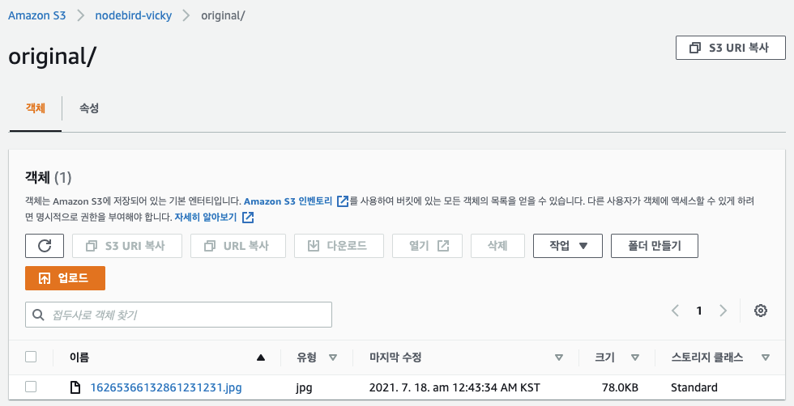

# S3에 이미지 올리기

### S3 도입 코드 LightSail에 반영하기

- 프로젝트 내 S3 도입 코드를 git merge 한 후 LightSail 터미널에서 아래와 같이 처리한다.

```bash
$ sudo su
$ cd nodebird
$ git pull
...
// 아래와 같은 에러가 발생하면
error: Your local changes to the following files would be overwritten by merge:
	package-lock.json
	package.json
Please commit your changes or stacsh them before you merge.

// 아래 명령어를 쳐준다. (단, .env 내부 값도 변경되었는지 확인)
$ git reset --har
HEAD is now at lea8fa1 initial commit

$ git pull // 성공
$ sudo npm i // aws-sdk, multer-s3 설치
$ sudo npm i bcrypt@5 // bcrypt@5으로 가입한다.
$ sudo npx pm2 reload all && sudo npx pm2 monit
```

- 만약 DB 관련 에러가 발생할 경우

  ```bash
  $ mysql -uroot -p
  Enter password:
  Error 2002 (HY000): ...
  $ sudo service mysql start
  $ mysql -uroot -p
  ```

### 카카오 로그인 시 IP 상에서 동작하도록 정보 추가

- [developers.kakao.com](http://developers.kakao.com) 접속 후 로그인
- 내 애플리케이션 → NodeBird
  - 앱 설정 → 플랫폼
    - Web [사이트 도메인]에 IP 도메인 `http://3.36.67.68` 추가
  - 카카오 로그인 → Redirect URL
    - `http://3.36.67.68/auth/kakao/callback`추가
- `http://3.36.67.68` 에서 카카오 로그인 정상 동작 확인 🚀

### 이미지 업로드 시도

- `http://3.36.67.68`에 접속하여 로그인 후 이미지 업로드

  - S3 버킷에 이미지가 잘 업로드되는지 확인 필요 !

  

  
