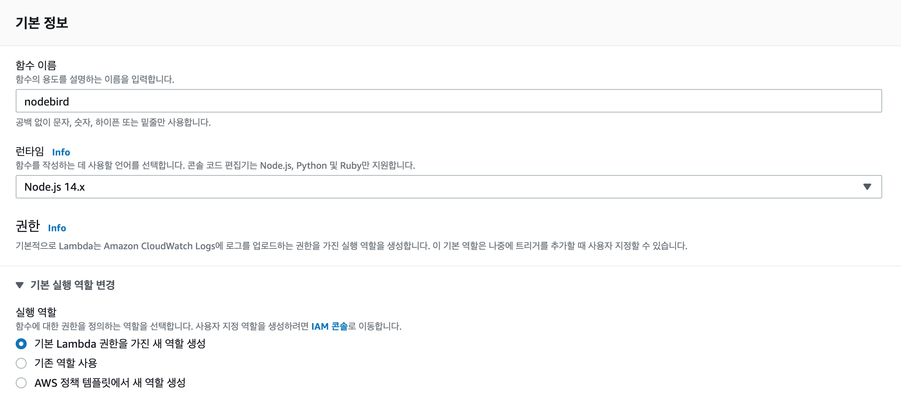
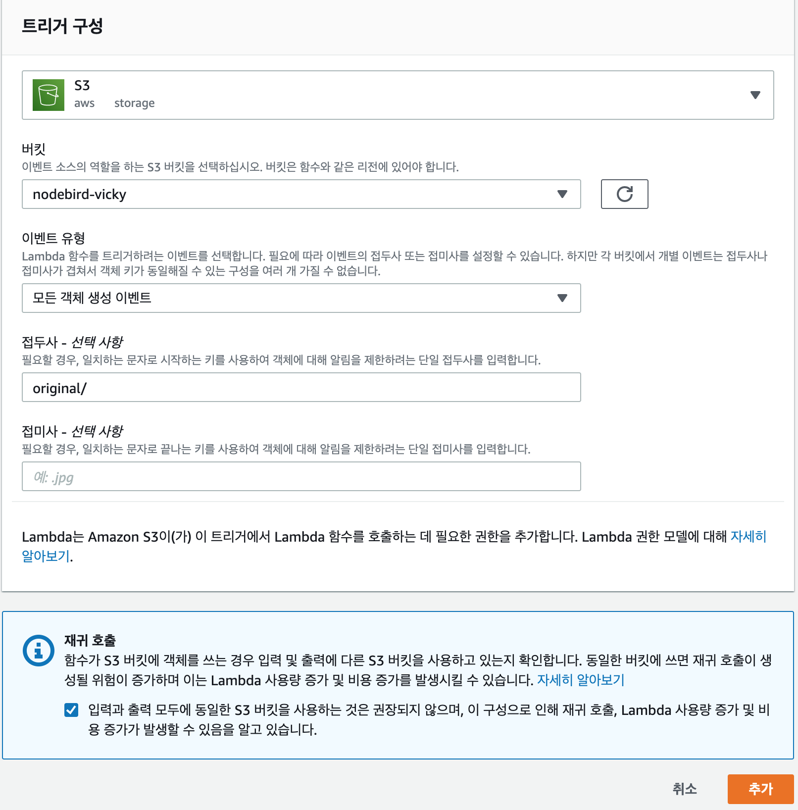

# 람다 설정하기

### 람다 서비스 설정하기

- AWS - 컴퓨팅 Lambda

### 새 함수 만들기



- 위와 같이 설정 후 함수 생성

### 함수 설정

- Amazon S3에서 파일 업로드 클릭
- Amazon S3 링크 URL에 [https://nodebird-vicky.s3.ap-northeast-2.amazonaws.com/aws-upload.zip](https://nodebird-vicky.s3.ap-northeast-2.amazonaws.com/aws-upload.zip) 작성 후 저장
- 구성 탭 → 일반 구성 → [편집]에서 아래와 같이 설정
  - 메모리: 256mb 설정
  - 제한시간: 30초 설정
  - 실행역할 : AWS 정책 템플릿에서 새 역할 생성
    - 역할이름: nodebird-lambda
    - 정책 템플릿 - 선택사항: [Amazon S3 객체 읽기 전용 권한]
- 코드 탭 → 런타임 설정 → [편집]에서 아래 설정 확인
  - 핸들러: index.handler
- 트리거 탭 → 트리거 추가

  - 트리거 구성: S3

    

    - 접두사를 `original/`로 설정하지 않으면 함수가 재귀호출되어 이미지 리사이징을 무한반복 시켜 비용이 엄청나게 발생할 수 있으므로 반드시 접두사를 넣어 재귀되지 않도록 처리한다.

### nodebird route에 람다함수 적용하기

- `nodebird/routes/post.js`

  ```jsx
  // ..
  router.post("/img", isLoggedIn, upload.single("img"), (req, res) => {
    console.log(req.file);
    const originalUrl = req.file.location;
    const url = originalUrl.replace(/\/original\//, "/thumb/");
    res.json({ url, originalUrl }); // 기존 이미지 주소, 리사이징된 주소 둘 다 보내준다.
    // 이미지 리사이징이 오래 걸릴 경우 기존 이미지라도 보여주기 위함
  });

  //..
  ```

- `nodebird/views/main.html`

  ```jsx
  <div class="timeline">
    
    <div>
  			/* ... */
        <div class="twit-img">
          
        </div>
    </div>
  </div>
  <script>
    if (document.getElementById("img")) {
      document.getElementById("img").addEventListener("change", function (e) {
  			// ...
        axios
          .post("/post/img", formData)
          .then((res) => {
            document.getElementById("img-url").value = res.data.url; // 리사이징된 이미지는 url로
            document.getElementById("img-preview").src = res.data.originalUrl; // 미리보기는 원본으로
            document.getElementById("img-preview").style.display = "inline";
          })
          .catch((err) => {
            console.error(err);
          });
      });
    }
  </script>
  
  ```

- 수정 코드를 git에 Push 해놓는다.

### LightSail에서 람다함수 반영하기

- `ssh`

  ```bash
  $ sudo su
  $ cd nodebird
  $ git pull

  $ sudo npm i sharp // 에러 발생해서 다시 설치
  $ sudo npx pm2 reload all && sudo npx pm2 monit

  // 만약 이미지 경로가 original -> thumb로 변경되지 않을 경우 아래와 같이 한다.
  $ cd ../aws-upload
  $ ls
  $ rm -rf aws-upload.zip
  $ rm -rf aws
  $ rm -rf awscliv2.zip // zip 파일 모두 삭제

  $ sudo zip -r aws-upload.zip ./* // zip 파일 다시 생성
  $ ls
  aws-upload.zip  index.js  node_modules  package-lock.json  package.json

  $ aws s3 cp "aws-upload.zip" s3://nodebird-vicky
  $ sudo npx pm2 reload all && sudo npx pm2 monit

  // 만약 mysql sequelize 관련 에러 발생할 경우
  $ mysql -uroot -p
  Enter password:
  Error 2002 (HY000): ...
  $ sudo service mysql start
  $ mysql -uroot -p
  ```

  위와 같이 설정 후 서버 재시작 해주면 문제없이 이미지 리사이즈되어 사이트가 동작하는 것을 확인할 수 있다.
