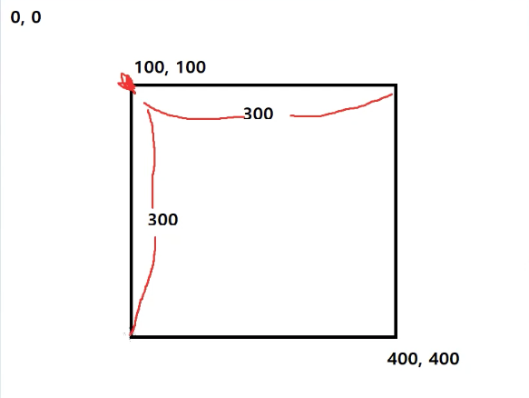
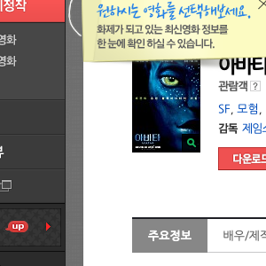

## axios와 cheerio로 이미지 다운로드

### 이미지 다운로드 준비하기

이제 이미지를 다운로드하는 방법에 대해 알아보자! puppeteer는 페이지 자체를 이미지샷(스크린샷)으로 찍어 저장할 수 있는 기능을 제공하고, 그 밖에도 이미지를 다운로드받아 파일로 저장하게 만들 수도 있다.

먼저 크롤링하는 사이트에 이미지를 poster 폴더에 저장해보자
poster 폴더에 이미지를 저장하기 위해서는 이미지를 저장할 poster 폴더만 존재해야 한다.
이를 미리 체크해주지 않고 매번 poster 폴더를 생성하여 저장할 경우 이미 폴더가 있을 때 에러가 발생한다.

`index.js`

```jsx
const fs = require("fs");

fs.readdir("screenshot", (err) => {
  // screenshot 폴더가 있는지 확인 후 없으면 에러 - 기존 폴더가 있을 경우 충돌 에러 발생하므로
  if (err) {
    console.error("screenshot 폴더가 없어 screenshot 폴더를 생성한다.");
    fs.mkdirSync("screenshot"); // sync 메서드는 프로그램의 처음과 끝에만 사용하는 것이 좋음
  }
});
fs.readdir("poster", (err) => {
  // poster 폴더가 있는지 확인 후 없으면 에러 - 기존 폴더가 있을 경우 충돌 에러 발생하므로
  if (err) {
    console.error("poster 폴더가 없어 poster 폴더를 생성한다.");
    fs.mkdirSync("poster");
  }
});

// crawler ..
```

위와 같이 원하는 폴더가 있는지 확인 후 없으면 폴더를 생성해준다.
또한, 웹크롤링 시 이미지 태그를 저장할 수 있도록 해당 엘리먼트를 가져오도록 크롤러 코드를 수정해준다.

```jsx
const crawler = async () => {
  try {
		// ..
    for (const [i, r] of records.entries()) {
      await page.goto(r.링크);
      const result = await page.evaluate(() => {
        const scoreEl = document.querySelector(".score.score_left .star_score");
        const imgEl = document.querySelector(".poster img"); // 이미지
        let score, img = ""; // 객체 저용
        if (scoreEl) {
          score = scoreEl.textContent;
        }
        if (imgEl) {
          img = imgEl.src;
        }
        return { score, img }; // 비구조화 할당
      });
      if (result.score) {
        const newCell = "C" + (i + 2);
        add_to_sheet(ws, newCell, "n", parseFloat(result.score.trim()));
      }
      // ...
    }
    // ..
  }
};
```

### axios로 이미지 저장하기

이제 `axios`로 해당 이미지를 저장해보자!

```jsx
const axios = require("axios");

const crawler = async () => {
  try {
    // ..
    for (const [i, r] of records.entries()) {
      await page.goto(r.링크);
      const result = await page.evaluate(() => {
        const scoreEl = document.querySelector(".score.score_left .star_score");
        let score = "";
        if (scoreEl) {
          score = scoreEl.textContent;
        }
        const imgEl = document.querySelector(".poster img");
        let img = "";
        if (imgEl) {
          img = imgEl.src;
        }
        return { score, img };
      });
      // score 처리
      if (result.score) {
        const newCell = "C" + (i + 2);
        add_to_sheet(ws, newCell, "n", parseFloat(result.score.trim())); // sheet에 평점 row 추가
      }
      // img 저장
      if (result.img) {
        // buffer가 연속적으로 들어있는 자료구조가 arraybuffer
        // axios로 이미지 다운로드 - img.src 내 파라미터로 인한 이미지 사이즈 제한으로 인해 정규표현식 추가
        const imgResult = await axios.get(result.img.replace(/\?.+$/, ""), { responseType: "arraybuffer" });
        // fs.writeFileSync로 제목을 타이틀로한 이미지 저장
        fs.writeFileSync(`poster/${r.제목}.jpg`, imgResult.data);
      }
      await page.waitForTimeout(3000);
    }
    // ..
  } catch (e) {
    console.error(e);
  }
};

crawler();
```

위처럼 `axios`로 이미지 `src`를 파라미터를 제거하여 Request를 하면 해당 데이터를 `response.data`로 저장할 수 있다. 이를 `fs` 모듈로 `poster` 파일에 저장하면 각 영화 타이틀을 이름으로 한 포스터들이 저장된다.

### 브라우저 사이즈 조절과 스크린샷

페이지 자체를 스크린샷을 찍어보려고 한다. 그런데 스크릿샷을 찍으려고 하면 브라우저 사이즈가 작은 상태임을 알 수 있다. 이것부터 개선해보자.

`index.js`

```jsx
const crawler = async () => {
  try {
    const browser = await puppeteer.launch({
      headless: process.env.NODE_ENV === "production",
      args: ["--window-size=1920,1080"], //  브라우저 사이즈 설정
    });
    const page = await browser.newPage();
    // 페이지 사이즈 설정
    await page.setViewport({
      width: 1920,
      height: 1080,
    });
    // ..
  }
	// ..
};
```

위처럼 브라우저 사이즈는 `puppeteer`에 `args` 옵션으로 설정하고, 보여지는 페이지 사이즈는 `page` 변수에서 설정해주면 정상적으로 브라우저가 커져서 노출된다.

그럼 이제 실제 스크린샷을 찍어보자.

`index.js`

```jsx
// ..
const crawler = async () => {
  try {
    // ..
    for (const [i, r] of records.entries()) {
      // ..
      if (result.img) {
        // 스크린샷 저장 구현
        // path 속성을 쓰면 저장 위치를 설정할 수 있다.
        // fullPage 옵션에 따라 전체 페이지를 스크린샷으로 찍을 수 있다.
        await page.screenshot({
          path: `screenshot/${r.제목}.png`,
          fullPage: true,
        });
        // 포스터 저장 구현
        const imgResult = await axios.get(result.img.replace(/\?.+$/, ""), { responseType: "arraybuffer" });
        fs.writeFileSync(`poster/${r.제목}.jpg`, imgResult.data);
      }
      // ..
    }
    // ..
  } catch (e) {
    console.error(e);
  }
};

crawler();
```

`page.screenshot()`으로 스크린샷을 찍을 수 있고, 위 `path`와 `fullPage` 옵션을 사용하면 전체 페이지가 스크린샷으로 찍힌 `png` 파일을 `screenshot` 폴더에 담을 수 있다.

만약 이미지를 특정 영역만 저장하고 싶을 땐 어떻게 할까? `screenshot` 함수에 `clip` 옵션을 추가하면 된다.
해당 옵션은 왼쪽 상단 모서리 좌표(x, y), 너비(width), 높이(height) 이렇게 총 4가지 값을 부여하면 된다.



`index.js`

```jsx
// ..
const crawler = async () => {
  try {
    // ..
    for (const [i, r] of records.entries()) {
      // ..
      if (result.img) {
        // 스크린샷 저장 구현
        // path 속성을 쓰면 저장 위치를 설정할 수 있다.
        // clip 속성을 쓰면 원하는 위치만 스크린샷으로 찍을 수 있다. (왼쪽 상단 모서리 좌표(x, y), 너비(width), 높이(height) 값이 필요)
        await page.screenshot({
          path: `screenshot/${r.제목}.png`,
          // fullPage: true,
          clip: { x: 100, y: 100, width: 300, height: 300 },
        });
        // 포스터 저장 구현
        const imgResult = await axios.get(result.img.replace(/\?.+$/, ""), { responseType: "arraybuffer" });
        fs.writeFileSync(`poster/${r.제목}.jpg`, imgResult.data);
      }
      // ..
    }
    // ..
  } catch (e) {
    console.error(e);
  }
};

crawler();
```

위처럼 `clip` 옵션 설정 후 크롤링을 하면 아래와 같이 스크린샷이 저장되어 `screenshot` 폴더에 담긴다.


