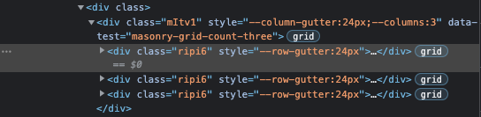

## 인피니트 스크롤링 크롤링

### 인피니트 스크롤링과 postman

이제 정적인 페이지가 아닌 사용자 인터랙션이 들어가는 페이지([unsplash.com](https://unsplash.com/))에 크롤링을 구현해보고자 한다.
이번에는 인피니트 스크롤링 페이지를 크롤링하며 postman을 사용해서 처리한다.

`postman`은 서버로 요청을 보낼 때 쓰는 패키지로 GET,POST 등의 각 종 요청을 손쉽게 처리할 수 있다.
또 `postman`은 `preview` 기능이 있어 다운받은 소스를 미리보기로 바로 확인할 수 있는데, 이 `preview` 기능으로 보는 화면이 실제 크롤러가 보는 화면일 가능성이 높다.

만약 크롤링을 한 사이트가 spa 구조일 경우 필요한 여러 정보들을 csr(client side rendering)로 받아오므로, 실제 preview해서 보면 원하는 이미지나 필요한 정보가 담겨있지 않은 상태로 응답을 받게된다. 따라서 별도의 요청으로 소스를 받아와야 하므로 여러 절차가 추가되어야 함(즉, axios나 cheerio로 구현은 어렵다)

이제 크롤링 소스를 구현해본다. 기존의 모든 코드는 삭제하고 가장 기본적인 구조만 남긴다.
(즉 모든 크롤링은 아래 코드에서부터 시작한다.)

`index.js`

```jsx
const fs = require("fs");
const axios = require("axios");
const puppeteer = require("puppeteer");

const crawler = async () => {
  try {
    // code start !
  } catch (e) {
    console.error(e);
  }
};

crawler();
```

### 인피니트 스크롤 태그 분석

실제 splash 사이트를 보면 돔 태그 내 삽입된 클래스명들이 모두 해시화 되어있는 것을 확인할 수 있다.



이는 소스 스크립트에 대한 보안이나 접근성을 방해하는 것, 또 캐싱을 통해 사이트의 부하를 줄여주는 역할을 해줄 수 있다. 이러헥 해쉬화 된 클래스명은 내부 소스가 변경될 때마다 클래스명이 변경되므로 크롤링을 할 때는 변경되는 점에 따라 주기적으로 업데이트를 해주어야 하므로 번거로울 수 있다.

unsplash의 태그들 중 필요한 태그를 위 클래스를 추적하여 가져와서 크롤러를 구현하면 아래와 같다.

`index.js`

```jsx
// ..

const crawler = async () => {
  try {
    const browser = await puppeteer.launch({ headless: false });
    const page = await browser.newPage();
    await page.goto("https://unsplash.com");
    const result = await page.evaluate(() => {
      let imgs = []; // imgs 배열 생성
      const imgEls = document.querySelectorAll(".ripi6");
      if (imgEls.length) {
        // querySelectorAll은 map을 쓸 수 없으므로 forEach로 배열에 push해준다.
        imgEls.forEach((v) => {
          let src = v.querySelector("img.YVj9w").src;
          src && imgs.push(src);
        });
      }
      return imgs;
    });
    console.log("result:", result);
  } catch (e) {
    console.error(e);
  }
};

crawler();

// result: [
//   "https://images.unsplash.com/photo-1640622842924-3ae860f77265?ixlib=rb-1.2.1&ixid=MnwxMjA3fDF8MHxlZGl0b3JpYWwtZmVlZHwxfHx8ZW58MHx8fHw%3D&w=1000&q=80",
//   "https://images.unsplash.com/photo-1647533532539-ff164151cd89?ixlib=rb-1.2.1&ixid=MnwxMjA3fDB8MHxlZGl0b3JpYWwtZmVlZHwzfHx8ZW58MHx8fHw%3D&w=1000&q=80",
//   "https://images.unsplash.com/photo-1647606472102-ca1959036bdf?ixlib=rb-1.2.1&ixid=MnwxMjA3fDB8MHxlZGl0b3JpYWwtZmVlZHw1fHx8ZW58MHx8fHw%3D&w=1000&q=80",
//   "https://images.unsplash.com/photo-1638913661377-abd9e8cf1998?ixlib=rb-1.2.1&ixid=MnwxMjA3fDF8MHxlZGl0b3JpYWwtZmVlZHw2fHx8ZW58MHx8fHw%3D&w=1000&q=80",
//   "https://images.unsplash.com/photo-1634072319894-107e61606191?ixlib=rb-1.2.1&ixid=MnwxMjA3fDB8MHxlZGl0b3JpYWwtZmVlZHw4fHx8ZW58MHx8fHw%3D&w=1000&q=80",
//   "https://images.unsplash.com/photo-1647610365194-662ed67a998e?ixlib=rb-1.2.1&ixid=MnwxMjA3fDB8MHxlZGl0b3JpYWwtZmVlZHwxMHx8fGVufDB8fHx8&w=1000&q=80",
//   // ...
// ];
```

### 인피니트 스크롤 환경에서 스크롤 내리고 태그 기다리기 구현

초기 unsplash 사이트에서는 위 result로 24개의 src만 가져온다. 만약 30개를 가져오고 싶다면 어떻게해야할까? 바로 인피니트 스크롤 환경에서 스크롤을 아래로 내리는 동작을 통해 추가된 img.src까지 담아와야 한다.

이를 구현하는 방법은 사람이 스크롤을 내리는 것처럼 흉내를 내면 된다. 또 스크롤을 내려 태그가 많이 쌓이면 그만큼 이미지를 가져오는데 서버 비용이 많이 발생하므로 크롤링이 끝나면 해당 엘리먼트(.ripi6)를 삭제해준다.
이후 스크롤을 하면 새로운 엘리먼트를 가져오는데 해당 엘리먼트는 아직 크롤링이 되지 않은 엘리먼트이므로 이를 크롤링해주면 된다.

우선 초기 img.src를 담은 후 기존의 .ripi6 엘리먼트를 지워준 뒤 스크롤을 내리는 동작까지 구현해보자

`index.js`

```jsx
const crawler = async () => {
  try {
    // ..
    const result = await page.evaluate(() => {
      let imgs = [];
      const imgEls = document.querySelectorAll(".ripi6");
      if (imgEls.length) {
        imgEls.forEach((v) => {
          let src = v.querySelector("img.YVj9w")?.src;
          src && imgs.push(src);
          v.innerHTML = "";
        });
      }
      // 세로로 100px 내려준다.
      window.scrollBy(0, 100);
      return imgs;
    });
    // 2. waitForSelector는 특정 선택자를 기다릴 수 있다.
    // 단, 30초간 기다린 후 선택자를 못 찾으면 timeout 에러
    await page.waitForSelector(".ripi6");
    console.log("새 이미지 태그 로드 완료");
  } catch (e) {
    console.error(e);
  }
};

crawler();
```

1. 지워줄 엘리먼트의 부모 엘리먼트에서 removeChild를 처리해주는 것에 주목하자
2. waitForSelector 메서드는 특정 선택자를 기다린 뒤 이후에 코드를 실행시킬 수 있는 메서드이다. 단, 30초간 기다린 후 선택자를 못 찾으면 timeout 에러가 발생한다.

### 스크롤을 조작해서 크롤링하기

위처럼 스크롤을 조작해서 새롭게 이미지 태그를 가져오는 로직을 구현했다면,
이를 원하는 수량만큼 재로드하여 img.src를 담을 수 있도록 반복문으로 구현을 해볼 차례이다.

`index.js`

```jsx
const crawler = async () => {
  try {
    const browser = await puppeteer.launch({ headless: false });
    const page = await browser.newPage();
    await page.goto("https://unsplash.com");
    let result = [];
    // img srcs가 30개 모일 때까지 반복한다.
    while (result.length <= 30) {
      const srcs = await page.evaluate(() => {
        window.scrollTo(0, 0); // 절대 좌표
        let imgs = [];
        const imgEls = document.querySelectorAll(".ripi6");
        if (imgEls.length) {
          imgEls.forEach((v) => {
            let src = v.querySelector("img.YVj9w")?.src; // 엘리먼트 있을 때만 가져온다.
            src && imgs.push(src);
            v.innerHTML = ""; // imgEl 내부만 비워주는 방식으로 변경
          });
        }
        window.scrollBy(0, 100); // 상대 좌표: 현재의 위치에서 스크롤 100px 이동
        return imgs;
      });
      result = result.concat(srcs);
      await page.waitForSelector(".ripi6");
      console.log("새 이미지 태그 로드 완료");
    }
    console.log(result);
    await page.close();
    await browser.close();
  } catch (e) {
    console.error(e);
  }
};

crawler();
// 새 이미지 태그 로드 완료
// 새 이미지 태그 로드 완료
// ...
```

위처럼 `result.length`가 30개 즉, `img.src`가 30개가 모일 때까지 while문으로 반복 구현해서 이미지로드를 완료할 수 있다. 또한 모든 작업을 마친 뒤 page, browser를 종료해주는 코드도 추가해준다..!

### 크롤링 결과물 파일 생성

이제 크롤링해온 이미지 링크 주소를 직업 axios로 요청하여 파일로 저장해본다.

1. 이미지 파일을 저장할 `imgs` 폴더가 있는지 확인하고 없으면 생성해준 다음 2. result 배열의 데이터에 forEach로 GET Request를 보낸 뒤 3. 파라미터를 제외한 값을 imgs 폴더에 저장해준다.

`index.js`

```jsx
const fs = require("fs");
const axios = require("axios");
const puppeteer = require("puppeteer");

// 1. imgs 폴더 생성
fs.readdir("imgs", (err) => {
  if (err) {
    console.error("imgs 폴더가 없어 imgs 폴더를 생성합니다.");
    fs.mkdirSync("imgs");
  }
});

const crawler = async () => {
  try {
    // Get Image srcs in result Array..
    result.forEach(async (src) => {
      // 2. 이미지 GET Request
      const imgResult = await axios.get(src.replace(/\?.*$/, ""), {
        responseType: "arraybuffer",
      });
      // 3. 이미지 저장
      fs.writeFileSync(`imgs/${new Date().valueOf()}.jpeg`, imgResult.data);
    });
    await page.close();
    await browser.close();
  } catch (e) {
    console.error(e);
  }
};

crawler();
```

이미지 저장 포맷을 `jpeg`로 해준 것은 해당 이미지를 크롬 개발자 도구에서 확인했을 때. `response Header`에 있던 `content-Type`이 `image/jpeg` 로 되어있었기 때문임

### puppeteer Q&A

Selenium은 다양한 브라우저(safari, edge 등)에서 테스트를 해야할 때 많이 사용.
단순 크롤링을 위해서는 puppeteer를 사용한다.

> 💡 실무에서 이렇게 사용 !
> puppeteer: 패치 전 사이트 로그인 페이지에서 돔 수집 후 싱크 임베드 테스트 → 문제여부 반환
> Selenium: 패치 후 QA를 셀레니움을 수동으로 돌려서 사용
