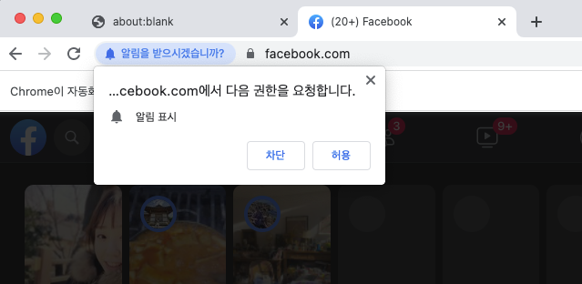

## 크롤러로 페이지 상호작용하기 - 페이스북 로그인 & 로그아웃

### 페이스북 로그인 태그 분석

이전 수업까지는 페이지에 방문해서 스크롤 이벤트를 하는 등으로 간단한 정보를 가져오는 심플한 크롤링을 진행해보았다. 이번에는 로그인, 로그아웃을 크롤러로 구현해보면서 사이트 상호작용에 대해 배워보고자 함

상호작용은 input에 정보를 입력하고, 키보드 입력이나 마우스 핸들링, 버튼 클릭 등의 행위를 모두 포함한다.
이런 사이트 상호작용이 어려운 페이지가 회원가입 페이지이다. 보통 회원가입 페이지에는 recapcha(사람인지 판단하는 프로그램)가 실행되어 크롤러가 회원가입하는 것을 막기 때문. 무조건 안되는 건 아니고 headless를 true로 했을 때 안 뜨는 경우도 있으니 테스트 해보면 된다.

먼저 지금까지 배웠던 것으로 페이스북 로그인을 시도해보자

`index.js`

```jsx
const puppeteer = require("puppeteer");

const crawler = async () => {
  try {
    const browser = await puppeteer.launch({ headless: false, args: ["--window-size=1920,1080"] });
    const page = await browser.newPage();
    await page.setViewport({
      width: 1080,
      height: 1080,
    });
    await page.goto("https://facebook.com");
    await page.evaluate(() => {
      document.querySelector("#email").value = "chw_326@hanmail.net";
      document.querySelector("#pass").value = "1234";
      document.querySelector("button[type=submit]").click();
    });
    // await page.close();
    // await browser.close();
  } catch (e) {
    console.error(e);
  }
};

crawler();
```

위처럼하면 실제 크롤러가 페이스북에 로그인을 시도하는 것을 확인할 수 있다.

### dotenv로 비밀번호 관리

위 코드의 문제는 아이디와 비밀번호가 모두 코드 내에 들어있어 노출될 위험이 있다는 점이다. 이를 evaluate의 인자로 전달해주는 방식으로 비밀번호를 관리하는데 이를 dotenv로 관리해준다.

이를 위해서 먼저 dotenv 패키지를 설치해준다.

```bash
> npm i dotenv
```

이후 `.env` 파일을 생성하여 거기에 개인정보를 저장해준다. 이 파일은 서버 업로드 시 권한을 최상위로 두거나 깃에 푸시하지 않도록 하여 개인정보가 공유되지 않도록 관리를 잘해주어야 한다.

`.env`

```bash
EMAIL=chw_326@hanmail.net
PASSWORD=1234
```

`index.js`

```jsx
// ..
const dotenv = require("dotenv"); // dotenv 호출
dotenv.config(); // dotenv 실행

const crawler = async () => {
  try {
    // ..
    await page.goto("https://facebook.com");
    // process.env로 정보 호출
    const id = process.env.EMAIL;
    const password = process.env.PASSWORD;
    // evaluate 함수는 자바스크립트의 Scope를 따르지 않으므로 인자로 넘김
    await page.evaluate(
      (id, password) => {
        document.querySelector("#email").value = id;
        document.querySelector("#pass").value = password;
        document.querySelector("button[type=submit]").click();
      },
      id,
      password
    );
    // ..
  } catch (e) {
    console.error(e);
  }
};

crawler();
```

위와 같이 `dotenv.config();` 로 개인정보를 불러와준 뒤 id, password를 담는 부분에서 `process.env` 환경 변수로 id, password 값을 가져올 수 있다.

### type, hover, click, keyboard

기존에 크롤러에 주로 사용해왔던 puppeteer API는 `evaluate`인데 이외에도 다양한 API가 제공된다.

`index.js`

```jsx
const crawler = async () => {
  try {
    // ..
    await page.goto("https://facebook.com");
    // evaluate 함수 대신..
    await page.type("#email", process.env.EMAIL); // email 입력
    await page.type("#pass", process.env.PASSWORD); // password 입력
    await page.hover("button[type=submit]"); // 버튼 위에 mouse hover
    await page.waitForTimeout(3000); // 3초 대기
    await page.click("button[type=submit]"); // submit!
  } catch (e) {
    console.error(e);
  }
};

crawler();
```

위처럼 `page.type`, `page.hover`, `page.click` 등의 이벤트로 로그인을 구현할 수 있다.



다음 로그아웃을 구현하려고 하면 로그인 후 [권한요청] alert가 뜨고 허용을 클릭해야지만 실제 페이스북 돔에 접근이 가능해진다. 이는 어떻게 처리할 수 있을까? 해당 페이지에 접근했을 때 차단, 허용 뿐만 아니라 esc 키를 눌렀을 때도 사라지는 것을 확인할 수 있다. 따라서 즉 아래와 같이 추가해준다.

```jsx
const crawler = async () => {
  try {
    // ..
    await page.click("button[type=submit]"); // submit!
    await page.waitForTimeout(10000); // 10초 대기(로그인 후 화면 전환) - 네트워크에 따라 상황이 달라짐.
    await page.keyboard.press("Escape"); // esc keypress
  } catch (e) {
    console.error(e);
  }
};

crawler();
```

위처럼 [keyboard.press](http://keyboard.press) 함수로 esc 버튼을 누르는 동작을 수행할 수 있다.  
이외에도 다양한 버튼 클릭이 제공되므로 [여기](https://github.com/puppeteer/puppeteer/blob/v1.12.2/lib/USKeyboardLayout.js)에서 필요한 정보를 찾아서 사용하면 된다.

### 페이스북 로그아웃

이제 페이스북 로그아웃을 구현해보자. 로그아웃 태그를 찾아가는 과정과 waitForTimeout등을 이용해서 인간처럼 행동하는 크롤러를 구현하면 된다.

`index.js`

```jsx
// ..
const crawler = async () => {
  try {
    // ..
    // 로그아웃 구현
    await page.click("#userNavigationLabel");
    await page.waitForSelector("li.navSubmenu:last-child");
    await page.waitForTimeout(3000); // 3초 대기
    await page.click("li.navSubmenu:last-child");

    // await page.close();
    // await browser.close();
  } catch (e) {
    console.error(e);
  }
};

crawler();
```

위처럼 로그아웃 버튼이 존재하는 영역을 찾아간 뒤 로그인 버튼이 있을 떄 클릭하도록 하면 로그아웃이 정상적으로 동작됨(_현재는 위처럼 정적인 id 명이 모두 사라진 상태.. 이 부분은 마우스 클릭으로 이벤트를 처리해본다_)

### waitForResponse

기존까지는 대기를 `waitForTimeout` 메서드를 사용해 정적인 대기시간을 부여해줬다. 그런데 네트워크에 따라 상황이 달라질 수 있으므로 이를 response를 기다린 뒤 작업이 진행되도록 하는 것이 더 바람직하다.

`index.js`

```jsx
// ..
const crawler = async () => {
  try {
    // ..
    await page.click("button[type=submit]"); // submit!
    // 10초 대기(로그인 후 화면 전환) - 네트워크에 따라 상황이 달라짐.
    // await page.waitForTimeout(10000);
    // waitForRequest 요청 대기, waitForResponse 응답 대기
    await page.waitForResponse((response) => {
      console.log(response, response.url());
      return response.url().includes("login");
    });
    // ..
    // await page.close();
    // await browser.close();
  } catch (e) {
    console.error(e);
  }
};

crawler();
```

위처럼 `/login`이라는 API의 `response`가 반환되는지를 확인한 뒤 이후 이벤트를 진행하면 네트워크 상황에 의존적이지 않은 코드를 구현할 수 있게된다. response는 사이트 운영에 없어서는 안되는 이벤트이므로 이를 통해 더 정확한 시점 체크를 하는 것이 바람직함

### 마우스 조작하기

우선 마우스 조작하기 전에 화면에 마우스가 움직이는 것이 보이지 않으므로 시각화해보도록 한다.

`index.js`

```jsx
const crawler = async () => {
  try {
    // ..
    await page.goto("https://facebook.com");
    // 마우스 시각화
    await page.evaluate(() => {
      (() => {
        const box = document.createElement("div");
        box.classList.add("mouse-helper");
        const styleElement = document.createElement("style");
        styleElement.innerHTML = `
          .mouse-helper {
            pointer-events: none;
            position: absolute;
            z-index: 100000;
            top: 0;
            left: 0;
            width: 20px;
            height: 20px;
            background: rgba(0,0,0,.4);
            border: 1px solid white;
            border-radius: 10px;
            margin-left: -10px;
            margin-top: -10px;
            transition: background .2s, border-radius .2s, border-color .2s;
          }
          .mouse-helper.button-1 {
            transition: none;
            background: rgba(0,0,0,0.9);
          }
          .mouse-helper.button-2 {
            transition: none;
            border-color: rgba(0,0,255,0.9);
          }
          .mouse-helper.button-3 {
            transition: none;
            border-radius: 4px;
          }
          .mouse-helper.button-4 {
            transition: none;
            border-color: rgba(255,0,0,0.9);
          }
          .mouse-helper.button-5 {
            transition: none;
            border-color: rgba(0,255,0,0.9);
          }
          `;
        document.head.appendChild(styleElement);
        document.body.appendChild(box);
        document.addEventListener(
          "mousemove",
          (event) => {
            box.style.left = event.pageX + "px";
            box.style.top = event.pageY + "px";
            updateButtons(event.buttons);
          },
          true
        );
        document.addEventListener(
          "mousedown",
          (event) => {
            updateButtons(event.buttons);
            box.classList.add("button-" + event.which);
          },
          true
        );
        document.addEventListener(
          "mouseup",
          (event) => {
            updateButtons(event.buttons);
            box.classList.remove("button-" + event.which);
          },
          true
        );
        function updateButtons(buttons) {
          for (let i = 0; i < 5; i++) box.classList.toggle("button-" + i, !!(buttons & (1 << i)));
        }
      })();
    });
    // ..
  } catch (e) {
    console.error(e);
  }
};

crawler();
```

위 코드를 넣어 `puppeteer` 브라우저에 마우스 스타일을 추가해주면 아래와 같이 좌표에 따라 마우스가 움직이는 것을 확인할 수 있다.


이를 기반으로 로그아웃을 마우스 움직임으로 처리하면 아래와 같다.

`index.js`

```jsx
// ..
const crawler = async () => {
  try {
    // login success..
    await page.evaluate(() => {
      (() => {
        // mouse styles ..
      })();
    });

    // 로그아웃 구현
    await page.mouse.move(1040, 30); // 로그아웃 hover하러 이동
    await page.waitForTimeout(1000);
    await page.mouse.click(1040, 30); // 로그아웃 돔 hover
    await page.waitForTimeout(1000);
    await page.mouse.move(1040, 410); // 로그아웃
    await page.waitForTimeout(1000);
    await page.mouse.click(1040, 410); // 로그아웃
    await page.waitForTimeout(2000);

    // 브라우저 종료
  } catch (e) {
    console.error(e);
  }
};
```

로그인 후 페이지가 새로고침된 뒤 마우스에 스타일을 부여해야 보고자하는 마우스 위치를 직접 확인할 수 있다.
위처럼 잡아서 하는건 굉장히 짜치는(?) 일이므로 가장 최후의 수단으로 사용해본다 ㅎ
### focus와 대문자 입력

기존의 page.type으로 해서 특정 돔에 텍스트를 넣을 수 있었다. 물론 해당 텍스트란에 대문자도 입력 가능함

```jsx
await page.type("#email", "VICKY"); // email 입력
```

그러나 만약 브라우저와 상호작용을 하거나 문자를 하나씩 입력해야할 경우에는 Shift 키를 누르면서 타이핑하는 방식을 크롤러로 직접 구현하는 방법으로 만들어볼 수 있다.

`index.js`

```jsx
const puppeteer = require("puppeteer");
const dotenv = require("dotenv");
dotenv.config();

const crawler = async () => {
  try {
    // ..

    // 대문자 입력
    // input box에 cursor focusing
    await page.click("#email"); // 혹은 page.focus('#email'); - 될 수도, 안될 수도!
    await page.keyboard.down("ShiftLeft");
    await page.keyboard.press("KeyV");
    await page.keyboard.press("KeyI");
    await page.keyboard.press("KeyC");
    await page.keyboard.press("KeyK");
    await page.keyboard.press("KeyY");
    await page.keyboard.up("ShiftLeft");
		// #email input에 VICKY 입력
		// ..
  } catch (e) {
    console.error(e);
  }
};

crawler();
```

위처럼하면 브라우저에 VICKY가 대문자로 잘 타이핑 되는걸 확인할 수 있다. 만약 `ShiftLeft`를 누르지 않은 상태로 KeyVICKY를 누를 경우 소문자로 입력된다.

```jsx
const puppeteer = require("puppeteer");
const dotenv = require("dotenv");
dotenv.config();

const crawler = async () => {
  try {
    // ..

    // 대문자 입력
    // input box에 cursor focusing
    await page.click("#email"); // 혹은 page.focus('#email'); - 될 수도, 안될 수도!
    await page.keyboard.press("KeyV");
    await page.keyboard.press("KeyI");
    await page.keyboard.press("KeyC");
    await page.keyboard.press("KeyK");
    await page.keyboard.press("KeyY");
		// #email input에 vicky 입력
		// ..
  } catch (e) {
    console.error(e);
  }
};

crawler();
```
