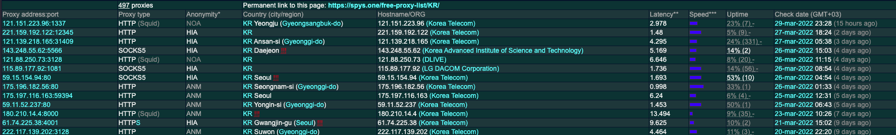

## 프록시로 서버 속이기

### 프록시 설명과 태그 분석

페이스북 같은 곳이 클라우드 IP를 차단하는 경우가 많이 생긴다. 이를 프록시를 통해 우회할 수 있다.
[프록시사이트](https://spys.one/free-proxy-list/KR/)에서 무료로 사용할 수 있는 가장 빠른 프록시 서버 IP를 가져와 크롤러에 적용하는 방법이다.



다양한 프록시 IP를 볼 수 있음

단, IP만 바꾼다고 해서 익명성이 항상 보장되지는 않는다. `anonymily`가 `NOA`인 경우 내가 누구인지 그대로 드러남. `HIA`나 `ANM`을 쓰면 익명성이 보장됨 참고하자!

이제 위 사이트에서 IP 주소와 Proxy type, latency 정보를 크롤러 내로 가져와야 한다. 태그 분석은 크롤링의 가장 기본이자 핵심이므로 개발자 도구에서 원하는 정보만 추출할 수 있는 방법을 찾은 뒤 코드에 추가해보면 된다.

`index.js`

```jsx
const puppeteer = require("puppeteer");
const dotenv = require("dotenv");
dotenv.config();

const crawler = async () => {
  try {
    const browser = await puppeteer.launch({
      headless: false,
      args: ["--window-size=1920,1080", "--disable-notifications"],
    });
    const page = await browser.newPage();
    await page.setViewport({ width: 1080, height: 1080 });

    // proxy 사이트 이동
    await page.goto("https://spys.one/free-proxy-list/KR/");
    const proxies = await page.evaluate(() => {
      // 원하는 태그 가져온다.
      document.querySelectorAll("tr > td:first-of-type > .spy14"); // IP
      Array.from(document.querySelectorAll("tr > td:nth-of-type(2)"))
        .slice(5)
        .map((v) => v.textContent); // Proxy type
      document.querySelectorAll("tr > td:nth-of-type(6) > .spy1"); // Latency 지연도
    });

    // ..
  } catch (e) {
    console.error(e);
  }
};

crawler();
```

### 프록시 ip 적용하기

이제 위에서 만든 정보들을 하나의 배열 안에 모으는 작업을 진행해보자.

`index.js`

```jsx
const puppeteer = require("puppeteer");
const dotenv = require("dotenv");
dotenv.config();

const crawler = async () => {
  try {
    // prettier-ignore
    const browser = await puppeteer.launch({ headless: false,args: ["--window-size=1920,1080", "--disable-notifications"] });
    const page = await browser.newPage();
    await page.setViewport({ width: 1080, height: 1080 });
    await page.goto("https://spys.one/free-proxy-list/KR/");
    const proxies = await page.evaluate(() => {
      // IP
      const ips = Array.from(document.querySelectorAll("tr > td:first-of-type > .spy14")).map((v) =>
        v.textContent.replace(/document\.write\(.+\)/, "")
      );
      // Proxy type
      const types = Array.from(document.querySelectorAll("tr > td:nth-of-type(2)"))
        .slice(5)
        .map((v) => v.textContent);
      // Latency 지연도
      const latencies = Array.from(document.querySelectorAll("tr > td:nth-of-type(6) > .spy1")).map(
        (v) => v.textContent
      );
      // Merge Data
      return ips.map((v, i) => ({
        ip: v,
        type: types[i],
        latencies: latencies[i],
      }));
    });
    console.log(proxies);
    await page.close();
    await browser.close();
  } catch (e) {
    console.error(e);
  }
};

crawler();

/*
[
	{ ip: '61.74.225.38:4001', type: 'HTTPS', latencies: '9.625' },
  { ip: '222.117.139.202:3128', type: 'HTTP', latencies: '4.464' },
  { ip: '112.168.200.30:80', type: 'HTTP', latencies: '1.295' },
  { ip: '59.15.154.94:443', type: 'SOCKS5', latencies: '1.783' },
  { ip: '125.141.139.60:5566', type: 'SOCKS5', latencies: '4.618' },
  { ip: '20.194.21.114:59394', type: 'HTTP', latencies: '6.693' },
  { ip: '221.168.32.66:9050', type: 'SOCKS5', latencies: '11.428' },
	// ..
]
*/
```

위처럼 크롤러를 돌리면 ip 목록들이 쭉 나오는 것을 확인할 수 있다.
이 데이터를 가장 빠른 `ip`로 정렬한 뒤 기징 첫번째 ip로 바꿔서 다시 브라우저를 키면 ip 속임이 가능하다.

```jsx
//..
const crawler = async () => {
  try {
    // ..
    const proxies = await page.evaluate(() => {
      /* codes.. */
    });

    // type이 HTTP, HTTPS로 시작하고, latencies가 가장 작은, 즉 가장 빠른 ip를 찾는다.
    const filtered = proxies.filter((v) => v.type.startsWith("HTTPS")).sort((p, c) => p.latencies - c.latencies);
    // 브라우저 종료
    await page.close();
    await browser.close();

    // 다시 브라우저를 킨다.
    browser = await puppeteer.launch({
      headless: false,
      args: [
        "--window-size=1920,1080",
        "--disable-notifications",
        `--proxy-server=${filtered[0].ip}`, // ip change!
        "--ignore-certificate-errors",
      ],
    });
    page = await browser.newPage();
    // ..
  } catch (e) {
    console.error(e);
  }
};

crawler();
```

위처럼 하면 기존에 사용하던 나의 Ip와 다른 프록시 ip를 알 수 있게됨 (현재 크로미움에서는 `err_proxy_connection_failed`를 뿌리고 있는데 이 부분은 자체적으로 사이트에서 막은 것으로 보임)
