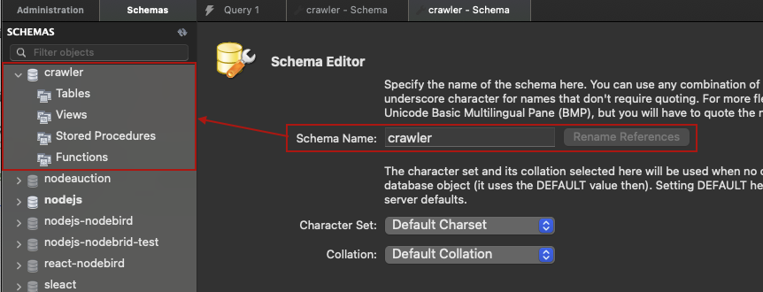
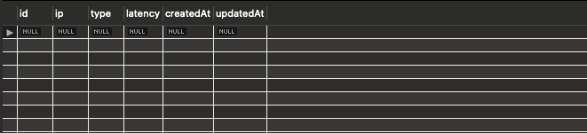
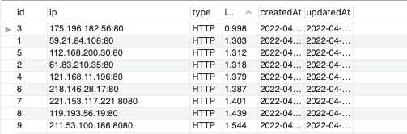

## 프록시로 서버 속이기

### 프록시 설명과 태그 분석

페이스북 같은 곳이 클라우드 IP를 차단하는 경우가 많이 생긴다. 이를 프록시를 통해 우회할 수 있다.
[프록시사이트](https://spys.one/free-proxy-list/KR/)에서 무료로 사용할 수 있는 가장 빠른 프록시 서버 IP를 가져와 크롤러에 적용하는 방법이다.


다양한 프록시 IP를 볼 수 있음

단, IP만 바꾼다고 해서 익명성이 항상 보장되지는 않는다. `anonymily`가 `NOA`인 경우 내가 누구인지 그대로 드러남. `HIA`나 `ANM`을 쓰면 익명성이 보장됨 참고하자!

이제 위 사이트에서 IP 주소와 Proxy type, latency 정보를 크롤러 내로 가져와야 한다. 태그 분석은 크롤링의 가장 기본이자 핵심이므로 개발자 도구에서 원하는 정보만 추출할 수 있는 방법을 찾은 뒤 코드에 추가해보면 된다.

`index.js`

```jsx
const puppeteer = require("puppeteer");
const dotenv = require("dotenv");
dotenv.config();

const crawler = async () => {
  try {
    const browser = await puppeteer.launch({
      headless: false,
      args: ["--window-size=1920,1080", "--disable-notifications"],
    });
    const page = await browser.newPage();
    await page.setViewport({ width: 1080, height: 1080 });

    // proxy 사이트 이동
    await page.goto("https://spys.one/free-proxy-list/KR/");
    const proxies = await page.evaluate(() => {
      // 원하는 태그 가져온다.
      document.querySelectorAll("tr > td:first-of-type > .spy14"); // IP
      Array.from(document.querySelectorAll("tr > td:nth-of-type(2)"))
        .slice(5)
        .map((v) => v.textContent); // Proxy type
      document.querySelectorAll("tr > td:nth-of-type(6) > .spy1"); // Latency 지연도
    });

    // ..
  } catch (e) {
    console.error(e);
  }
};

crawler();
```

### 프록시 ip 적용하기

이제 위에서 만든 정보들을 하나의 배열 안에 모으는 작업을 진행해보자.

`index.js`

```jsx
const puppeteer = require("puppeteer");
const dotenv = require("dotenv");
dotenv.config();

const crawler = async () => {
  try {
    // prettier-ignore
    const browser = await puppeteer.launch({ headless: false,args: ["--window-size=1920,1080", "--disable-notifications"] });
    const page = await browser.newPage();
    await page.setViewport({ width: 1080, height: 1080 });
    await page.goto("https://spys.one/free-proxy-list/KR/");
    const proxies = await page.evaluate(() => {
      // IP
      const ips = Array.from(document.querySelectorAll("tr > td:first-of-type > .spy14")).map((v) =>
        v.textContent.replace(/document\.write\(.+\)/, "")
      );
      // Proxy type
      const types = Array.from(document.querySelectorAll("tr > td:nth-of-type(2)"))
        .slice(5)
        .map((v) => v.textContent);
      // Latency 지연도
      const latencies = Array.from(document.querySelectorAll("tr > td:nth-of-type(6) > .spy1")).map(
        (v) => v.textContent
      );
      // Merge Data
      return ips.map((v, i) => ({
        ip: v,
        type: types[i],
        latencies: latencies[i],
      }));
    });
    console.log(proxies);
    await page.close();
    await browser.close();
  } catch (e) {
    console.error(e);
  }
};

crawler();

/*
[
	{ ip: '61.74.225.38:4001', type: 'HTTPS', latencies: '9.625' },
  { ip: '222.117.139.202:3128', type: 'HTTP', latencies: '4.464' },
  { ip: '112.168.200.30:80', type: 'HTTP', latencies: '1.295' },
  { ip: '59.15.154.94:443', type: 'SOCKS5', latencies: '1.783' },
  { ip: '125.141.139.60:5566', type: 'SOCKS5', latencies: '4.618' },
  { ip: '20.194.21.114:59394', type: 'HTTP', latencies: '6.693' },
  { ip: '221.168.32.66:9050', type: 'SOCKS5', latencies: '11.428' },
	// ..
]
*/
```

위처럼 크롤러를 돌리면 ip 목록들이 쭉 나오는 것을 확인할 수 있다.
이 데이터를 가장 빠른 `ip`로 정렬한 뒤 기징 첫번째 ip로 바꿔서 다시 브라우저를 키면 ip 속임이 가능하다.

```jsx
//..
const crawler = async () => {
  try {
    // ..
    const proxies = await page.evaluate(() => {
      /* codes.. */
    });

    // type이 HTTP, HTTPS로 시작하고, latencies가 가장 작은, 즉 가장 빠른 ip를 찾는다.
    const filtered = proxies.filter((v) => v.type.startsWith("HTTPS")).sort((p, c) => p.latencies - c.latencies);
    // 브라우저 종료
    await page.close();
    await browser.close();

    // 다시 브라우저를 킨다.
    browser = await puppeteer.launch({
      headless: false,
      args: [
        "--window-size=1920,1080",
        "--disable-notifications",
        `--proxy-server=${filtered[0].ip}`, // ip change!
        "--ignore-certificate-errors",
      ],
    });
    page = await browser.newPage();
    // ..
  } catch (e) {
    console.error(e);
  }
};

crawler();
```

위처럼 하면 기존에 사용하던 나의 Ip와 다른 프록시 ip를 알 수 있게됨 (현재 크로미움에서는 `err_proxy_connection_failed`를 뿌리고 있는데 이 부분은 자체적으로 사이트에서 막은 것으로 보임)

### 데이터베이스 연동하기

위처럼 ip 목록을 크롤링으로 직접 가져왔지만 실무에서는 해당 프록시 주소를 DB에 저장해서 사용한다. 이 뿐만아니라 상품 정보를 긁어오는 크롤링을 만들 때에도 긁어오는 상품 정보를 데이터베이스에 저장한 뒤 사용하게 됨.

따라서 크롤러에 데이터베이스를 연동하는 작업을 배워보도록 하자!
node 기반의 javascript 크롤러이므로 데이터베이스는 `sequelize`를 사용한다.

```bash
> npm i sequelize mysql2
> npm i -g sequelize-cli
```

db가 어떻게 연동되어서 동작하는지를 확인하고자 하므로 어떤 것을 사용해도 상관없음. (sequelize를 사용하려면 mysql2(mysql connector) 패키지를 함께 설치해줘야 한다. mysql2 라이센스에 우리 소스코드도 따라가면 된다.)
이후 MySQL 워크벤치를 열어 내 localhost 내부에 스키마를 새로 생성해준다.



이후 크롤러 프로젝트(index.js)가 있는 폴더에서 sequelize-init으로 db 관련 폴더가 생성되도록 추가해준다.

```bash
> sequelize init
```

위처럼 `init`으로 `sequelize`가 자동 생성되도록 해주면 해당 폴더에 `config`, `migrations`, `models`, `seeders` 폴더가 자동으로 생성됨

그리고 아래와 같이 몇가지 db 설정을 해준다.

`config/config.js`

`.env` 파일에 `SEQUELIZE_PASSWORD` 추가한 뒤 처리

```jsx
require("dotenv").config();

module.exports = {
  development: {
    username: "root",
    password: process.env.SEQUELIZE_PASSWORD,
    database: "nodejs-nodebird",
    host: "127.0.0.1",
    dialect: "mysql",
  },
  // ..
};
```

`models/proxy.js`

```jsx
module.exports = (sequelize, Sequelize) => {
  return sequelize.define("proxy", {
    ip: {
      type: Sequelize.STRING(30),
      allowNull: false,
    },
    type: {
      type: Sequelize.STRING(20),
      allowNull: false,
    },
    latency: {
      type: Sequelize.FLOAT.UNSIGNED,
      allowNull: false,
    },
  });
};
```

`models/index.js`

```jsx
const Sequelize = require("sequelize");
const env = process.env.NODE_ENV || "development";
const config = require("../config/config")[env];
const db = {};

const sequelize = new Sequelize(config.database, config.username, config.password, config);

db.Proxy = require("./proxy")(sequelize, Sequelize);

db.sequelize = sequelize;
db.Sequelize = Sequelize;

module.exports = db;
```

위처럼 설정해준 뒤 크롤러 코드에 db 연결 코드를 붙여주면 완성!

`index.js`

```jsx
// ..
const db = require("./models");

const crawler = async () => {
  await db.sequelize.sync(); // db 연결
  try {
    // ..
  } catch (e) {
    // ..
  }
};
```

위처럼 저장 후 `npm start`로 코드를 실행시키면 mysql db가 자동으로 연결되면서 crawler 스키마 내부 테이블에 정상적으로 테이블이 생성된 것을 확인할 수 있다.



### 크롤링 결과물 데이터베이스에 저장하기

실제 크롤링 결과물로 나오는 Proxy 정보를 db.Proxy에 저장해볼 차례이다.

`index.js`

```jsx
// ..

const crawler = async () => {
  await db.sequelize.sync(); // db 연결
  try {
    // ..
    const filtered = proxies.filter((v) => v.type.startsWith("HTTP")).sort((p, c) => p.latency - c.latency);
    // 1. db Proxy에 프록시 정보 저장
    await Promise.all(
      filtered.map(async (v) => {
        return db.Proxy.create({
          ip: v.ip,
          type: v.type,
          latency: v.latency,
        });
      })
    );
    await page.close();
    await browser.close();

    // 2. 가장 빠른 latency를 가져온다.
    const fastestProxy = await db.Proxy.findOne({
      order: [["latency", "ASC"]],
    });

    // 3. 브라우저 restart
    console.log(`restart ip: ${fastestProxy.ip}`); // restart ip: 175.196.182.56:80}
    browser = await puppeteer.launch({
      headless: false,
      args: [
        "--window-size=1920,1080",
        "--disable-notifications",
        `--proxy-server=${fastestProxy.ip}`,
        "--ignore-certificate-errors",
        "--ignore-certificate-errors-spki-list ",
      ],
    });

    // codes..
    await page.close();
    await browser.close();
    await db.sequelize.close(); // 4. db connection 닫기
  } catch (e) {
    console.error(e);
  }
};

crawler();
```

1. `Promise.all` 내부로 프록시 정보를 저장하는 코드를 추가해준 뒤 브라우저를 종료한다.

   

2. DB에서 가장 빠른 `latency`를 `findOne` 메서드로 찾아온다.
3. 해당 정보를 `puppeteer.launch` 내 `args` 옵션으로 추가해주면 `ip`가 정상적으로 변경됨
4. 모든 작업이 완료되면 `db.sequelize.close();` 로 db connection을 종료해준다.

### 브라우저 여러 개 사용하기

puppeteer에서는 브라우저를 여러 개 사용할 수 있는 API도 제공한다. 만약 크롤러를 통해 가지고 온 proxy 정보를 여러 개의 브라우저를 띄워 사용하게 되면 더 많은 일을 효율적으로 수행할 수 있게된다.

`index.js`

```jsx
// ..

const crawler = async () => {
  await db.sequelize.sync(); // db 연결
  try {
    // ..
    await Promise.all(
      filtered.map(async (v) => {
        // upsert는 없으면 create 있으면 override
        return db.Proxy.upsert({
          ip: v.ip,
          type: v.type,
          latency: v.latency,
        });
      })
    );
    await page.close();
    await browser.close();

    // 빠른 latency 순으로 배열을 가져온다. findAll
    const fastestProxies = await db.Proxy.findAll({
      order: [["latency", "ASC"]],
    });

    // 브라우저 restart
    browser = await puppeteer.launch({
      headless: true,
      args: [
        "--window-size=1920,1080",
        "--disable-notifications",
        `--proxy-server=${fastestProxies[0].ip}`,
        "--ignore-certificate-errors",
        "--ignore-certificate-errors-spki-list ",
      ],
    });
    const browser2 = await puppeteer.launch({
      headless: true,
      args: [
        "--window-size=1920,1080",
        "--disable-notifications",
        `--proxy-server=${fastestProxies[1].ip}`,
        "--ignore-certificate-errors",
        "--ignore-certificate-errors-spki-list ",
      ],
    });
    const browser3 = await puppeteer.launch({
      headless: true,
      args: [
        "--window-size=1920,1080",
        "--disable-notifications",
        `--proxy-server=${fastestProxies[2].ip}`,
        "--ignore-certificate-errors",
        "--ignore-certificate-errors-spki-list ",
      ],
    });

    const page1 = await browser.newPage();
    const page2 = await browser2.newPage();
    const page3 = await browser3.newPage();

    await page1.goto("https://github.com/wonieeVicky");
    await page2.goto("https://github.com/wonieeVicky");
    await page3.goto("https://github.com/wonieeVicky");

    await db.sequelize.close(); // db connection 닫기
  } catch (e) {
    console.error(e);
  }
};

crawler();
```

위처럼 처리하면 browser를 여러개 띄워서 크롤링을 할 수 있다. 단, 이렇게 하나의 서버에서 여러 개의 브라우저를 띄우는 것은 메모리를 많이 먹게 되므로 여러개의 서버를 띄워 해당 서버에서 하나의 브라우저만 실행되도록 하는 것이 더 바람직할 수 있다. 때에 따라 알맞게 사용하도록 하자!
