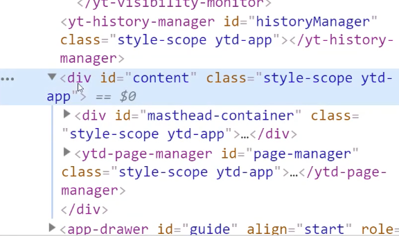

## 유튜브 크롤링 구현

### 유튜브 크롤링 준비와 browswerFetcher

유튜브 크롤링을 하기 위해 기본 크롤러 default 소스로 크롤러를 실행해본다.

`index.js`

```jsx
const puppeteer = require("puppeteer");
const dotenv = require("dotenv");
dotenv.config();

const crawler = async () => {
  try {
    const browser = await puppeteer.launch({
      headless: false,
      args: ["--window-size=1920,1080", "--disable-notifications"],
    });
    const page = await browser.newPage();
    await page.setViewport({
      width: 1080,
      height: 1080,
    });
    await page.goto("https://youtube.com");

    // await page.close();
    // await browser.close();
  } catch (e) {
    console.error(e);
  }
};
```

위처럼 코드 작성 후 유튜브에 접근하면 페이지가 정상적으로 뜨지않는 이슈가 발생할 수 있다.


이유는 puppeteer가 사용하는 chromium의 버전이 유튜브에서 지원하는 브라우저와 버전이 맞지 않아서 생기는 이슈! 이러한 점을 개선하기 위해 구글에서는 모든 운영체제에서 지원이 가능한 chrome 버전을 다운로드 받을 수 있도록 제공한다. 먼저 버전을 찾는 소스를 프로젝트에 추가해본다.

`check_availability.js`

```jsx
/**
 * Copyright 2017 Google Inc. All rights reserved.
 *
 * Licensed under the Apache License, Version 2.0 (the "License");
 * you may not use this file except in compliance with the License.
 * You may obtain a copy of the License at
 *
 *     http://www.apache.org/licenses/LICENSE-2.0
 *
 * Unless required by applicable law or agreed to in writing, software
 * distributed under the License is distributed on an "AS IS" BASIS,
 * WITHOUT WARRANTIES OR CONDITIONS OF ANY KIND, either express or implied.
 * See the License for the specific language governing permissions and
 * limitations under the License.
 */

const assert = require("assert");
const puppeteer = require("puppeteer");
const https = require("https");
const SUPPORTER_PLATFORMS = ["linux", "mac", "win32", "win64"];

const fetchers = SUPPORTER_PLATFORMS.map((platform) => puppeteer.createBrowserFetcher({ platform }));

/* 코드 생략.. */

/**
 * @param {string} text
 * @param {number} length
 * @return {string}
 */
function padCenter(text, length) {
  const printableCharacters = filterOutColors(text);
  if (printableCharacters.length >= length) return text;
  const left = Math.floor((length - printableCharacters.length) / 2);
  const right = Math.ceil((length - printableCharacters.length) / 2);
  return spaceString(left) + text + spaceString(right);
}
```

위 소스는 구글에서 제공. 그대로 옮겨붙임
해당 파일을 base로 하여 쉘에 해당 스크립트를 실행시키면 아래와 같이 실행됨

```bash
> node check_availability
           linux   mac   win32  win64
  995684     +      +      -      -
  995683     +      +      +      +
  995682     -      -      -      -
  995681     -      -      -      -
  995680     +      -      -      -
  995679     -      -      -      -
  995678     -      -      -      -
  995677     -      -      -      -
  995676     +      -      -      -
  995675     -      +      -      -
  995674     -      -      -      -
  995673     -      -      -      -
  995672     -      -      -      -
  995671     -      -      -      -
  995670     -      -      -      -
```

그럼 위에서 모든 버전을 다 지원하는 버전인 995683버전을 사용하면 된다는 것을 알 수 있음!
이를 크롤러 소스에 아래와 같이 적용해본다.

`index.js`

```jsx
// ..
const crawler = async () => {
  try {
    const browserFetcher = puppeteer.createBrowserFetcher(); // 브라우저 가져오기
    const revisionInfo = await browserFetcher.download("995683"); // 버전정보 가져오기
    const browser = await puppeteer.launch({
      headless: false,
      executablePath: revisionInfo.executablePath, // 995683 version 브라우저가 실행됨
      args: ["--window-size=1920,1080", "--disable-notifications"],
    });
    // ..
  } catch (e) {
    console.error(e);
  }
};
```

위처럼 puppeteer.createBrowserFetcher 함수를 실행하여 원하는 버전을 다운로드받아 적용하면 유튜브 화면이 정상적으로 노출되는 것을 확인할 수 있다!
버전 문제가 발생할 수 있으며, 어떻게 개선해나가는지 방법을 이해하도록 해보자

### 로그인 및 waitUntil로 로딩 기다리기

유튜브는 사이트를 웹 컴포넌트를 사용하여 구축했음. 따라서 일반 div, span 태그 등의 기본적 마크업 언어가 아닌 본인들만의 태그를 만들어서 섞어서 사이트를 구성함.



웹 컴포넌트는 컴포넌트를 단위별로 서비스 특징에 맞춰 커스텀 개발한 것이라고 보면된다.
또 크롤링 시 로그인 버튼의 디자인이 바뀐다거나 하는 이슈가 있으니 선택자를 잘 골라서 개발해야 한다.

유튜브 태그를 분석하여 로그인 영역 엘리먼트를 가져왔다면, 이제 로그인을 구현해본다.
오늘은 `waitUntil`이라는 메서드로 모든 네트워크가 완료된 이후에 크롤러가 실행되도록 만들어본다!

`index.js`

```jsx
//..

const crawler = async () => {
  try {
    // ..
    await page.goto("https://youtube.com", {
      // page 전환되자마자 이벤트 실행되지 않도록 모든 이벤트를 기다리도록 커스텀
      // 유튜브 동영상 로딩할 때에는 networkidle0을 쓰면 안됨: 계속 스트림 네트워크 발생
      // networkidle0: 모든 네트워크가 다 호출되었을 때 실행
      // networkidle2: 2개 네트워크가 마무리 되지 않아도 허용 후 크롤러 실행
      // domcontentloaded: 돔 호출 완료 시
      waitUntil: "networkidle0",
    });

    await page.waitForSelector("#buttons ytd-button-renderer:last-child a");
    await page.click("#buttons ytd-button-renderer:last-child a");

    // await page.close();
    // await browser.close();
  } catch (e) {
    console.error(e);
  }
};

crawler();
```

위처럼 waitUntil 메서드를 `page.goto`함수의 인자로 넣어주면 네트워크 진행 후 크롤러가 실행되도록 상세히 설정할 수 있다.
(돔 로딩이 완료되었을떄, 미완료 네트워크가 n개 남았을 때 등등)

### 구글 로그인 구현

구글 로그인은 API가 제공되어 굳이 크롤링을 하지 않아도 되지만 다양한 환경에서 크롤링을 구현해보면 좋으므로 한번 도전해본다.

`index.js`

```jsx
// ..
const crawler = async () => {
  try {
    // ..
		// 로그인 버튼 클릭
    await page.waitForSelector("#buttons ytd-button-renderer:last-child a");
    await page.click("#buttons ytd-button-renderer:last-child a");
    await page.waitForNavigation({
      waitUntil: "networkidle2", // 네트워크 상황 체크
    });

		// 아이디 입력
    await page.waitForSelector("#identifierId");
    await page.type("#identifierId", process.env.EMAIL); // email type
    await page.waitForSelector("#identifierNext");
    await page.click("#identifierNext"); // 다음 페이지 넘어가기

		// 비밀번호 입력
    await page.waitForSelector('input[type="password"]');
    // await page.type('input[type="password"]', process.env.PASSWORD);
		// 위 코드 error 발생! 아래 방법으로 우회
    await page.evaluate((password) => {
      document.querySelector('input[type="password"]').value = password;
    }, process.env.PASSWORD);

    await page.waitForTimeout(3000);
    await page.waitForSelector("#passwordNext");
    await page.click("#passwordNext"); // 다음 창으로 넘어가기

    await page.waitForNavigation({
      waitUntil: "networkidle2",
    });
    console.log("youtube main!");

		// ..
  }
};
```

로그인 과정에서 비밀번호 입력창에서 해당 엘리먼트를 잘 찾아오지 못하는 발생했다.
이럴 땐 기존 방법을 우회하여 evaluate 함수로 직접 해당 인풋에 타이핑하여 값을 넣어주는 방식으로 구현한다.

모든 건 안되는 건 없으니 방법을 찾아서 적용해보면 좋다 :) 구글 로그인 유지도 함께 적용해보자.

```jsx
// ..
const crawler = async () => {
  try {
    // ..
		// 로그인 정보 userDataDir에 적용
    const browser = await puppeteer.launch({
			// ..
      userDataDir: "/Users/uneedcomms/Library/Application Support/Google/Chrome/Default", // login 쿠키 삽입 - 첫 시도는 직접 로그인
    });

	  // 유튜브 진입
		// 만약 로그인 존재하는 #avatar-btn이 없으면
    if (!(await page.$("#avatar-btn"))) {
      // 로그인 시도 ..
      await page.waitForNavigation({ waitUntil: "networkidle2" });
    } else {
      console.log("이미 로그인 됨");
    }
  }
};
```

로그인 쿠키가 없을 경우 if문 분기 처리하여 로그인 로직을 가둔 뒤, else에 유튜브에서 할 일을 적어넣는다.
