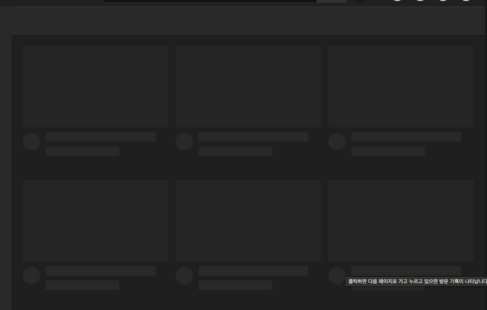

## 유튜브 크롤링 구현

### 유튜브 크롤링 준비와 browswerFetcher

유튜브 크롤링을 하기 위해 기본 크롤러 default 소스로 크롤러를 실행해본다.

`index.js`

```jsx
const puppeteer = require("puppeteer");
const dotenv = require("dotenv");
dotenv.config();

const crawler = async () => {
  try {
    const browser = await puppeteer.launch({
      headless: false,
      args: ["--window-size=1920,1080", "--disable-notifications"],
    });
    const page = await browser.newPage();
    await page.setViewport({
      width: 1080,
      height: 1080,
    });
    await page.goto("https://youtube.com");

    // await page.close();
    // await browser.close();
  } catch (e) {
    console.error(e);
  }
};
```

위처럼 코드 작성 후 유튜브에 접근하면 페이지가 정상적으로 뜨지않는 이슈가 발생할 수 있다.



이유는 puppeteer가 사용하는 chromium의 버전이 유튜브에서 지원하는 브라우저와 버전이 맞지 않아서 생기는 이슈! 이러한 점을 개선하기 위해 구글에서는 모든 운영체제에서 지원이 가능한 chrome 버전을 다운로드 받을 수 있도록 제공한다. 먼저 버전을 찾는 소스를 프로젝트에 추가해본다.

`check_availability.js`

```jsx
/**
 * Copyright 2017 Google Inc. All rights reserved.
 *
 * Licensed under the Apache License, Version 2.0 (the "License");
 * you may not use this file except in compliance with the License.
 * You may obtain a copy of the License at
 *
 *     http://www.apache.org/licenses/LICENSE-2.0
 *
 * Unless required by applicable law or agreed to in writing, software
 * distributed under the License is distributed on an "AS IS" BASIS,
 * WITHOUT WARRANTIES OR CONDITIONS OF ANY KIND, either express or implied.
 * See the License for the specific language governing permissions and
 * limitations under the License.
 */

const assert = require("assert");
const puppeteer = require("puppeteer");
const https = require("https");
const SUPPORTER_PLATFORMS = ["linux", "mac", "win32", "win64"];

const fetchers = SUPPORTER_PLATFORMS.map((platform) => puppeteer.createBrowserFetcher({ platform }));

/* 코드 생략.. */

/**
 * @param {string} text
 * @param {number} length
 * @return {string}
 */
function padCenter(text, length) {
  const printableCharacters = filterOutColors(text);
  if (printableCharacters.length >= length) return text;
  const left = Math.floor((length - printableCharacters.length) / 2);
  const right = Math.ceil((length - printableCharacters.length) / 2);
  return spaceString(left) + text + spaceString(right);
}
```

위 소스는 구글에서 제공. 그대로 옮겨붙임
해당 파일을 base로 하여 쉘에 해당 스크립트를 실행시키면 아래와 같이 실행됨

```bash
> node check_availability
           linux   mac   win32  win64
  995684     +      +      -      -
  995683     +      +      +      +
  995682     -      -      -      -
  995681     -      -      -      -
  995680     +      -      -      -
  995679     -      -      -      -
  995678     -      -      -      -
  995677     -      -      -      -
  995676     +      -      -      -
  995675     -      +      -      -
  995674     -      -      -      -
  995673     -      -      -      -
  995672     -      -      -      -
  995671     -      -      -      -
  995670     -      -      -      -
```

그럼 위에서 모든 버전을 다 지원하는 버전인 995683버전을 사용하면 된다는 것을 알 수 있음!
이를 크롤러 소스에 아래와 같이 적용해본다.

`index.js`

```jsx
// ..
const crawler = async () => {
  try {
    const browserFetcher = puppeteer.createBrowserFetcher(); // 브라우저 가져오기
    const revisionInfo = await browserFetcher.download("995683"); // 버전정보 가져오기
    const browser = await puppeteer.launch({
      headless: false,
      executablePath: revisionInfo.executablePath, // 995683 version 브라우저가 실행됨
      args: ["--window-size=1920,1080", "--disable-notifications"],
    });
    // ..
  } catch (e) {
    console.error(e);
  }
};
```

위처럼 puppeteer.createBrowserFetcher 함수를 실행하여 원하는 버전을 다운로드받아 적용하면 유튜브 화면이 정상적으로 노출되는 것을 확인할 수 있다! 버전 문제가 발생할 수 있으며, 어떻게 개선해나가는지 방법을 이해하도록 해보자
