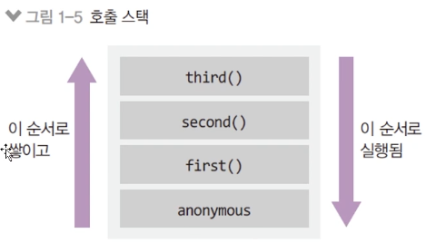

# 1) 호출 스택 알아보기

## 2-1. 호출 스택

아래의 코드가 어떻게 실행될까?

```jsx
function first() {
  second();
  console.log("첫 번쨰");
}
function second() {
  third();
  console.log("두 번째");
}
function third() {
  console.log("세 번째");
}
first();
```

- 위 코드의 순서 예측
- 쉽게 파악하는 방법: 호출 스택 그리기

  

- 호출 스택(함수의 호출, 자료구조의 스택)
  - Anonymous는 가상의 전역 컨텍스트(항상 있다고 생각하는게 좋음)
  - 함수 호출 순서대로 쌓이고, 역순으로 실행된다.
  - 함수 실행이 완료되면 스택에서 빠진다
  - LIFO 구조라서 스택이라고 불린다. (Last In First Out)

```jsx
function run() {
  console.log("3초 후 실행");
}
console.log("시작");
setTimeout(run, 3000);
console.log("끝");
```

- 위 코드의 순서 예측
- 호출 스택만으로는 설명이 안된다. (run은 호출 안했는데..?)
- 호출 스택 + 이벤트 루프로 설명할 수 있다.
