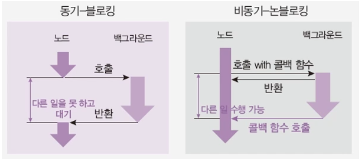

# 11. 파일 시스템 사용하기

## 11-1. fs

파일 시스템에 접근하는 모듈

- 파일/폴더 생성, 삭제, 읽기, 쓰기 가능
- 웹 브라우저에서는 제한적이었으나 노드는 권한을 가지고 있음
- 파일 읽기 예제(결과의 버퍼는 뒤에서 설명함)

  ```jsx
  //readme.txt
  나를 읽어주세요.

  // read.js
  const fs = require("fs");

  fs.readFile("./readme.txt", (err, data) => {
    if (err) {
      throw err;
    }
    console.log(data);
    console.log(data.toString());
  });

  // 혹은
  const fs = require("fs").promises;

  fs.readFile("./readme.txt")
    .then((data) => {
      console.log(data);
      console.log(data.toString());
    })
    .catch((err) => {
      throw err;
    });
  ```

  ```bash
  $ node read
  <Buffer ef bb bf eb 82 98 eb a5 bc 20 ec 9d bd ec 96 b4 ec a3 bc ec 84 b8 ec 9a 94>
  나를 읽어주세요
  ```

- 파일 생성 예제

  ```jsx
  const fs = require("fs").promises;

  fs.writeFile("./writeme.txt", "글을 입력합니다.")
    .then(() => {
      return fs.readFile("./writeme.txt");
    })
    .then((data) => {
      console.log(data.toString());
    })
    .catch((err) => {
      throw err;
    });
  ```

  `writeme.txt` 생성

  ```jsx
  글을 입력합니다.
  ```

  ```bash
  $ node test
  글을 입력합니다.
  ```

- 상기 코드에서 콜백 함수로 파일 생성 등을 구현한 이유는 백그라운로 넘어가면 코드가 동시에 실행되므로 실행순서가 보장되지 않기 때문이다. 가령 예를 들면 writeFile을 동일하게 4개를 실행하면 1,2,3,4로 실행되는 것이 아니라 4,3,1,2 등으로 순서가 섞여버리기 때문에 콜백 함수로 구현하였다.

## 11-2. 동기 메서드와 비동기 메서드

- 이전 예제를 여러 번 실행해보기
  - 매 번 순서가 다르게 실행된다.
  - 순서에 맞게 실행하려면?
- 동기와 비동기: 백그라운드 작업 완료 확인 여부
- 블로킹과 논 블로킹: 함수가 바로 return 되는지 여부
- 노드에서는 대부분 동기 - 블로킹 방식과 비동기 - 논 블로킹 방식이다.

  

- 동기 처리 방식의 예

  ```jsx
  const fs = require("fs");

  fs.readFile("./readme.txt", (err, data) => {
    if (err) {
      throw err;
    }
    console.log("1번:", data.toString());
  });
  fs.readFile("./readme.txt", (err, data) => {
    if (err) {
      throw err;
    }
    console.log("2번:", data.toString());
  });
  fs.readFile("./readme.txt", (err, data) => {
    if (err) {
      throw err;
    }
    console.log("3번:", data.toString());
  });
  fs.readFile("./readme.txt", (err, data) => {
    if (err) {
      throw err;
    }
    console.log("4번:", data.toString());
  });
  ```

  ```bash
  $ node test
  4번: 나를 읽어주세요
  1번: 나를 읽어주세요
  2번: 나를 읽어주세요
  3번: 나를 읽어주세요
  ```

- 비동기 처리 방식의 예

  ```jsx
  const fs = require("fs");

  let data = fs.readFileSync("./readme.txt");
  console.log("1번:", data.toString());
  data = fs.readFileSync("./readme.txt");
  console.log("2번:", data.toString());
  data = fs.readFileSync("./readme.txt");
  console.log("3번:", data.toString());
  data = fs.readFileSync("./readme.txt");
  console.log("4번:", data.toString());
  ```

  혹은 async를 활용하여 구현

  ```jsx
  const fs = require("fs").promises;

  async function main() {
    let data = await fs.readFile("./readme.txt");
    console.log("1번:", data.toString());
    data = await fs.readFile("./readme.txt");
    console.log("2번:", data.toString());
    data = await fs.readFile("./readme.txt");
    console.log("3번:", data.toString());
    data = await fs.readFile("./readme.txt");
    console.log("4번:", data.toString());
  }
  main();
  ```

  ```bash
  $ node test
  1번: 나를 읽어주세요
  2번: 나를 읽어주세요
  3번: 나를 읽어주세요
  4번: 나를 읽어주세요
  ```
