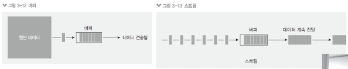

# 12. 버퍼와 스트림 이해하기

## 버퍼 사용하기

- 일정한 크기로 모아두는 데이터
- 일정한 크기가 되면 한 번에 처리
- 버퍼링: 버퍼에 데이터가 찰 때까지 모으는 작업
- 노드에서는 Buffer 객체 사용

  ```jsx
  const buffer = Buffer.from("저를 버퍼로 바꿔보세요");
  console.log("from():", buffer); // 0, 1을 16진법으로 표현
  console.log("length:", buffer.length); // 32바이트
  console.log("toString():", buffer.toString()); // 문자열로 변환

  const array = [Buffer.from("띄엄 "), Buffer.from("띄엄 "), Buffer.from("띄어쓰기")];
  const buffer2 = Buffer.concat(array); // 버퍼를 합침
  console.log("concat():", buffer2.toString());

  const buffer3 = Buffer.alloc(5); // 5바이트짜리 빈 버퍼를 만들 때 사용
  console.log("alloc():", buffer3);
  ```

  ```jsx
  from(): <Buffer ec a0 80 eb a5 bc 20 eb b2 84 ed 8d bc eb a1 9c 20 eb b0 94 ea bf 94 eb b3 b4 ec 84 b8 ec 9a 94>
  length: 32
  toString(): 저를 버퍼로 바꿔보세요
  concat(): 띄엄 띄엄 띄어쓰기
  alloc(): <Buffer 00 00 00 00 00>
  ```

## 스트림 사용하기

- 데이터의 흐름
- 일정한 크기로 나눠서 여러 번에 걸쳐서 처리
- 버퍼(또는 청크)의 크기를 작게 만들어서 주기적으로 데이터를 전달
- 버퍼 방식에 비해 메모리를 아낄 수 있다.
- 스트리밍: 일정한 크기의 데이터를 지속적으로 전달하는 작업

  

- 스트림 사용 예시

  ```
  저는 조금씩 조금씩 나눠서 전달됩니다. 나눠진 조각을 chunk라고 부릅니다.
  안녕하세요. 헬로 노드 헬로 스트림 헬로 버퍼
  ```

  만약 위의 문장을 스트림 방식으로 읽어들이고 싶다면 아래와 같이 한다.

  ```jsx
  const fs = require("fs");
  const readStream = fs.createReadStream("./readme.txt");
  const data = [];
  readStream.on("data", (chunk) => {
    data.push(chunk);
    console.log("data:", chunk, chunk.length);
  });
  readStream.on("end", () => {
    console.log("end: ", Buffer.concat(data).toString());
  });
  readStream.on("error", (err) => {
    console.log("error:", err);
  });
  ```

  ```bash
  $ node test
  data: <Buffer ef bb bf ec a0 80 eb 8a 94 20 ec a1 b0 ea b8 88 ec 94 a9 20 ec a1 b0 ea b8 88 ec 94 a9 20 eb 82 98 eb 88 a0 ec 84 9c 20 ec a0 84 eb 8b ac eb 90 a9 eb ... 114 more bytes> 164
  end:  저는 조금씩 조금씩 나눠서 전달됩니다. 나눠진 조각을 chunk라고 부릅니다.
  안녕하세요. 헬로 노드 헬로 스트림 헬로 버퍼
  ```

  스트림은 1바이트씩 조각조각으로 나눠서 읽어들인다고 했는데 왜 Buffer에 모두 담길까? `createReadStream` 처음에 64키로바이트를 읽어버리므로 나누지 않고 한번에 읽어버린 것이다.

  만약 나눠서 읽는 것을 테스트해보고 싶다면 64KB 이상의 파일을 읽어들이거나 `createReadStream`의 두번째 인자로 highWaterMark를 설정해주면 된다.

  ```jsx
  const readStream = fs.createReadStream("./readme.txt", { highWaterMark: 16 });
  ```

  ```bash
  $ node test
  data: <Buffer ef bb bf ec a0 80 eb 8a 94 20 ec a1 b0 ea b8 88> 16
  data: <Buffer ec 94 a9 20 ec a1 b0 ea b8 88 ec 94 a9 20 eb 82> 16
  data: <Buffer 98 eb 88 a0 ec 84 9c 20 ec a0 84 eb 8b ac eb 90> 16
  data: <Buffer a9 eb 8b 88 eb 8b a4 2e 20 eb 82 98 eb 88 a0 ec> 16
  data: <Buffer a7 84 20 ec a1 b0 ea b0 81 ec 9d 84 20 63 68 75> 16
  data: <Buffer 6e 6b eb 9d bc ea b3 a0 20 eb b6 80 eb a6 85 eb> 16
  data: <Buffer 8b 88 eb 8b a4 2e 0a ec 95 88 eb 85 95 ed 95 98> 16
  data: <Buffer ec 84 b8 ec 9a 94 2e 20 ed 97 ac eb a1 9c 20 eb> 16
  data: <Buffer 85 b8 eb 93 9c 20 ed 97 ac eb a1 9c 20 ec 8a a4> 16
  data: <Buffer ed 8a b8 eb a6 bc 20 ed 97 ac eb a1 9c 20 eb b2> 16
  data: <Buffer 84 ed 8d bc> 4
  end:  저는 조금씩 조금씩 나눠서 전달됩니다. 나눠진 조각을 chunk라고 부릅니다.
  안녕하세요. 헬로 노드 헬로 스트림 헬로 버퍼
  ```

  그럼 위와 같이 문서가 16바이트씩 나뉘어서 읽혀진다. 한번에 162Byte를 읽어들이는 버퍼 방식에 비해 메모리가 16바이트만 있어도 프로그램이 돌아가기 때문이다. 따라서 대용량 파일 서버를 만들 때에는 스트림 방식이 필수이다. (예를 들어 서버 100기가 짜리 파일을 나눠서 읽어 전송하면 된다!)

  파일을 쓸 때도 스트림 방식은 효율적이다.

  ```jsx
  const fs = require("fs");
  const writeStream = fs.createWriteStream("./writeme.txt");
  writeStream.on("finish", () => {
    console.log("파일 쓰기 완료");
  });
  writeStream.write("이 글을 씁니다.\n");
  writeStream.write("한번 더 씁니다.\n");
  writeStream.end();
  ```

  ```bash
  $ node
  파일 쓰기 완료
  ```

  `writeme.txt`

  ```jsx
  이 글을 씁니다.
  한번 더 씁니다.
  ```
