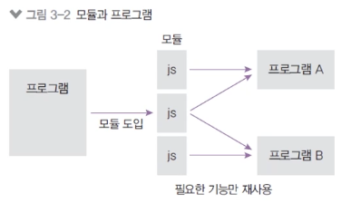

# 2. 모듈 만들기

**노드는 자바스크립트 코드를 모듈로 만들 수 있다.**



- 모듈: 특정한 기능을 하는 함수나 변수들의 집합
- 모듈로 만들면 여러 프로그램에서 재사용 가능

**같은 폴더 내에 var.js, func.js, index.js 만들기**

- 파일 끝에 module exports로 모듈로 만들 값을 지정
- 다른 파일에서 require(파일경로)로 그 모듈의 내용을 가져올 수 있다.

`var.js`

```jsx
const odd = "홀수입니다";
const even = "짝수입니다";

module.exports = {
  odd,
  even,
  checkOddOrEven,
};
```

`func.js`

```jsx
const odd = "홀수입니다";
const even = "짝수입니다";

function checkOddOrEven(num) {
  if (num % 2) {
    return odd;
  }
  return even;
}

module.exports = checkOddOrEven;
```

`index.js`

```jsx
const { odd, even } = require("./var"); // module.exports를 구조분해 할당한 값
const checkNumber = require("./func"); // 변수명은 마음대로 지어도 된다.

function checkStringOddOrEven(str) {
  if (str.length % 2) {
    return odd;
  }
  return even;
}

console.log(checkNumber(10));
console.log(checkStringOddOrEven("hello"));
```

위 코드를 `node index`란 명령어로 REPL에서 실행해보면 **`짝수입니다 홀수입니다`** 가 출력된다.

**자바스크립트 자체 모듈 시스템 문법이 생겼다.**

- 아직 노드에서의 지원은 완벽하지 않다. .mjs 확장자를 사용해야 한다.
- 크게는 require 대신 import, module exports 대신 export default를 쓰는 것으로 바뀐다.
