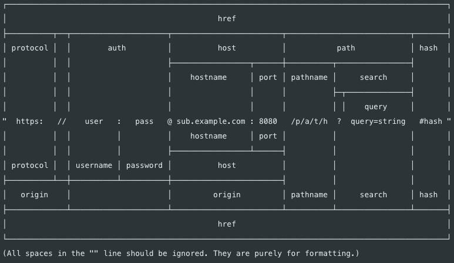

# 8. url과 querystring

## 8-1. url 모듈

인터넷 주소를 쉽게 조작하도록 도와주는 모듈

- url 처리에 크게 두 가지 방식이 있음(기존 노드 방식 vs WHATWG 방식)
- 아래 그림에서 가운데 주소를 기준으로 위쪽은 기존 노드 방식, 아래쪽은 WHATWG 방식
- 자세한 사항은 [node.js 공식문서](https://nodejs.org/dist/latest-v15.x/docs/api/url.html)에서 확인하자



> 외우려고 하지말자. 쓰다보면 자연스럽게 외워진다.

## 8-2. url 모듈 예제

url 모듈 안에 URL 생성자가 있다. 이 생성자에 주소를 넣어 객체로 만들면 주소가 부분별로 정리된다. 이 방식이WHATWG의 url이다. WHATWG에만 있는 username, password, origin, searchParams 속성이 존재한다.

```jsx
const url = require("url");
const { URL } = url;

const myURL = new URL("https://github.com/wonieeVicky?name=woniee#honor");
console.log("new URL():", myURL);
console.log("url.format():", url.format(myURL));

console.log("-----------------------");

const parseUrl = url.parse("https://github.com/wonieeVicky?name=woniee#honor");
console.log("url.parse()", parseUrl);
console.log("url.format():", url.format(parseUrl));
```

```bash
new URL(): URL {
  href: 'https://github.com/wonieeVicky?name=woniee#honor',
  origin: 'https://github.com',
  protocol: 'https:',
  username: '',
  password: '',
  host: 'github.com',
  hostname: 'github.com',
  port: '',
  pathname: '/wonieeVicky',
  search: '?name=woniee',
  searchParams: URLSearchParams { 'name' => 'woniee' },
  hash: '#honor'
}
url.format(): https://github.com/wonieeVicky?name=woniee#honor
-----------------------
url.parse() Url {
  protocol: 'https:',
  slashes: true,
  auth: null,
  host: 'github.com',
  port: null,
  hostname: 'github.com',
  hash: '#honor',
  search: '?name=woniee',
  query: 'name=woniee',
  pathname: '/wonieeVicky',
  path: '/wonieeVicky?name=woniee',
  href: 'https://github.com/wonieeVicky?name=woniee#honor'
}
url.format(): https://github.com/wonieeVicky?name=woniee#honor
```

## 8-3. url 모듈 메서드

기존 노드 방식 메서드

- url.param(주소): 주소를 분해한다. WHATWG 방식과 비교하면 username과 password 대신 auth 속성이 있고, searchParams 대신 query가 있다.
- url.format(주소): WHATWG 방식의 url과 기존 노드의 url 모두 사용할 수 있다. 분해되었던 url 객체를 다시 원래 상태로 조립한다.

## 8-4. searchParams

WHATWG 방식에서 쿼리스트링(search) 부분 처리를 도와주는 객체

- ?page=3&limit=10&category=nodejs&category=javascript 부분
- getAll(키): 키에 해당하는 모든 값들을 가져온다. category 키에는 두 가지 값, 즉 nodejs와 javascript의 값이 들어있다.
- get(키): 키에 해당하는 첫 번째 값만 가져온다.
- has(키): 해당 키가 있는지 없는지를 검사한다.
- keys(): searchParams의 모든 키를 반복키(iterator, ES2015 문법) 객체로 가져온다.
- values(): searchParams의 모든 값을 반복기 객체로 가져온다.
- append(키, 값): 해당 키를 추가한다. 같은 키의 값이 있다면 유지하고 하나 더 추가한다.
- set(키, 값): append와 비슷하지만 같은 키의 값들을 모두 지우고 새로 추가한다.
- delete(키): 해당 키를 제거한다.
- toString(): 조작한 searchParams 객체를 다시 문자열로 만든다. 이 문자열을 search에 대입하면 주소에 반영된다.

```jsx
const { URL } = require("url");

const myURL = new URL(
  "http://www.github.io/wonieeVicky?page=3&limit=10&category=nodejs&category=javascript"
);
console.log("searchParams:", myURL.searchParams);
console.log("searchParams.getAll():", myURL.searchParams.getAll("category"));
console.log("searchParams.get():", myURL.searchParams.get("limit"));
console.log("myURL.searchParams.keys():", myURL.searchParams.keys());
console.log("myURL.searchParams.values():", myURL.searchParams.values());

myURL.searchParams.append("filter", "es3");
myURL.searchParams.append("filter", "es5");
console.log(myURL.searchParams.getAll("filter"));

myURL.searchParams.set("filter", "es6");
console.log(myURL.searchParams.getAll("filter"));

myURL.searchParams.delete("filter");
console.log(myURL.searchParams.getAll("filter"));

console.log("searchParams.toString():", myURL.searchParams.toString());
myURL.search = myURL.searchParams.toString();
```

```bash
searchParams: URLSearchParams {
  'page' => '3',
  'limit' => '10',
  'category' => 'nodejs',
  'category' => 'javascript' }
searchParams.getAll(): [ 'nodejs', 'javascript' ]
searchParams.get(): 10
myURL.searchParams.keys(): URLSearchParams Iterator { 'page', 'limit', 'category', 'category' }
myURL.searchParams.values(): URLSearchParams Iterator { '3', '10', 'nodejs', 'javascript' }
[ 'es3', 'es5' ]
[ 'es6' ]
[]
searchParams.toString(): page=3&limit=10&category=nodejs&category=javascript
```

## 8-5. querystring

기존 노드 방식에서는 url.querystring을 querystring 모듈로 처리

- querystring.parse(쿼리): url의 query 부분을 자바스크립트 객체로 분해해준다.
- querystring.stringify(객체): 분해된 query 객체를 문자열로 다시 조립해준다.

```jsx
const url = require("url");
const querystring = require("querystring");

const parseUrl = url.parse(
  "https://www.github.io/wonieeVicky?page=3&limit=10&category=nodejs&category=javascript"
);
const query = querystring.parse(parseUrl.query);
console.log("querystirng.parse():", query);
console.log("querystring.stringify():", querystring.stringify(query));
```

```bash
querystirng.parse(): [Object: null prototype] {
  page: '3',
  limit: '10',
  category: [ 'nodejs', 'javascript' ]
}
querystring.stringify(): page=3&limit=10&category=nodejs&category=javascript
```
