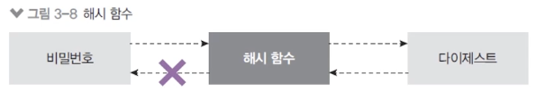
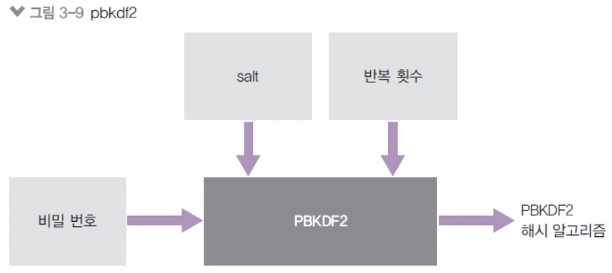

# 9. crypto와 util

## 9-1. 단방향 암호화(crypto)

- 암호화는 멀티쓰레드로 돌아간다.
- 암호화는 가능하지만 복호화는 불가능
  - 암호화: 평문을 암호로 만듦
  - 복호화: 암호를 평문으로 해독
- 단방향 암호화의 대표 주자는 해시 기법
  - 문자열을 고정된 길이의 다른 문자열로 바꾸는 방식
  - 비밀번호 등록 시 해당 방법을 이용함
  - abcdefgh 문자열 → qvew



## 9-2. Hash 사용하기

- createHash(알고리즘): 사용할 해시 알고리즘을 넣어준다.
  - md5, sha1, sha256, sha512 등이 가능하지만, md5와 sha1은 이미 취약점이 발견됨
  - 현재는 sha512 정도로 충분하지만, 이후 sha512마저도 취약해지면 더 강화된 알고리즘으로 바꿔야 함
- update(문자열): 변환할 문자열을 넣어준다.
- digest(인코딩): 인코딩할 알고리즘을 넣어준다.
  - base64, hex, latin1이 주로 사용되는데, 그중 base64가 결과 문자열이 가장 짧아 애용된다. 결과물로 변환된 문자열을 반환한다.

```jsx
const crypto = require("crypto");

console.log("base64: ", crypto.createHash("sha512").update("비밀번호").digest("base64"));
console.log("hex: ", crypto.createHash("sha512").update("비밀번호").digest("hex"));
console.log("base64: ", crypto.createHash("sha512").update("다른 비밀번호").digest("base64"));
```

```bash
base64: dvfV6nyLRRt3NxKSlTHOkkEGgqW2HRtfu19Ou/psUXvwlebbXCboxIPmDYOFRIpqav2eUTBFuHaZri5x+usy1g==
hex: 76f7d5ea7c8b451b773712929531ce92410682a5b61d1b5fbb5f4ebbfa6c517bf095e6db5c26e8c483e60d8385448a6a6afd9e513045b87699ae2e71faeb32d6
base64: cx49cjC8ctKtMzwJGBY853itZeb6qxzXGvuUJkbWTGn5VXAFbAwXGEOxU2Qksoj+aM2GWPhc1O7mmkyohXMsQw==
```

## 9-3. pbkdf2

- 컴퓨터의 발달로 기존 암호화 알고리즘이 위협받고 있음

  - sha512가 취약해지면 sha3으로 넘어가야한다.
  - 현재는 pbkdf2나, bcrypt, scrypt 알고리즘으로 비밀번호를 암호화
  - Node는 pbkdf2와 scrypt 지원

  

- pbkdf2예제
  - crypto.randomBytes로 64바이트 문자열 생성 → salt 역할
  - pbkdf2 인수로 순서대로 비밀번호, salt, 반복 횟수, 출력 바이트, 알고리즘
  - 반복 횟수를 조정해 암호화하는 데 1초 정도 걸리게 맞추는 것이 권장된다.

```jsx
const crypto = require("crypto");

crypto.randomBytes(64, (err, buf) => {
  const salt = buf.toString("base64");
  console.log("salt:", salt);
  crypto.pbkdf2("비밀번호", salt, 100000, 64, "sha512", (err, key) => {
    console.log("password:", key.toString("base64"));
  });
});
```

```bash
salt: tv/non63G0KP/F0UTgS57sMa2tLNwv04mi+wgPOva3vpA1Piwkw7cjUyxot/nlRPjcBsbwHj6BuOwnVU086Btg==
password: KIt5A8cUfVZQIf+SeT265YjyEXqF6h7yF7oXptVARx3Atgcw6teySQ5lr5dd3ZbucqBp61/JYpl7ZmdBuEGJAQ==
```

## 9-4. 양방향 암호화

- 대칭형(createCipheriv) 암호화(암호문 복호화 가능)
  - key가 사용된다. → key 관리를 잘해야 한다.
  - 암호화할 때와 복호화할 때 같은 key를 사용해야 한다.
  - 프론트에서는 사용할 수 없다.
    - crypto-js 라이브러리의 AES와 같은 기능
- 양방향 암호화 메서드
  - `crypto.createCiperiv(알고리즘, 키, iv)`
    - 암호화 알고리즘과 키, 초기화 벡터를 넣어준다.
    - 암호화 알고리즘은 aes-256-cbc사용. 다른 알고리즘을 사용해도 된다.
    - 사용 가능한 알고리즘 목록은 crypto.getCiphers()를 하면 볼 수 있다.
    - 키는 32바이트, 초기화벡터(iv)는 16바이트로 고정이다.
  - `crypto.update(문자열, 인코딩, 출력 인코딩)`
    - 암호화할 대상과 대상의 인코딩, 출력 결과물의 인코딩을 넣어준다
    - 보통 문자열은 utf8 인코딩을, 암호는 base64를 많이 사용한다.
  - `crypto.final(출력 인코딩)`
    - 출력 결과물의 인코딩을 넣어주면 암호화가 완료된다.
  - `crypto.createDecipheriv(알고리즘, 키, iv)`
    - 복호화할 때 사용한다. 암호활할 때 사용했던 알고리즘과 키, iv를 그대로 넣어주어야 한다.
  - `crypto.update(문자열, 인코딩, 출력 인코딩)`
    - 암호화된 문장, 그 문장의 인코딩, 복호화할 인코딩을 넣어준다.
    - createCipher의 update()에서 utf8, base64 순으로 넣었다면 createDecipher의 update()에서는 base64, utf8순으로 넣으면 된다.
    - decipher.final(출력 인코딩): 복호화 결과물의 인코딩을 넣어준다.

```jsx
const crypto = require("crypto");

const algorithm = "aes-256-cbc";
const key = "abcdefghijklmnopqrstuvwxyz123456";
const iv = "1234567890123456";

const cipher = crypto.createCipheriv(algorithm, key, iv);
let result = cipher.update("암호화할 문장", "utf-8", "base64");
result += cipher.final("base64");
console.log("암호화:", result);

const decipher = crypto.createDecipheriv(algorithm, key, iv);
let result2 = decipher.update(result, "base64", "utf8");
result2 += decipher.final("utf8");
console.log("복호화:", result2);
```

```bash
암호화: iiopeG2GsYlk6ccoBoFvEH2EBDMWv1kK9bNuDjYxiN0=
복호화: 암호화할 문장
```

## 9-5. util

- 각종 편의 기능을 모아둔 모듈
  - deprecated와 promisefy가 자주 쓰인다.
- util의 메서드
  - `util.deprecate`
    - 함수가 deprecated 처리되었음을 알려준다.
    - 첫 번째 인자로 넣은 함수를 사용했을 때 경고 메시지가 출력된다.
    - 두 번째 인자로 경고 메시지 내용을 넣으면 된다. 함수가 조만간 사라지거나 변경될 때 알려줄 수 있어서 매우 유용하다.
  - `util.promisify`
    - 콜백 패턴을 프로미스 패턴으로 바꿔준다.
    - 바꿀 함수를 인자로 제공하면 된다. 이렇게 바꿔두면 async/await 패턴까지 사용할 수 있어 좋다. 단, 콜백이 (error, data) ⇒ {} 형식이어야 한다.
    - randomBytes와 비교해볼 것. 프로미스를 콜백으로 바꾸는 util.callbackify도 있지만 자주 사용되진 않는다.

```jsx
const util = require("util");
const crypto = require("crypto");

const dontUseMe = util.deprecate((x, y) => {
  console.log(x + y);
}, "dontUseMe 함수는 deprecated되었으니 더 이상 사용하지 마세요!");

dontUseMe(1, 2);

const randomBytesPromise = util.promisify(crypto.randomBytes);
randomBytesPromise(64)
  .then((buf) => {
    console.log(buf.toString("base64"));
  })
  .catch((error) => {
    console.error(error);
  });
```

```bash
3
(node:12940) DeprecationWarning: dontUseMe 함수는 deprecated되었으니 더 이상 사용하지 마세요!
(Use `node --trace-deprecation ...` to show where the warning was created)
aPy3/86E2mYoSNtfRi39OPRG3c9MC3CA0Pf2wqxYI8k1c9ccbqa8aBLvikUZcF+V7TaTflmQPT2Tl5FyaDRkQw==
```
