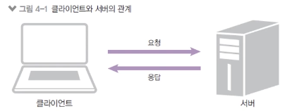
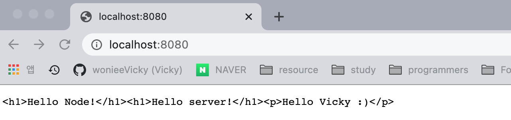

# 1. HTTP 서버 만들기

노드는 자바스크립트 실행기이지 서버가 아니다. 하지만 자바스크립트로 서버를 돌릴 수 있는 코드를 작성해놓으면 노드가 그 서버를 실행을 해준다.

### 1-1. 서버와 클라이언트

- 서버와 클라이언트의 관계

  

  - 클라이언트가 서버로 요청(request)을 보냄
  - 서버는 요청을 처리
  - 처리 후 클라이언트로 응답(response)을 보냄
  - 모든 요청과 응답은 HTTP로 처리한다.

### 1-2. 노드로 http 서버 만들기

- http 요청에 응답하는 노드 서버
  - http라는 모듈을 노드에서 제공해준다.
  - createServer로 요청 이벤트에 대기
  - req 객체는 요청에 관한 정보가, res 객체는 응답에 관한 정보가 담겨있다.

`createServer.js`

```jsx
const http = require('http');
http.createServer((req, res) => {
  // 여기에 어떻게 응답할지 적는다.
});
```

### 1-3. 8080 포트에 연결하기

- res 메서드로 응답을 보냄
  - write로 응답 내용을 적고
  - end로 응답 마무리(내용을 넣어도 된다)
- listen(포트) 메서드로 특정 포트에 연결

```jsx
const http = require('http');

http
  .createServer((req, res) => {
    res.writeHead(200, { 'Content-Type': 'text/html/; charset=utf-8' });
    res.write('<h1>Hello Node!</h1>');
    res.end('<p>Hello Server</p>');
  })
  .listen(8080, () => {
    // 서버연결
    console.log('8080번 포트에서 서버 대기중입니다!');
  });
```

위와 같이 설정 후 터미널에서 `node server1`을 치면 `8080번 포트에서 서버 대기중입니다!`이 출력되면서 서버가 실행된다. 서버를 실행한 경우 해당 터미널은 8080포트에 연결된 것으로, 터미널 하나를 잡아먹는다.

위와 같이 설정 후 브라우저에서 localhost:8080에 접근하면 아래와 같이 실행되는 것을 확인할 수 있다. 노드 코드를 수정한 후에는 반드시 해당 서버를 종료한 뒤 재 실행 해주어야 변경사항이 반영되니 참고하자!



위와 같이 모든 서버는 도메인 뒤에 포트가 숨겨져 있다. HTTPS의 경우 뒤에 :443이 숨겨져있고, HTTP 사이트의 경우 뒤에 :80이 숨겨져있다. (실제 [www.naver.com:443](http://www.naver.com:443) 로 접근하면 네이버에 잘 접속된다) 하나의 도메인에 여러 종류의 포트번호를 붙여서 다양한 서비스를 운영할 수도 있다.

### 1-4. localhost와 포트

- localhost는 컴퓨터 내부 주소
  - 외부에서 접근 불가능
- 포트는 서버 내에서 프로세스를 구분하는 번호이다.
  - 기본적으로 http 서버는 80번 포트 사용(생략가능, https는 443)
  - 예: www.gilbut.com:80 → www.gilbut.com
  - 다른 포트로 데이터베이스나 다른 서버 동시에 연결 가능
