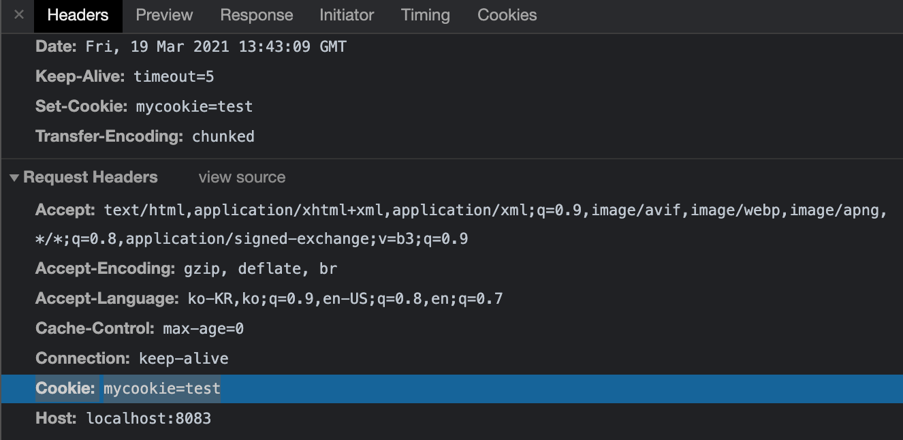

# 5. 쿠키 이해하기

### 5-1. 쿠키의 필요성

- 요청에는 한 가지 단점이 있다.
  - 누가 요청을 보냈는지 모른다.(IP 주소와 브라우저 정보 정도만 앎)
  - 로그인을 구현하면 됨
  - 쿠키와 세션이 필요
- 쿠키: 키 = 값의 쌍

  - name=zerocho
  - 쿠키는 매 요청마다 서버에 정보를 동봉해서 보내준다.
  - 서버는 쿠키를 읽어 누구인지 파악

    

### 5-2. 쿠키 서버 만들기

- 쿠키 넣는 것을 직접 구현
  - writeHead: 요청 헤더에 입력하는 메서드
  - Set-Cookie: 브라우저에게 쿠키를 설정하라고 명령
- 쿠키: 키 = 값의 쌍
  - name=zerocho
  - 매 요청마다 서버에 동봉해서 보낸다.

```jsx
const http = require("http");

http
  .createServer((req, res) => {
    console.log(req.url, req.headers.cookie);
    res.writeHead(200, { "Set-Cookie": "mycookie=test" });
    res.end("Hello Cookie");
  })
  .listen(8083, () => {
    console.log("8083번 보트에서 서버 대기 중입니다!!!");
  });
```

### 5-3. 헤더와 본문

- http 요청과 응답은 헤더와 본문을 가진다.

  

  - 헤더는 요청 또는 응답에 대한 정보를 가짐
  - 본문은 주고받는 실제 데이터
  - 쿠키는 부가적인 정보이므로 헤더에 저장

따라서 위 Set-Cookie 코드를 node로 실행해서 돌려보면 localhost:8083의 Set-Cookie에 mycookie=test라는 값이 잘 들어가있는 것을 볼 수 있다. 유효기간이 있는데 Session이라고 적혀있다. 브라우저를 닫으면 사라지는 쿠키라는 의미이다.


서버에서 쿠키를 한번 심은 뒤에는 이후 모든 페이지의 요청에 해당 쿠키값이 함께 전달된다. 새로고침 해보면 아래와 같이 mycookie=test가 헤더에 같이 보내지는 것을 확인할 수 있다.



### 5-4. http 상태 코드

- writeHead 메서드에 첫 번째 인수로 넣은 값
  - 요청이 성공했는지 실패했는지 알려준다.
  - 2XX : 성공을 알리는 상태 코드. 대표적으로 200(성공), 201(작성됨)이 많이 사용된다.
  - 3XX : 리다이렉션(다른 페이지로 이동)을 알리는 상태 코드. 어떤 주소를 입력했는데 다른 주소의 페이지로 넘어갈 때 이 코드가 사용된다. 대표적으로 301(영구 코드), 302(임시 이동)가 있다.
  - 4XX : 요청 오류를 나타낸다. 요청 자체에 오류가 있을 때 표시된다. 대표적으로 401(권한 없음), 403(금지됨), 404(찾을 수 없음)가 있다.
  - 5XX : 서버 오류를 나타낸다. 요청은 제대로 왔지만 서버에 오류가 생겼을 때 발생한다. 이 오류가 뜨지 않게 주의해서 프로그래밍해야 한다. 이 오류를 클라이언트로 res.writeHead로 직접 보내는 경우는 없고, 예기치 못한 에러 발생 시 서버가 알아서 5XX대 코드를 보낸다. 500(내부 서버 오류), 502(불량 게이트웨이), 503(서비스를 사용할 수 없음)이 자주 사용된다.

### 5-5. 쿠키로 나를 식별하기

- 쿠키로 내 정보를 입력
  - parseCookie: 쿠키 문자열을 객체로 변환
  - 주소가 /login인 경우와 /인 경우로 나뉜다.
  - /login인 경우 쿼리스트링으로 온 이름을 쿠키로 저장한다.
  - 그 외의 경우 쿠키가 있는지 없는지 판단하여 있으면 환영 인사, 없으면 로그인페이지로 리다이렉팅

`cookie2.html`

```jsx
<!DOCTYPE html>
<html>
  <head>
    <meta charset="utf-8" />
    <title>쿠키&세션 이해하기</title>
  </head>
  <body>
    <form action="/login">
      <input id="name" name="name" placeholder="이름을 입력하세요" />
      <button id="login">로그인</button>
    </form>
  </body>
</html>
```

`cookie2.js`

```jsx
const http = require("http");
const fs = require("fs").promises;
const url = require("url");
const qs = require("querystring");

// cookie를 객체로 바꿔준다.
const parseCookies = (cookie = "") =>
  cookie
    .split(";")
    .map((v) => v.split("="))
    .reduce((acc, [k, v]) => {
      acc[k.trim()] = decodeURIComponent(v);
      return acc;
    }, {});

http
  .createServer(async (req, res) => {
    const cookies = parseCookies(req.headers.cookie); // { mycookie: 'test' }
    // 주소가 /login으로 시작하는 경우
    if (req.url.startsWith("/login")) {
      const { query } = url.parse(req.url);
      const { name } = qs.parse(query);
      const expires = new Date();
      // 쿠키 유효 시간을 현재시간 + 5분으로 설정
      expires.setMinutes(expires.getMinutes() + 5);
      res.writeHead(302, {
        Location: "/",
        "Set-Cookie": `name=${encodeURIComponent(
          name
        )}; Expires=${expires.toGMTString()}; HttpOnly; Path=/`,
      });
      res.end();
      // name이라는 쿠키가 있는 경우
    } else if (cookies.name) {
      res.writeHead(200, { "Content-Type": "text/plain; charset=utf-8" });
      res.end(`${cookies.name}님 안녕하세요`);
    } else {
      // 로그인 페이지도 아니고 cookies가 없는 경우
      try {
        const data = await fs.readFile("./cookie2.html");
        res.writeHead(200, { "Content-Type": "text/html; charset=utf-8" });
        res.end(data);
      } catch (err) {
        res.writeHead(500, { "Content-Type": "text/plain; charset=utf-8" });
        res.end(err.message);
      }
    }
  })
  .listen(8084, () => {
    console.log("8084번 포트에서 서버 대기 중입니다!");
  });
```

위와 같이 쿠키로 나를 식별할 수 있도록 코드를 작성 후 node를 실행시키면 input창이 나오고 해당 필드에 내 이름을 입력하여 로그인을 누르면 `http://localhost:8084/login?name=%EB%B9%84%ED%82%A4%EC%9D%B4`이 GET 요청으로 실행된다.

1. 그러면 이후 서버에서 `parseCookies` 함수가 실행되어 전달된 Cookie에 대한 객체값을 생성한다. 이때 변환되어 들어온 한국어를 풀어보기 위해 decodeURIComponent를 사용하여 객체값을 만들어준다.
2. 이후 반환 시 내 이름을 다시 encodeURIComponent로 변환하여 Set-Cookie에 저장시킨다. 이때 쿠키의 유효시간을 정할 수도 있다. 쿠키의 만료기간을 넣지 않으면 브라우저가 끄는 순간에 쿠키가 사라지므로 직접 만료시간을 적어준다. 만약 **해당 유효기간이 지나버리면 브라우저에서 알아서 해당 쿠키를 전송에 포함시키지 않는다.** `HttpOnly;`라는 메서드는 자바스크립트에서 쿠키로 접근하지 못하도록 처리한다. (로그인 쿠키의 경우 필수이다.) 자바스크립트로 접근이 가능하도록 하면 보안상 문제가 되기 때문이다. `Path=/`의 의미는 path `/`이하로는 모두 해당 쿠키를 받는다는 의미이다.
3. 돌려줄 때에는 302 status code를 주는데 리다이렉트 처리를 의미한다. /login으로 요청 → /로 리다이렉트

---
