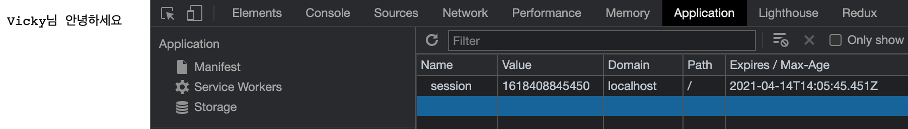

# 세션 사용하기

### 쿠키의 정보는 노출되고 수정되는 위험이 있다.

쿠키를 가지고 서버와 통신을 하다보면 보안에 문제가 발생할 수 있다. 왜냐하면 쿠키의 값은 누구나 탈취나 수정이 가능하기 때문. 따라서 웬만하면 중요한 정보는 세션이 가지고 있고, 이 세션에 접속할 수 있는 키 같은 것만 브라우저에 보내줘서 브라우저 자체에서 중요한 정보를 알아낼 수 없게 하는 것이 좋다.

- 중요한 정보는 서버에서 관리하고 클라이언트에는 세션 키만 제공
- 서버에 세션 객체(session) 생성 후, uniqueInt(키) 를 만들어 속성명으로 사용
- 속성 값이 정보 저장 후 uniqueInt를 클라이언트에 보냄

`session.js`

```jsx
const http = require("http");
const fs = require("fs").promises;
const url = require("url");
const qs = require("querystring");

const parseCookies = (cookie = "") =>
  cookie
    .split(";")
    .map((v) => v.split("="))
    .reduce((acc, [k, v]) => {
      acc[k.trim()] = decodeURIComponent(v);
      return acc;
    }, {});

const session = {}; // 1. 세션을 담는 객체 생성

http
  .createServer(async (req, res) => {
    const cookies = parseCookies(req.headers.cookie);
    if (req.url.startsWith("/login")) {
      const { query } = url.parse(req.url);
      const { name } = qs.parse(query);
      const expires = new Date();
      expires.setMinutes(expires.getMinutes() + 5);
      const uniqueInt = Date.now(); // 2. unique한 키 생성
      // 3. session에 중요한 데이터를 담는다.
      session[uniqueInt] = {
        name,
        expires,
      };
      // 4. 쿠키에는 고유한 키 값(uniqueInt)만 보낸다.
      res.writeHead(302, {
        Location: "/",
        "Set-Cookie": `session=${uniqueInt}; Expires=${expires.toGMTString()}; HttpOnly; Path=/`,
      });
      res.end();
      // 5. 세션 쿠키가 존재하고, 만료 기간이 지나지 않았다면 데이터에 접근할 수 있다.
    } else if (cookies.session && session[cookies.session].expires > new Date()) {
      res.writeHead(200, { "Content-Type": "text/plain; charset=utf-8" });
      res.end(`${session[cookies.session].name}님 안녕하세요`);
    } else {
      try {
        const data = await fs.readFile("./cookie2.html");
        res.writeHead(200, { "Content-Type": "text/html; charset=utf-8" });
        res.end(data);
      } catch (err) {
        res.writeHead(500, { "Content-Type": "text/plain; charset=utf-8" });
        res.end(err.message);
      }
    }
  })
  .listen(8085, () => {
    console.log("8085번 포트에서 서버 대기 중입니다!");
  });
```

세션의 중요한 맥락은 브라우저는 의미를 알 수 없는 키 만을 가지고 있고, 그 키를 통해 서버의 데이터에 접근한다는 것이다.

1. 세션을 사용하기 위해 데이터를 담을 session 객체를 생성한다.
2. session 접근에 키 값이 되어줄 unique한 키를 생성한다.
3. 세션 내 unique key 값 안에 value와 expires 데이터를 추가해준다.
4. 쿠키에는 고유한 키 값만 보내준다. `session=${uniqueInt}`
5. 세션 쿠키가 존재하고 만료 기간이 지나지 않았을 때 데이터에 접근하는 것을 허용한다.
   - 물론 쿠키의 유효기간이 지나면 브라우저 자체에서 쿠키를 실어보내지 않으나 한번 더 처리해준다.

### 세션 서버 실행하기

```bash
$ node session
8085번 포트에서 서버 대기 중입니다!
```

세션 서버를 실행하면 아래와 같이 uniqueInt값만 Value에 존재하는 것을 볼 수 있다.



위 방법은 세션을 만드는 과정을 테스트해본 것일 뿐 실 서버에서는 세션을 직접 구현하지 않고 express-sesion을 사용하여 구현한다. 이후 6장에서 순차적으로 학습해보자
