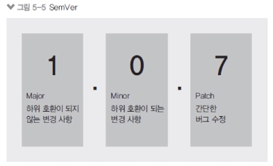

# node_modules와 npx, SemVer

package.json을 설치하면 해당 디렉토리 내에 `package-lock.json`과 `node_modules`가 생성된다.

### npx

npm 으로 전역 글로벌에 패키지를 설치해줄 수 있다.

- 모든 프로젝트와 콘솔에서 패키지를 사용할 수 있음

```bash
$ npm i -g rimraf // 혹은 npm i --global rimraf
```

이렇게 해주면 전역 터미널 상태에서 rimraf 메서드를 사용할 수 있게 된다.

```bash
$ rimraf node_modules // node_modules를 삭제하는 명령어
```

위와 같이 명령어를 치면 node_modules가 삭제된다.

하지만 위 방법의 단점은 해당 설치에 대한 정보가 어디에도 기록되지 않아 담당자가 바뀌면 해당 메서드가 설치되어있는 여부를 알지 못한다는 점이다. 따라서 요즘에는 `Dev dependencies`로 패키지를 설치해준 뒤 `npx`를 사용해 전역에서 사용하는 방법을 많이 채택한다. (글로벌 설치는 기피하자)

```bash
$ npm i rimraf -D
$ npx rimraf node_modules
```

`npx`는 node package excute의 줄임말로, 노드 패키지를 실행한다의 의미를 가지고 있는 명령어이다.  
글로벌 설치 없이 글로벌 명령어를 사용이 가능하게 해준다.

### node_modules

- npm install 시 `node_modules` 폴더 생성
  - 내부에 설치한 패키지들이 들어 있음
  - express 외에도 express와 의존 관계가 잇는 패키지들이 모두 설치됨
- `package-lock.json`도 생성되어 패키지 간 의존 관계를 명확하게 표시한다.

## package-lock.json이 필요한 이유

### 가. SemVer 버저닝

- 노드 패키지 버전은 SemVer(유의적 버저닝) 방식을 따름

  

  - Major(주 버전), Minor(부 버전), Patch(수 버전)
  - 노드에서는 배포를 할 때 항상 버전을 올려야 한다.
  - Major는 하위 버전과 호환되지 않은 수정 사항이 생겼을 때 올린다.
  - Minor는 하위 버전과 호환되는 수정 사항이 생겼을 때 올린다.
  - Patch는 기능에 버그를 해결했을 때 올린다.

### 나. 버전 기호 사용하기

- 버전 앞에 기호를 붙여 의미를 더함
  - ^1.1.1
    - 패키지 업데이트 시 minor 버전까지만 업데이트 됨(2.0.0버전은 안 됨)
    - 보통 이 경우를 가장 많이 사용한다.
  - ~1.1.1
    - 패키지 업데이트 시 patch 버전까지만 업데이트 됨(1.2.0버전은 안 됨)
  - > =, <=, >, < 는 이상, 이하, 초과, 미만
  - @latest는 최신을 의미
  - @next로 가장 최신 배포판 사용 가능(불안정함)
  - 알파/베타/RC 버전이 존재할 수도 있음(1.1.1-alpha.0, 2.0.0-beta.1, 2.0.0-rc.0)
