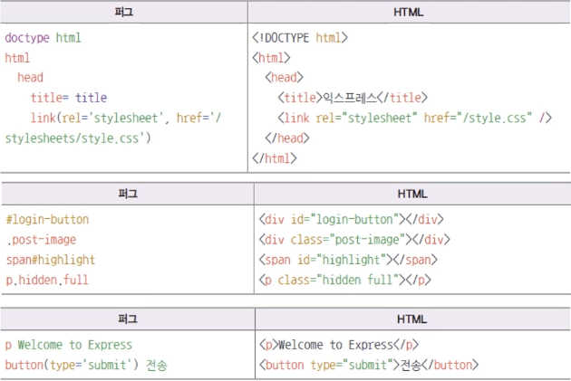

# template engine: Pug

### 템플릿 엔진은 HTML의 정적인 단점을 개선

- 반복문, 조건문, 변수 등을 사용할 수 있다.
- 동적인 페이지 작성이 가능하다.
- PHP, JSP와 유사하다.
- 요즘 잘 사용하지 않음

### Pug(구 Jade)

문법이 Ruby와 비슷해서 코드 양이 많이 줄어든다.

- HTML과 많이 달라 호불호가 갈린다.
- Express에 `app.set`으로 퍼그 연결해준다.

  ```jsx
  // ..
  app.set("port", process.env.PORT || 3000);
  app.set("views", path.join(__dirname, "views"));
  app.set("view engine", "pug");

  app.use(morgan("dev"));
  // ..
  ```

### Pug - HTML 표현




### Pug - 변수

- `res.render`에서 두 번째 인수 객체에 Pug 변수를 넣음

  ```jsx
  router.get("/", (req, res, next) => {
    // views 내 index.pug가 실행됨
    res.render("index", { title: "Express" });
  });
  ```

- `res.locals` 객체에 넣는 것도 가능(미들웨어간 공유 가능)

  ```jsx
  router.get("/", (req, res, next) => {
    res.locals.title = "Express";
    res.render("index");
  });
  ```

- `=` 이나 `#{}`으로 변수 렌더링 가능(= 뒤에는 자바스크립트 문법 사용 가능)

  

### Pug - 파일 내 변수

퍼그 파일 안에서 변수 선언 가능

- - 뒤에 자바스크립트 사용

    

- 변수 값을 Escape 하지 않을 수도 있음(자동 escape)

  - 자동으로 렌더링 되지 않게 처리, 렌더링 되도록 처리하려면 `!=`로 하면 된다.

  

### Pug - 반복문

- for in 이나 each in으로 반복문을 돌릴 수 있다.

  

- 값과 인덱스를 가져올 수 있다.

  

### Pug - 조건문

- if else if else 문, case when문 사용 가능

  

  

### Pug - include

- 퍼그 파일에 다른 퍼그 파일을 넣을 수 있음

  - 헤더, 푸터, 내비게이션 등의 공통 부분을 따로 관리할 수 있어 편리하다.
  - include로 파일 경로 지정

    

### Pug - extends와 block

- 레이아웃을 정할 수 있음

  - 공통되는 레이아웃을 따로 관리할 수 있어 좋음. include와도 같이 사용한다.
  - 바뀌는 부분은 block으로 설정할 수 있음

    
