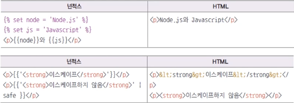
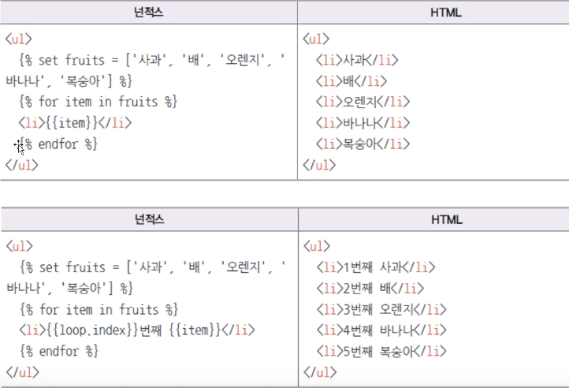
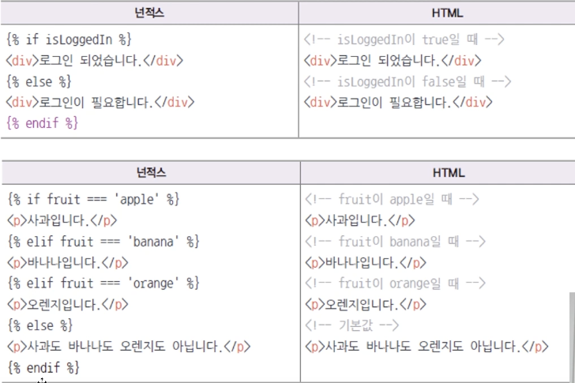
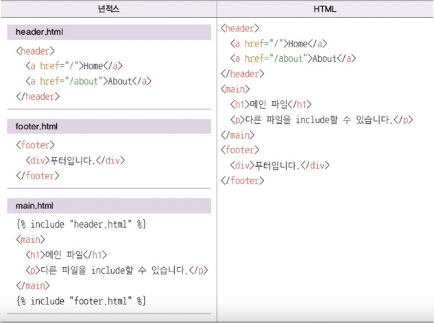
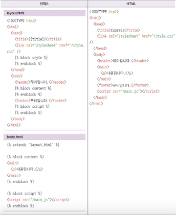

# nunjucks 템플릿 엔진, 에러처리 미들웨어

### Pug의 문법에 적응되지 않는다면 넌적스를 사용하면 좋다.

- Pug를 지우고 Nunjucks 설치

  ```bash
  $ npm i nunjucks
  ```

- 확장자는 html 또는 njk(view engine을 njk로)

  ```jsx
  // ...
  const path = require("path");
  const nunjucks = require("nunjucks");

  dotenv.config();
  const indexRouter = require("./routes");
  const userRouter = require("./routes/user");

  const app = express();
  app.set("port", process.env.PORT || 3000);
  app.set("view engine", "html");

  // views 폴더에 넌적스 파일이 쌓임
  nunjucks.configure("views", {
    express: app,
    watch: true,
  });

  app.use(morgan("dev"));
  ```

### 넌적스 - 변수

- {{변수}}

  ```html
  <h1>{{title}}</h1>
  <p>Welcome to {{title}}</p>
  <button class="{{title}}" type="submit">전송</button>
  <input placeholder="{{title}} 연습" />
  ```

- 내부 변수 선언 가능 {%set 자바스크립트 구문}

  

### 넌적스 - 반복문

-  안에 for in 작성 (인덱스는 Loop 키워드)

  

### 넌적스 - 조건문

-  안에 조건문 작성

  

### 넌적스 - include

- 파일이 다른 파일을 불러올 수 있음

  - include에 파일 경로 넣어줄 수 있음

    

### 넌적스 - 레이아웃

- 레이아웃을 정할 수 있음

  - 공통되는 레이아웃을 따로 관리할 수 있어 좋음, include 와도 같이 사용

    

## 에러 처리 미들웨어

- 에러 발생 시 템플릿 엔진과 상관없이 템플릿 엔진 변수를 설정하고 error 템플릿을 렌더링함

  - res.locals 변수명으로도 템플릿 엔진 변수 생성 가능
  - process.env.NODE_ENV는 개발환경인지 배포환경인지 구분해주는 속성

    `app.js`

    ```jsx
    // ...
    app.use((req, res, next) => {
      const error = new Error(`${req.method} ${req.url} 라우터가 없습니다.`);
      error.status = 404;
      next(error);
    });

    app.use((err, req, res, next) => {
      res.locals.message = err.message;
      // 배포 시에는 안뜨게 처리 :: 보안 이슈
      res.locals.error = process.env.NODE_ENV !== "production" ? err : {};
      res.status(err.status || 500);
      res.render("error");
    });

    // ...
    ```

### 에러처리 템플릿을 pug, nunjucks로 구현하면

`error.pug`

```jsx
extends layout

block content
	h1= message
	h2= error.status
	pre #{error.stack}
```

`error.html` - nunjucks

```jsx



<h1>{{message}}</h1>
<h2>{{error.status}}</h2>
<pre>{{error.stack}}</pre>

```
