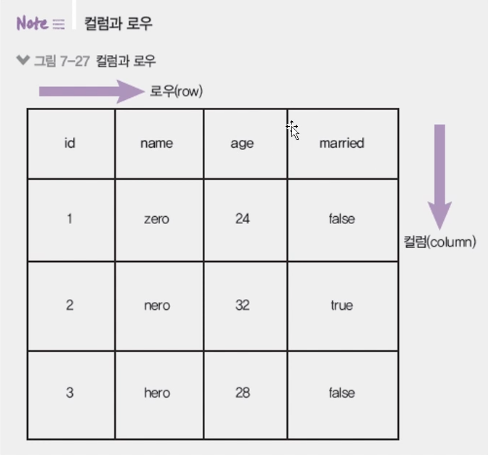

# 데이터베이스와 MySQL 테이블 만들기

## 데이터베이스

- 지금까지는 데이터를 서버 메모리에 저장했다.
  - 서버를 재시작하면 데이터도 사라져버림 → 영구적으로 저장할 공간 필요
- MySQL 관계형 데이터베이스 사용
  - 데이터베이스: 관련성을 가지며 중복이 없는 데이터들의 집합
  - DBMS(database management system): 데이터베이스를 관리하는 시스템
  - RDBMS: 관계형 데이터베이스를 관리하는 시스템
  - 서버의 하드 디스크나 SSD 등의 저장 매체에 데이터를 저장
  - 서버 종료 여부와 상관없이 데이터를 계속 사용할 수 있음
  - 여러 사람이 동시에 접근할 수 있고, 권한을 따로 줄 수 있음

## MySQL 설치

- mac 내에 MySQL 설치방법은 [MySQL과 시퀄라이즈 연결](https://github.com/wonieeVicky/TIL/blob/main/React/react-nodebird-sns/38-connect-mysql-and-sequelize.md) 여기에서 확인할 수 있음 : )

## MySQL 테이블 만들기

### 1. 데이터베이스 생성하기

- 콘솔에서 MySQL 프롬프트에 접속

  - `CREATE SCHEMA nodejs;`로 nodejs 데이터베이스 생성
  - `use nodejs;` 로 생성한 데이터베이스 선택

    ```bash
    mysql > CREATE SCHEMEA `nodejs` DEFAULT CHARACTER SET utf8;
    Query OK, 1 row affected (0.01sec)

    mysql> show databases;
    +--------------------+
    | Database           |
    +--------------------+
    | information_schema |
    | mysql              |
    | nodejs             |
    | performance_schema |
    | react-nodebird     |
    | sys                |
    +--------------------+
    6 rows in set (0.01 sec)

    mysql > use nodejs; // 하나의 서비스가 생성된다.
    Database changed
    ```

### 2. 테이블 생성하기

- MySQL 프롬프트에서 테이블 생성

  - CREATE TABLE [데이터베이스명.테이블명]으로 테이블 생성
  - 사용자 정보를 저장하는 테이블

    ```bash
    mysql> CREATE TABLE nodejs.comments(
        -> id INT NOT NULL AUTO_INCREMENT, // 숫자 필수값, 1씩 증가
        -> commenter INT NOT NULL, // 숫자 필수값
        -> comment VARCHAR(100) NOT NULL, // 100글자 필수값
        -> created_at DATETIME NOT NULL DEFAULT now(), // 기본값으로 현재시간을 넣어줌
        -> PRIMARY KEY(id),
        -> INDEX commenter_idx (commenter ASC),
        -> CONSTRAINT commenter
        -> FOREIGN KEY (commenter)
        -> REFERENCES nodejs.users (id)
        -> ON DELETE CASCADE
        -> ON UPDATE CASCADE)
        -> COMMENT = '댓글'
        -> DEFAULT CHARSET=utf8mb4
        -> ENGINE=InnoDB;
    ```

### 3. 컬럼과 로우

- 나이, 결혼 여부 ,성별과 같은 정보가 컬럼
- 실제로 들어가는 데이터를 로우

  

### 4. 컬럼 옵션들

- id INT NOT NULL AUTO_INCREMENT
  - 컬럼명 옆의 것들은 컬럼에 대한 옵션들
  - 자료형
    - INT: 정수 자료형(FLOAT(소수), DOUBLE(복잡한 소수)은 실수)
    - VARCHAR: 문자형 자료형, 가변길이(CHAR은 고정 길이)
    - TEXT: 긴 문자열은 TEXT로 별도 저장
    - DATETIME: 날짜 자료형 저장
    - TINYINT: -128에서 127까지 저장하지만 여기서는 1 또는 0만 저장해 불리언 값 표현
  - 옵션
    - NOT NULL: 빈 값은 받지 않는다는 뜻 (NULL은 빈 값 허용)
    - AUTO_INCREMENT: 숫자 자료형인 경우 다음 로우가 저장될 때 자동으로 1 증가
    - UNSIGNED: 0과 양수만 허용
    - ZEROFILLL: 숫자의 자리 수가 고정된 경우 빈 자리에 0을 넣음
    - DEFAULT now(): 날짜 컬럼의 기본값을 현재 시간으로 (DEFAULT 0, DEFAULT 1)
