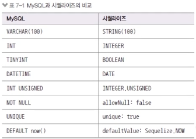

# 시퀄라이즈 모델 생성

### 모델 생성하기

테이블에 대응되는 시퀄라이즈 모델 생성

`models/user.js`

```jsx
const Sequelize = require("sequelize");

module.exports = class User extends Sequelize.Model {
  static init(sequelize) {
    // super.init(모델에 대한 정의, 모델에 대한 설정)
    return super.init(
      {
        // id는 알아서 넣어주므로 넣지 않아도 된다.
        name: {
          type: Sequelize.STRING(20),
          allowNull: false, // Not null
          unique: true, // 고유하게
        },
        age: {
          type: Sequelize.INTEGER.UNSIGNED,
          allowNull: false,
        },
        married: {
          type: Sequelize.BOOLEAN,
          allowNull: false,
        },
        comment: {
          type: Sequelize.TEXT,
          allowNull: true,
        },
        // 직접 구현해보았으나 timestamps 설정으로 자동 주입 가능
        created_at: {
          type: Sequelize.DATE, // DATETIME, MYSQL DATE -> Sequelize DateOnly
          allowNull: false,
          defaultValue: Sequelize.NOW,
        },
      },
      {
        sequelize,
        timestamps: false, // default true -> createdAt, updatedAt 자동 들어간다.
        underscored: false, // 자동으로 만들어주는 키들의 underscored 설정 - snake_case 사용 여부
        modelName: "User", // 모델 이름, 자바스크립트에서 사용한다.
        tableName: "users", // 테이블 이름 (모델이름이 Bird면 테이블 이름은 자동으로 birds로 저장된다.)
        paranoid: false, // soft delete 사용 설정: deletedAt 자동 포함 여부
        charset: "utf8",
        collate: "utf8_general_ci", // utf8mb4_general_ci 이모티콘 쓸 수 있음
      }
    );
  }

  static associate(db) {
    // db settings...
  }
};
```

`models/comment.js`

```jsx
const Sequelize = require("sequelize");

module.exports = class Comment extends Sequelize.Model {
  static init(sequelize) {
    return super.init(
      {
        comment: {
          type: Sequelize.STRING(100),
          allowNull: false,
        },
        created_at: {
          type: Sequelize.DATE,
          allowNull: true,
          defaultValue: Sequelize.NOW,
        },
      },
      {
        sequelize,
        timestamps: false,
        modelName: "Comment",
        tableName: "comments",
        paranoid: false,
        charset: "utf8mb4",
        collate: "utf8mb4_general_ci",
      }
    );
  }

  static associate(db) {
    // db settings...
  }
};
```

`models/index.js`

```jsx
const Sequelize = require("sequelize");
const User = require("./user");
const Comment = require("./comment");

const env = process.env.NODE_ENV || "development";
const config = require("../config/config")[env];
const db = {};

const sequelize = new Sequelize(config.database, config.username, config.password, config);

db.sequelize = sequelize;
db.Sequelize = Sequelize;

db.User = User;
db.Comment = Comment;

User.init(sequelize); // model과 MySQL 연결
Comment.init(sequelize); // model과 MySQL 연결

User.associate(db);
Comment.associate(db);

module.exports = db;
```

### 모델 옵션들

- 시퀄라이즈 모델의 자료형은 MySQL의 자료형과 조금 다르다.

  

- define 메서드의 세 번째 인자는 테이블 옵션이다.
  - timestamps: true면 createdAt(생성시간), updatedAt(수정시간) 컬럼을 자동으로 만듦
  - 예제에서는 직접 created_at 컬럼을 만들었으므로 false로 한다.
  - paranoid 옵션이 true이면 deletedAt(삭제시간) 컬럼 생성, 로우 복구를 위해 완전히 삭제하지 않고 deletedAt에 표시해둔다. (soft delete 방식)
  - underscored 옵션은 camel case로 생성되는 컬럼을 snake case로 생성한다.
  - modelName은 모델 이름, tableName 옵션은 테이블 이름으로 설정
  - charset과 collate는 한글 설정을 위해 필요(이모티콘 넣으려면 utf8mb4로)
