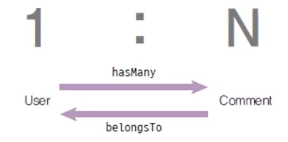
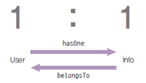
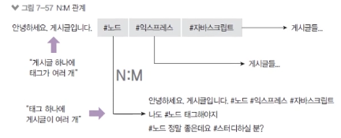
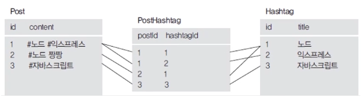

# 테이블 간 관계 이해하기

### 관계 정의하기

- users 모델과 comments 모델 간의 관계를 정의

  

  - 1:N 관계 (사용자 한 명이 댓글 여러 개 작성)
  - 시퀄라이즈에서는 1:N관계를 hasMany로 표현(사용자.hasMany(댓글))
  - 반대의 입장에서는 belongsTo(댓글.belongsTo(사용자))
  - belongsTo가 있는 테이블에 컬럼이 생김(댓글 테이블에 commenter 컬럼)

`models/users.js`

- User가 여러 개의 Comment를 가지며,  
  User의 id를 Comment 테이블의 commenter 컬럼이 참조하고 있다.

```jsx
// ...
	static associate(db) {
    db.User.hasMany(db.Comment, { foreignKey: "commenter", sourceKey: "id" });
  }
// ...
```

`models/comment.js`

- Comment는 User에 속해있다. commenter 컬럼이 User의 targetKey로 id를 바라본다.
- foreignKey는 belongsTo에 해당하는 테이블 즉 Comment에 추가된다.

```jsx
// ...
	static associate(db) {
    db.Comment.belongsTo(db.User, { foreignKey: "commenter", targetKey: "id" });
  }
// ...
```

### 1대 1관계

- 예) 사용자 테이블과 사용자 정보 테이블

  

- 사용자 테이블에 모두 두지않고, 사용자 테이블과 사용자 정보 테이블로 나누는 이유?
  - 빈번히 사용되는 정보와 그렇지 않은 정보의 구별
  - 그 외에도 중요도, 보안 위협성 때문에 하나의 테이블을 2-3개로 쪼개는 경우도 있다.
  - 즉 하나여도 되는 테이블이 분리되었으므로 hasOne 1:1 관계를 가진다.
- 1:1 관계 테이블에서 누가 hasOne의 역할을 하고 누가 belongsTo 역할을 하는지는 관계를 설정하는 당사자가 결정해서 진행한다. 즉 foreignKey를 어떤 테이블 컬럼에 추가할 것인지에 따라 결정하면 된다.

```jsx
db.User.hasOne(db.Info, { foreignKey: "UserId", sourceKey: "id" });
db.Info.belongsTo(db.User, { foreignKey: "UserId", targetKey: "id" });
```

### N대 M 관계

- 다대다 관계

  - 예) 게시글과 해시태그 테이블

    

  - 하나의 게시글이 여러 개의 해시태그를 가질 수 있고 하나의 해시태그가 여러 개의 게시글을 가질 수 있음
  - DB 특성상 다대다 관계는 중간 테이블에 생긴다.

    ```jsx
    db.Post.belongsToMany(db.Hashtag, { through: "PostHashtag" });
    db.HashTag.belongsToMany(db.Post, { throught: "PostHashtag" });
    ```

    

    ✅ 굳이 중간 테이블을 생성해야할까? Post, Hashtag 테이블에서 각 데이터에 대한 정보를 hastags, posts로 가지고 관리하지 않는 이유는? 데이터베이스의 컬럼 생성시 정규화 원칙을 위반하기 때문이다. 데이터베이스 컬럼에는 반드시 한 가지의 데이터만 들어가야 한다. 각 테이블에 데이터를 넣으면 1,2, ..N의 여러 개의 데이터가 들어가므로 원칙 위반..! 물론 Array 값으로 넣을 수 있으나 컬럼에 배열을 넣는 것은 정규화 위반이므로 가급적 배제하는 것이 좋다.
