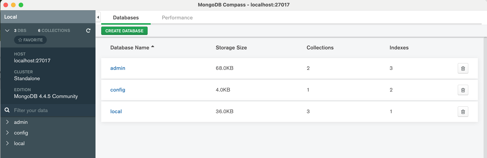

# 데이터베이스 만들기

### 어드민 설정하기

- 어드민 권한을 설정하여 DB에 비밀번호 설정

  ```bash
  $ mongo

  > use admin
  switched to db admin
  > db.createUser({ user: '이름', pwd: '비밀번호', roles: ['root'] })
  Successfully added user: { "user" : "root", "roles" : ["root"] }
  ```

- 비밀번호 설정 후 몽고디비 재시작, 설정파일 수정

  ```bash
  $ brew services stop mongodb-community
  Stopping `mongodb-community`... (might take a while)
  ==> Successfully stopped `mongodb-community` (label: homebrew.mxcl.mongodb-community)

  $ vim /usr/local/etc/mongod.conf
  ```

- 콘솔이 전화되면 마지막에 두 줄을 추가 후 :wq로 저장

  /usr/local/etc/mongod.conf

  ```bash
  ...
  security:
  	authorization: enabled
  ```

- 다시 mongodb 실행 후 mongo admin -u [이름] -p [비밀번호] 로 접속

  ```bash
  $ brew services start mongodb-community
  $ mongo admin -u [이름] -p [비밀번호]
  ```

### 커넥션 생성하기

- 컴퍼스(MongoDB Compass Community) 로 접속

  - Fill in connection Fields individually 클릭

    - Port 27017 로 설정
    - Authentication을 Username / Password로 설정
    - Username, Password를 db.createUser에 설정한 데이터로 설정
    - Authentication Database 는 admin으로 설정 후 connect

      

### 데이터베이스 만들기

- 몽고디비로 데이터베이스를 만들기 위해서는 mongod shell로 직접 입력하는 방법(1)과 MongoDB Compass의 CREATE DATABASE로 만드는 방법(2)이 있다.

  (1) 방법

  ```bash
  > use nodejs;
  switched to db nodejs
  > show dbs;
  admin   0.000GB
  config  0.000GB
  local   0.000GB
  > db
  nodejs
  ```

  `use [db이름];` 을 통해 데이터베이스를 생성한 뒤 `show dbs;` 로 생성된 db를 조회한다. 아직 nodejs가 나오지 않는 것은 데이터가 추가된 내용이 아직 없기 때문, 실제 `db;`로 실행시키면 nodejs라는 db가 잘 생성되어 있다는 것을 알 수 있다.

### 컬렉션 생성하기

- 따로 생성할 필요가 없다.

  - 다큐먼트를 넣는 순간 컬렉션도 자동으로 생성된다.
  - 직접 mongo shell에 생성할 수도 있음

    ```bash
    > db.createCollection('users')
    { "ok" : 1 }
    > db.createCollection('comments')
    { "ok" : 1 }
    ```

  - show collections로 현재 컬렉션을 확인한다.

    ```bash
    > show collections
    comments
    users
    ```
