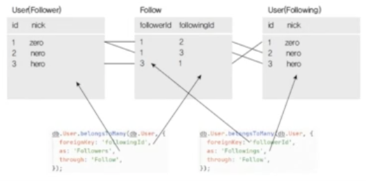

# 테이블 관계 정의

### associate 작성하기

- 모델간의 관계들을 associate에 작성
  - 1대다 : hasMany 와 belongsTo
  - 다대다 : belongsToMany
    - foreignKey: 외래키
    - as: 컬럼에 대한 별명
    - through: 중간 테이블명

`models/user.js`

```tsx
const Sequelize = require("sequelize");

module.exports = class User extends Sequelize.Model {
  static init(sequelize) {
    return super
      .init
      // ...
      ();
  }

  static associate(db) {
    db.User.hasMany(db.Post);
    db.User.belongsToMany(db.User, {
      foreignKey: "followingId", // foreignKey: 누가 follower, following인지 체크
      as: "Followers",
      through: "Follow", // Follow 라는 중간 테이블 사용
    });
    db.User.belongsToMany(db.User, {
      foreignKey: "followerId",
      as: "Followings",
      through: "Follow", // Follow 라는 중간 테이블 사용
    });
  }
};
```

`models/post.js`

```tsx
const Sequelize = require("sequelize");

module.exports = class Post extends Sequelize.Model {
  static init(sequelize) {
    return super
      .init
      // ...
      ();
  }

  static associate(db) {
    db.Post.belongsTo(db.User);
    db.Post.belongsToMany(db.Hashtag, { through: "PostHashtag" }); // 중간 테이블 이름 PostHashtag
  }
};
```

`models/hashtag.js`

```tsx
const Sequelize = require("sequelize");

module.exports = class Hashtag extends Sequelize.Model {
  static init(sequelize) {
    return super
      .init
      // ...
      ();
  }
  static associate(db) {
    db.Hashtag.belongsToMany(db.Post, { through: "PostHashtag" });
  }
};
```

### 팔로잉-팔로워 다대다 관계

- User(다) : User(다)

  

  - 다대다 관계이므로 중간 테이블(Follow) 생성됨
  - 모델 이름이 같으므로 구분 필요함(as가 구분자 역할, foreignKey는 반대 테이블 컬럼의 프라이머리 키 컬럼)
  - 시퀄라이즈는 as 이름을 바탕으로 자동으로 addFollower, getFollowers, addFollowing, getFollowings 메서드 생성

### 시퀄라이즈 설정하기

- 시퀄라이즈 설정은 config/congfig.json에서

  - 개발환경용 설정은 `config/config.json` development 아래에

    ```json
    {
      "development": {
        "username": "root",
        "password": "password",
        "database": "nodejs-nodebird",
        "host": "127.0.0.1",
        "dialect": "mysql"
      },
      "production": {
        "username": "root",
        "password": null,
        "database": "database_production",
        "host": "127.0.0.1",
        "dialect": "mysql"
      }
    }
    ```

- 설정 파일 작성 후 nodebird 데이터베이스 생성

  ```bash
  $ npx sequelize db:create

  Sequelize CLI [Node: 16.2.0, CLI: 6.2.0, ORM: 6.6.2]

  Loaded configuration file "config/config.json".
  Using environment "development".
  Database nodejs-nodebird created.
  ```

### 모델과 서버 연결하기

- app.js에 sequelize 설정

  ```tsx
  // ...
  dotenv.config();
  const { sequelize } = require("./models");

  sequelize
    .sync({ force: false }) // force: true이면 데이터를 모두 지운 뒤 새로 생성(dev에서만!)
    .then(() => {
      console.log("데이터베이스 연결 성공");
    })
    .catch((err) => {
      console.error(err);
    });
  // ...
  ```

- npm start로 서버 실행 시 콘솔에 SQL 문이 표시된다.

  ```bash
   npm start
  > nodebird-playground@1.0.0 start
  > nodemon app

  [nodemon] 2.0.7
  [nodemon] to restart at any time, enter `rs`
  [nodemon] watching path(s): *.*
  [nodemon] watching extensions: js,mjs,json
  [nodemon] starting `node app.js`
  8001 번 포트에서 대기 중
  Executing (default): CREATE TABLE IF NOT EXISTS `users` (`id` INTEGER NOT NULL auto_increment , `email` VARCHAR(40) UNIQUE, `nick` VARCHAR(15) NOT NULL, `password` VARCHAR(100), `provider` VARCHAR(10) NOT NULL DEFAULT 'local', `snsId` VARCHAR(30), `createdAt` DATETIME NOT NULL, `updatedAt` DATETIME NOT NULL, `deletedAt` DATETIME, PRIMARY KEY (`id`)) ENGINE=InnoDB DEFAULT CHARSET=utf8 COLLATE utf8_general_ci;
  Executing (default): SHOW INDEX FROM `users` FROM `nodejs-nodebird`
  ...
  데이터베이스 연결 성공
  ```
