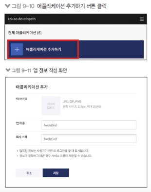
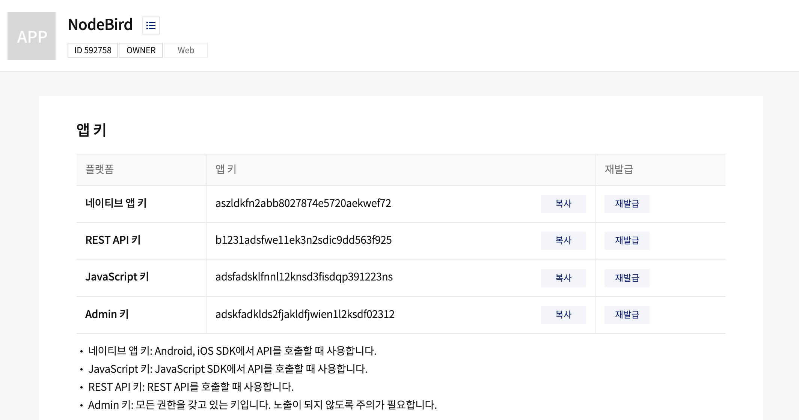
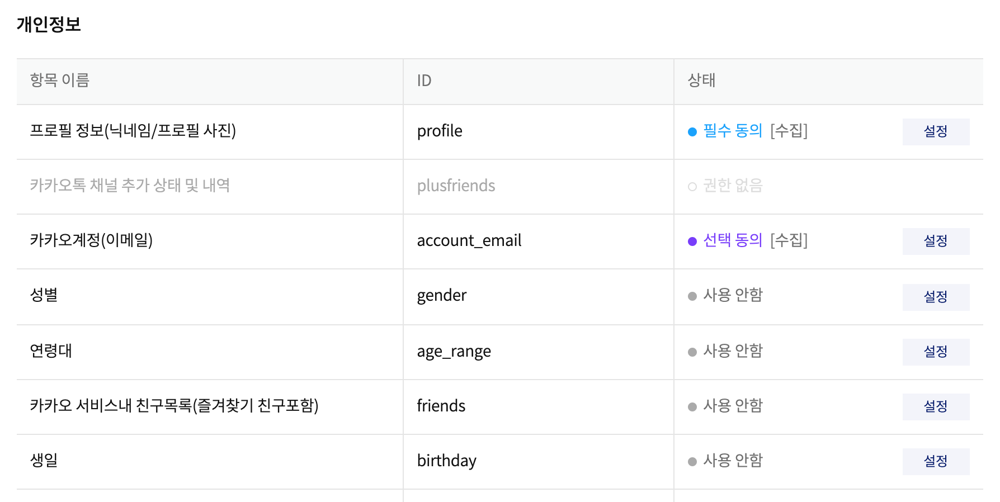

# 카카오 로그인 구현

### 카카오 로그인 구현

- passport/kakaoStrategy.js 작성
  - clientID에 카카오 앱 아이디 추가
  - callbackURL : 카카오 로그인 후 카카오가 결과를 전송해줄 URL
  - accessToken, refreshToken : 로그인 성공 후 카카오가 보내준 토큰(사용하지 않음)
  - profile : 카카오가 보내준 유저 정보
  - profile의 정보를 바탕으로 회원가입
- `passport/kakaoStrategy.js`

  ```jsx
  const passport = require("passport");
  const KakaoStrategy = require("passport-kakao").Strategy;

  const User = require("../models/user");

  module.exports = () => {
    passport.use(
      new KakaoStrategy(
        {
          clientID: process.env.KAKAO_ID,
          callbackURL: "/auth/kakao/callback",
        },
        async (accessToken, refreshToken, profile, done) => {
          // OAUTH2
          console.log("kakao profile", profile);
          try {
            const exUser = await User.findOne({
              where: { snsId: profile.id, provider: "kakao" },
            });
            if (exUser) {
              done(null, exUser);
            } else {
              const newUser = await User.create({
                email: profile._json && profile._json.kakao_account_email,
                nick: profile.displayName,
                snsId: profile.id,
                provider: "kakao",
              });
              done(null, newUser);
            }
          } catch (err) {
            console.error(err);
            done(err);
          }
        }
      )
    );
  };
  ```

  ### 카카오 로그인용 라우터 만들기

  - 회원가입과 로그인이 전략에서 동시에 수행된다.
    - passport.authenticate('kakao')만 하면 됨
    - /kakao/callback 라우터에서는 인증 성공 시(res.redirect)와 실패 시(failureRedirect) 리다이렉트할 경로 지정
  - `routes/auth.js`

    ```jsx
    // ...

    // 카카오로그인하기 눌렀을 때
    router.get("/kakao", passport.authenticate("kakao")); // 카카오 가서 회원가입 해야 한다.

    router.get(
      "/kakao/callback",
      passport.authenticate("kakao", {
        failureRedirect: "/",
      }),
      (req, res) => {
        res.redirect("/");
      }
    );

    module.exports = router;
    ```

  - `app.js`

    ```jsx
    // ...
    const pageRouter = require("./routes/page");
    const authRouter = require("./routes/auth");
    const { sequelize } = require("./models");

    app.use("/", pageRouter);
    app.use("/auth", authRouter); // /auth/join ..

    // ...
    ```

### 카카오 로그인 앱 만들기

- [https://developers.kakao.com에](https://developers.kakao.com에) 접속하여 회원가입

  - NodeBird 앱 만들기

    - 애플리케이션 추가 > 앱 이름, 회사 이름 작성

      

### 카카오 앱 키 저장하기

- REST API 키를 저장해서 .env에 저장

  

- `.env`

  ```
  COOKIE_SECRET=password1234
  KAKAO_ID=aadkfjadlkfjadlfk
  ```

### 카카오 동의항목 설정

- 이메일, 생일 등의 정보를 얻기 위해 동의항목 설정

  

### 카카오 로그인 시도

- 카카오톡 로그인 버튼을 누르면 카카오 로그인 창으로 전환
  - 계정 동의 후 다시 NodeBird 서비스로 리다이렉팅 처리

---
