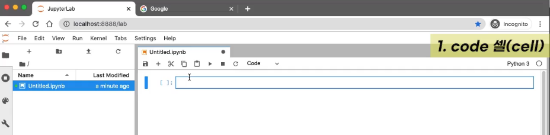
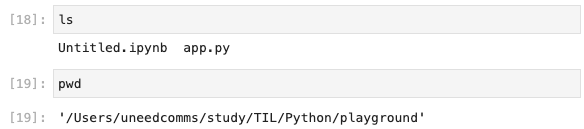

## Python 개발 환경 세팅

### 1. Anaconda 설치

Anaconda for Mac으로 [macOS installer](https://www.anaconda.com/downloads#macos) 다운로드 및 설치
터미널로 확인했을 때 정상적으로 노출된다.

```bash
(base) uneedcomms@MacBook-Pro-3 ~ % conda
usage: conda [-h] [-V] command ...

conda is a tool for managing and deploying applications, environments and packages.

Options: ...
```

### 2. jupyter 실행하기

cmd에서 파이썬을 실행하는 것이 UI적으로 좋지 않으므로 좀 더 편하게 사용할 수 있는 jupyter를 실행하여 python 코드를 공부해본다. jupyter는 아래와 같은 방법으로 실행한다.

```bash
$ cd playground
$ jupyter-lab

NumExpr defaulting to 8 threads.
[I 2022-11-24 23:22:20.297 ServerApp] jupyterlab | extension was successfully linked.
[I 2022-11-24 23:22:20.312 ServerApp] Writing Jupyter server cookie secret to /Users/uneedcomms/Library/Jupyter/runtime/jupyter_cookie_secret
[I 2022-11-24 23:22:20.538 ServerApp] nbclassic | extension was successfully linked.
[I 2022-11-24 23:22:20.538 ServerApp] panel.io.jupyter_server_extension | extension was successfully linked.
[I 2022-11-24 23:22:20.635 ServerApp] nbclassic | extension was successfully loaded.
[I 2022-11-24 23:22:20.636 LabApp] JupyterLab extension loaded from /Users/uneedcomms/opt/anaconda3/lib/python3.9/site-packages/jupyterlab
[I 2022-11-24 23:22:20.636 LabApp] JupyterLab application directory is /Users/uneedcomms/opt/anaconda3/share/jupyter/lab
[I 2022-11-24 23:22:20.639 ServerApp] jupyterlab | extension was successfully loaded.
[I 2022-11-24 23:22:20.641 ServerApp] panel.io.jupyter_server_extension | extension was successfully loaded.
[I 2022-11-24 23:22:20.642 ServerApp] Serving notebooks from local directory: /Users/uneedcomms/study/TIL/Python/playground
[I 2022-11-24 23:22:20.643 ServerApp] Jupyter Server 1.18.1 is running at:
[I 2022-11-24 23:22:20.643 ServerApp] http://localhost:8888/lab?token=bfea20b7c109a0a1903dafd250617eb24b913456c6d1b989
[I 2022-11-24 23:22:20.643 ServerApp]  or http://127.0.0.1:8888/lab?token=bfea20b7c109a0a1903dafd250617eb24b913456c6d1b989
[I 2022-11-24 23:22:20.643 ServerApp] Use Control-C to stop this server and shut down all kernels (twice to skip confirmation).
[C 2022-11-24 23:22:20.646 ServerApp]

    To access the server, open this file in a browser:
        file:///Users/uneedcomms/Library/Jupyter/runtime/jpserver-25590-open.html
    Or copy and paste one of these URLs:
        http://localhost:8888/lab?token=bfea20b7c109a0a1903dafd250617eb24b913456c6d1b989
     or http://127.0.0.1:8888/lab?token=bfea20b7c109a0a1903dafd250617eb24b913456c6d1b989
[I 2022-11-24 23:22:26.132 LabApp] Build is up to date
```

위처럼 처리되면 `http://localhost:8888/lab` 에 Jupyterlab이라는 python 실행이 가능한 ui를 확인할 수 있음 . 실제 핵심로직은 커널에 존재하고 ui를 dev server로 보여준다고 생각하면 된다.


실제 파일을 새롭게 생성하면 jupyterlab을 실행한 playground 위치에 파일이 생성된다.

### jupyter 둘러보기

jupyter를 둘러보자.



Launcher에서 Python 파일을 새로 생성하며 위와 같이 새로 생성된다.
하나의 영역을 code 셀 (Cell)이라고 한다.

몇가지 단축키로는 Ctrl + Enter 시 파이썬 코드 실행 후 대기, Shift + Enter 시 파이썬 코드 실행 후 다음 코드를 작성하도록 셀이 넘어간다. 이외에도 다양한 단축키가 존재함. 실습하면서 익히자

jupyter 이용 시 셀의 타입 code, markdown, Raw 타입으로 바꿔서 작성할 수 있다. code 때는 c, markdown은 y등을 클릭하면 자유자재로 타입을 빠르게 변경할 수 있다.

터미널 명령어 실행도 셀 내에서 처리할 수 있다.



이외에도 코드작성시 tab을 누르면 자동완성 기능을 제공한다. shift + tab 클릭 시에는 메서드에 대한 설명을 알려준다. (사용법) 이외에도 마크다운의 순서대로 자동 넘버링 기능도 제공함

다양한 기능이 제공되니 구글링으로 jupyter 사용방법에 대한 팁들을 중간중간 찾아보자
