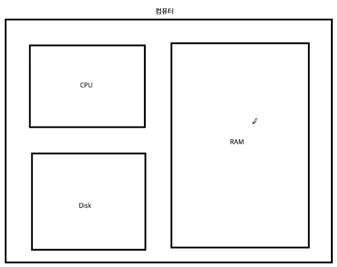

## Python 자료형에 대하여

> 💫 **Reference: 점프투 파이썬 : [https://wikidocs.net/book/1](https://wikidocs.net/book/1)**

### 간단한 컴퓨터 구조와 램(RAM)

- RAM : context(문맥), 프로그램이 돌아가기 위한 저장공간을 의미함, 임시데이터 저장 공간
- Disk : 영구적으로 저장되는 데이터의 저장소
- CPU : 프로그램의 실제 연산을 진행 후 RAM에 저장
