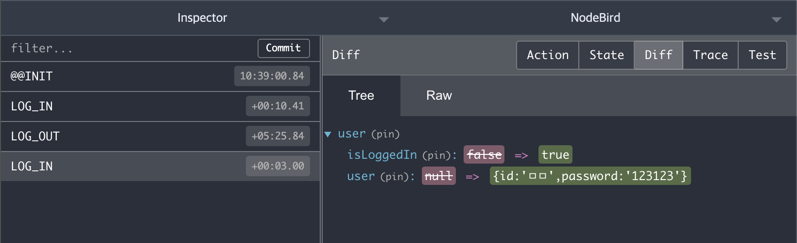

# 미들웨어와 리덕스 데브툴즈

크롬 개발자도구에서 redux-saga나 redux-thunk와 같은 미들웨어를 적용하고 리덕스 데이터 변경 히스토리를 리덕스 데브툴즈를 확인하기 위해서는 먼저 redux-devtools-extension 패키지 설치를 해야한다.

```bash
$ npm i redux-devtools-extension
```

그리고 해당 패키지를 `configureStore` 내 store에 enhancer로 접목시켜준다.

```jsx
import { createWrapper } from "next-redux-wrapper";
import { applyMiddleware, compose, createStore } from "redux";
import { composeWithDevTools } from "redux-devtools-extension"; // 1. 추가

import reducer from "../reducers/index";

const configureStore = () => {
  // 2. 해당 배열 내에 thunk나 saga 등의 미들웨어가 삽입
  const middlewares = [];

  // 3. production과 development 상황에서의 enhancer 분기처리
  const enhancer =
    process.env.NODE_ENV === "production"
      ? compose(applyMiddleware(...middlewares))
      : composeWithDevTools(applyMiddleware(...middlewares));

  // 4. createStore의 두 번째 인자로 enhancer 추가
  const store = createStore(reducer, enhancer);
  return store;
};

const wrapper = createWrapper(configureStore, { debug: process.env.NODE_ENV === "development" });
export default wrapper;
```

- 만약 dev 작업 시 포트번호를 변경하고 싶다면?

이후 npm run dev로 실행시켜 redux-devtool로 화면을 확인하면 액션에 따른 Reducer 동작이 모두 기록으로 남겨져있다. 이렇게 모든 dispatch 과정을 히스토리로 남기기 때문에 state값들은 불변성을 유지해야 한다!


