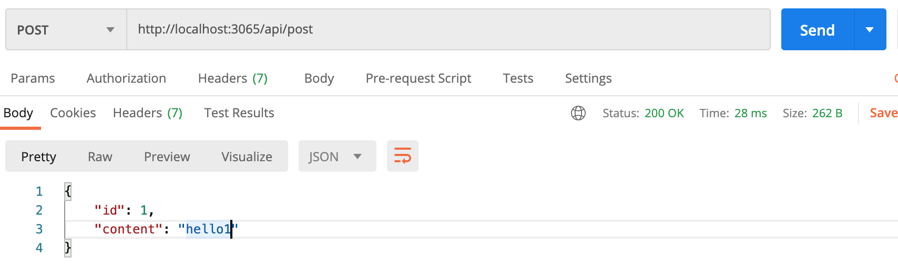

# 익스프레스로 라우팅 그리고 라우터 분리하기

## 익스프레스 라우팅 하기

익스프레스도 내부적으로 http를 쓰기 때문에 서버를 돌릴 수 있다.  
서버를 돌리려면 노드에서 제공하는 http 모듈을 써야한다. 아래 express 적용 포맷을 살펴보자

```jsx
const express = require("express");
const app = express(); // 처음에 함수 실행!

// url path '/'에 보내는 get 메서드
app.get("/", (req, res) => {
  res.send("hello express");
});
// url path '/api'에 보내는 get 메서드
app.get("/api", (req, res) => {
  res.send("hello api");
});

app.listen(3065, () => {
  console.log("서버 실행 중");
});
```

위와 같이 적은 후 터미널에 `node app`을 실행시키면 `localhost:3065`로 hello express가 `localhost:3065/api`로는 hello api가 노출된다. 이처럼 브라우저의 주소입력창에 주소를 직접 입력하는 것은 대표적인 GET 요청이다.

```jsx
const express = require("express");
const app = express();

app.get("/api/posts", (req, res) => {
  // json 객체 응답
  res.json([
    { id: 1, content: "hello1" },
    { id: 2, content: "hello2" },
    { id: 3, content: "hello3" },
  ]);
});
app.post("/api/post", (req, res) => {
  // json 객체 응답
  res.json({ id: 1, content: "hello1" });
});
app.delete("/api/post", (req, res) => {
  res.json({ id: 1 });
});

app.listen(3065, () => {
  console.log("서버 실행 중");
});
```

위와 같이 코드를 작성 후 `localhost:3065/api/posts`에 들어가면 [ { id: 1, content: "hello1" }, { id: 2, content: "hello2" }, { id: 3, content: "hello3" } ] 와 같은 json 객체가 응답으로 내려간다. 이렇게 백엔드 개발자는 어떤 데이터를 줘야하는지 협의하고 데이터를 어떻게 내려줄지에 대해 정하고 라우터들을 정해놓는게 주요한 업무이다.

위와 같이 브라우저 주소 입력창으로의 접근은 GET만 가능하다. 그렇다면 나머지 POST, DELETE 등은 어떻게 할까? 보통 프론트에서 axios를 통해 해당 url에 접근하거나 테스트를 위해서 postman을 사용하기도 한다. postman을 통해 post api를 쳐보면 아래와 같이 json 객체가 응답으로 내려오는 것을 확인할 수 있다.



위와 같은 방식으로 `app.get(가져오다)`, `app.post(생성하다)`, `app.put(전체수정)`, `app.delete(삭제)`, `app.patch(부분수정)`, `app.options(찔러보기: 나 요청보낼 수 있어? 받아줄거임?)`, `app.head(헤더, 바디 중 헤더만 가져오기)` 등을 많이 사용한다. api 주소 또한 백엔드, 프론트엔드 개발자가 상호 협의만 된다면 adskfalj로 지어도 되지만 보통 모두의 이해를 위해 REST API 방식으로 구축하곤 한다.
(더 자세한 사항은 정리해놓은 글에서 살펴보자 [REST API](https://www.notion.so/REST-API-3ab095c472974407a227580e91b02da9))

위와 같은 Api들이 서비스에 딸 수 십, 수 백가지로 커지므로 한 파일로 관리하가 어려워진다. 이럴 때에는 기능별로 API를 나누어 라우팅 처리한다. (만들어진 API들을 문서화할 때에는 보통 Swagger라는 툴을 많이 쓴다. 다음에 한번 보자)

## 익스프레스 라우터 분리하기

노드에서는 import, export를 쓰지않고 require와 module.exports를 사용한다.  
프론트에서도 import, export를 webpack이 require와 module.exports로 변환해주는 개념으로  
향후에는 import, export로 합쳐질 것으로 예상한다.

api 주소에 중복된 단어가 많아지면 그 영역을 라우터로 분리한다.  
`/back/routes` 폴더 생성 후 `post.js` 파일을 새롭게 생성해보자.

```jsx
const express = require("express");

const router = express.Router();

// POST /post
router.post("/", (req, res) => {
  res.json({ id: 1, content: "hello1" });
});

// DELETE /post
router.delete("/", (req, res) => {
  res.json({ id: 1 });
});

module.exports = router;
```

위와 같이 /post API를 구성해놓은 후 app.js에서 아래와 같이 호출하면 라우터가 분리된다.

```jsx
const express = require("express");
const postRouter = require("./routes/post");
const app = express();

app.use("/post", postRouter);

app.listen(3065, () => {
  console.log("서버 실행 중");
});
```

use 메서드를 사용해 연결하고 첫번째 인자로 `/post`라는 접두어(prefix)를 붙여주면 해당 접두어가 api path에 자동으로 포함된다.
