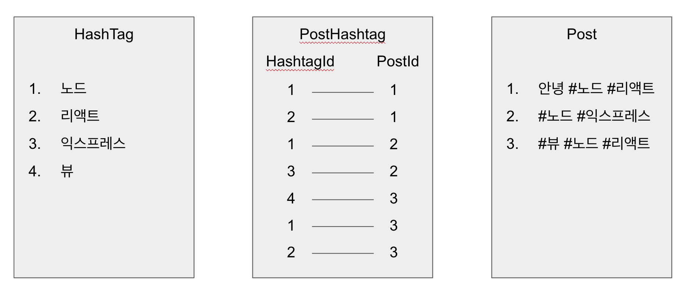
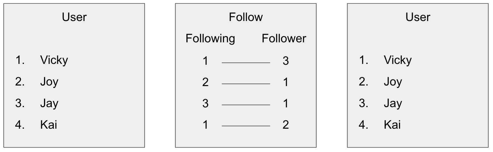
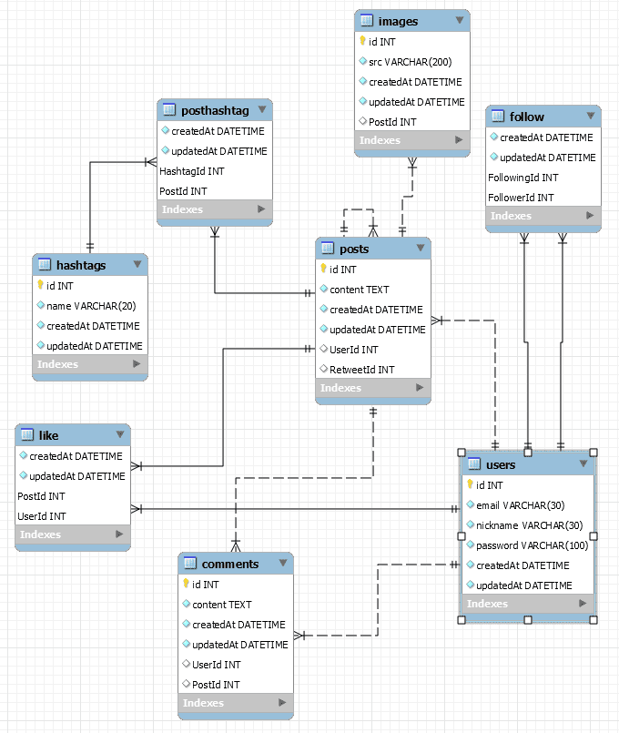

# 시퀄라이즈 관계 설정

## 1대다 관계

NodeBird 기능의 특성 상 게시글은 한 사람만 쓸 수 있고, 한 명의 유저는 여러 개의 글을 쓸 수 있다.  
이러한 관계를 user와 post간의 `1 대 다` 관계에 있다고 말한다. 이러한 관계를 user.js와 post.js에 표현해보면 아래와 같다.

```jsx
// user.js
module.exports = (sequelize, DataTypes) => {
  const User = sequelize.define("User", {});
  User.associate = (db) => {
    db.User.hasMany(db.Post); // 한 사람이 여러 개의 글을 쓸 수 있다.
    db.User.hasMany(db.Comment); // 한 사람이 여러 개의 댓글을 쓸 수 있다.
  };
  return User;
};
```

```jsx
// post.js
module.exports = (sequelize, DataTypes) => {
  const Post = sequelize.define("Post", {});
  Post.associate = (db) => {
    db.Post.belongsTo(db.User); // 작성 글은 User에 속해있다.
    db.Post.hasMany(db.Comment); // 작성 글은 여러 코멘트를 가지고 있다.
    db.Post.hasMany(db.Image);
    db.Post.belongsTo(db.Post, { as: "Retweet" }); // 리트윗 관계: 어떤 게시글이 어떤 게시글의 리트윗
  };
  return Post;
};
```

```jsx
module.exports = (sequelize, DataTypes) => {
  // MySQL에는 users 테이블 생성
  const Image = sequelize.define(
    "Image",
    {
      src: {
        type: DataTypes.STRING(200), // URL이 길어질 수 있으므로 200자로 잡는다.
        allowNull: false,
      },
    },
    {
      charset: "utf8",
      collate: "utf8_general_ci",
    }
  );
  Image.associate = (db) => {
    db.Image.belongsTo(db.Post);
  };
  return Image;
};
```

```jsx
// comment.js
module.exports = (sequelize, DataTypes) => {
  // MySQL에는 users 테이블 생성
  const Comment = sequelize.define("Comment", {
    content: {
      type: DataTypes.TEXT,
      allowNull: false,
    },
    // UserId: 1, > 하나의 댓글에 대한 소유자
    // PostId: 3  > 하나의 댓글에 대한 소유 게시글
  });
  Comment.associate = (db) => {
    db.Comment.belongsTo(db.User); // 코멘트는 어떤 유저에 속해있다.
    db.Comment.belongsTo(dv.Post); // 코멘트는 어떤 글에 속해있다.
  };
  return Comment;
};
```

comment.js를 보면 다른 데이터에 의존적인 상태의 정보가 많다. (belongsTo만 사용된 구조)
이와 같은 구조일 경우 belongsTo를 넣게 되면 자동으로 테이블에 속해진 글의 데이터가 포함된다. (위 UserId, PostId처럼 따로 넣어주지 않아도 데이터가 생성됨)

## 다대다 관계

그런데 여기서 문제는 `다대다` 관계인 hashTag와 Post이다. 하나의 게시글 안에 여러 개의 해시태그를 가질 수 있고, 해시태그도 여러 개의 게시글을 가질 수 있다. (해시태그로 검색 시 관련 게시글이 검색되는 것과 같은!) 이럴 때에는 관계를 `belongsToMany`를 사용하여 연결해준다.

```jsx
// post.js
module.exports = (sequelize, DataTypes) => {
  const Post = sequelize.define("Post", {});
  Post.associate = (db) => {
    db.Post.belongsTo(db.User); // 작성 글은 User에 속해있다.
    db.Post.hasMany(db.Comment); // 작성 글은 여러 코멘트를 가지고 있다.
    db.Post.hasMany(db.Image);
    db.Post.belongsToMany(db.Hashtag); // 작성 글은 여러개의 해시태그를 가짐
  };
  return Post;
};
```

```jsx
// hashtag.js
module.exports = (sequelize, DataTypes) => {
  const Hashtag = sequelize.define("Hashtag", {});
  Hashtag.associate = (db) => {
    db.Hashtag.belongsToMany(db.Post); // 해시태그는 여러개의 글을 가짐
  };
  return Hashtag;
};
```

위와 같이 belongsToMany를 사용할 경우에는 중간에 연결해주는 테이블이 하나 더 생성된다.  
가령 두 테이블을 합쳐서 `PostHashtag`라는 테이블이 생성되는 것인데, 그 안에서 각 데이터가 바라보는 정보를 입력한다. 이렇게 하면 각 데이터에 맞는 뷰가 그려지고, 검색이나 필터링도 가능해진다.



또 `다대다` 관계를 가지는 것으로 **좋아요**도 포함된다.  
하나의 게시글이 여러개의 좋아요를 받을 수 있고, 여러 개의 게시글을 유저가 좋아요 누를 수 있기 때문이다!

```jsx
module.exports = (sequelize, DataTypes) => {
  const Post = sequelize.define("Post", {}, {});
  Post.associate = (db) => {
    db.Post.belongsTo(db.User); // 포스트의 작성자
    db.Post.hasMany(db.Comment);
    db.Post.hasMany(db.Image);
    db.Post.belongsTo(db.Post, { as: "Retweet" }); // 리트윗 관계: 어떤 게시글이 어떤 게시글의 리트윗 게시글(1대 다 관계)
    db.Post.belongsToMany(db.Hashtag);
    db.Post.belongsToMany(db.User, { through: "Like", as: "Likers" }); // 포스트의 좋아요를 누른 사람들
  };
  return Post;
};

module.exports = (sequelize, DataTypes) => {
  const User = sequelize.define("User", {}, {});
  User.associate = (db) => {
    db.User.hasMany(db.Post); // 나의 글들
    db.User.hasMany(db.Comment); // 한 사람이 여러 개의 댓글을 쓸 수 있다.
    db.User.belongsToMany(db.Post, { through: "Like", as: "Liked" }); // 내가 좋아요를 누른 글들
  };
  return User;
};
```

위 belognsToMany의 두번째 인자로 들어가는 객체 값은 생성될 중간 테이블 명이다.  
관계 테이블명을 정의할 수 있고, 해당 데이터는 관계된 모델 파일 둘 다 가지고 있어야 한다.

그런데 위에 보면 db.Post나 db.User가 중첩되어 사용되는 것처럼 느껴진다.  
이럴 때 분리를 위해 별칭(as)을 대문자로 붙여준다.  
`db.User.belongsToMany(db.Post, { through: "Like", as: 'Liked' });`
위와 같이 별칭 as 값을 이용하면 이후에 post.getLikers로 게시글을 좋아요 누른 사람을 가져올 수 있게 된다.

덧붙여.. 별개로 `hasOne` 이라는 것도 있다.  
만약 유저의 정보를 별도로 보관하고 있는 Userinfo라는 데이터가 있다고 쳤을 때, db.User.hasOne(db.Userinfo) → db.Userinfo.belongTo(db.User) 인 관계를 가진다.

- 잠깐! 누구에게 belongTo를 넣는 것인가가 헷갈린다면..🥺

같은 테이블도 관계가 있을 수 있다.  
가령 예를 들면 User테이블에 각 User 별로 Follow, Following의 값을 가지는 것이다.



즉 핵심은 다대다 관계일 때 중간 테이블이 생긴다는 것이다! 이 중간테이블을 통해 원활하게 검색이 가능하다!

```jsx
module.exports = (sequelize, DataTypes) => {
  const User = sequelize.define("User", {}, {});
  User.associate = (db) => {
    db.User.belongsToMany(db.Post, {
      through: "Follow",
      as: "Followers",
      foreignKey: "FollowingId", // 나를 팔로워하는 사람을 찾으려면 '팔로잉 한사람(followingId)'를 찾아야한다.
    });
    db.User.belongsToMany(db.Post, {
      through: "Follow",
      as: "Followings",
      foreignKey: "FollowerId", // 내가 팔로잉하는 사람을 찾으려면 '나(followerId)'를 먼저 찾아야한다.
    });
  };
  return User;
};
```

이렇게 하나의 테이블 안에 관계가 생길 때는 헷갈리기 때문에 바라보는 키 값을 별도로 정해주는데 이게 바로 foreignKey이다. 보통 별칭의 반대되는 개념이 들어간다. (이해가 안되니 여러번 보자..🧐)
through는 테이블 이름을 바꿔주고, foreignKey는 컬럼의 명을 바꿔줬다고 보면 된다.

### 참고용 ERD


