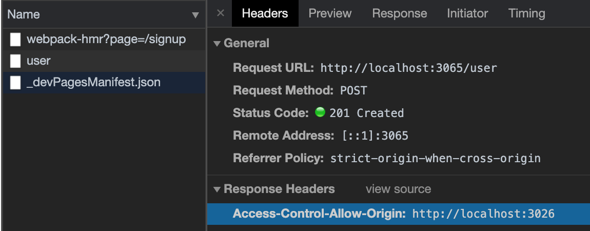

# CORS 문제 해결하기

이제 실제로 회원가입을 진행해보자!

혹시 회원가입이 실패로 떨어지고, Network에 user status가 failed인가?  
만약 에러가 `ERR_CONNECTION_REFUSED`라고 나와있다면 서버가 꺼져있거나 방화벽 등에 의해 막혀있는 상태인 것이다.

서버를 제대로 다시 켜준 뒤 다시 회원가입을 하면 아래와 같은 에러가 발생한다. 바로 **CORS 에러**이다!

```bash
Access to XMLHttpRequest at 'http://localhost:3065/user' from origin 'http://localhost:3026' has been blocked by CORS policy: Response to preflight request doesn't pass access control check: No 'Access-Control-Allow-Origin' header is present on the requested resource.
```

'Access-Control-Allow-Origin' header가 없다고 나와있는 경고문구인데(~~일할 때 진짜 많이 봤.... 큽..~~)  
브라우저 서버와 백엔드 서버가 도메인이 다름으로서 브라우저 상에서 api를 차단하는데 이것이 바로 CORS 에러다.  
이런 오류가 발생할 경우 3026 에서 3065로 요청을 주고 받을 수 있도록 허용을 별도로 해줘야 한다.

해당 오류는 브라우저에서 발생했으므로 이게 브라우저에서 다른 도메인으로 호출 시에만 발생하며,  
프론트 서버에서 백엔드 서버와의 통신에서는 발생하지 않는다. 이를 해결하는 방법으로는 몇가지가 있는데 먼저

1. 프록시 방식 (프론트 처리)

   이는 브라우저와 다른 도메인 간의 호출 시 에러이고, 서버와 서버 간에는 발생하지 않으므로 프론트 서버를 브릿지로 API 를 대신 호출하도록 하는 방식이 있다. 이것이 프록시 방식이다! (webpack devServer 원리)

   브라우저(3026) 프론트 서버로 API 요청 → 프론트 서버(3026) API 대신 요청 → 백엔드 서버(3065)에서 프론트 서버(3026)로 Response 응답 → 프론트 서버(3026) API 응답을 브라우저(3026)에 전달

2. 'Access-Control-Allow-Origin' 설정 방식 (백엔드 처리)

   백엔드에서 'Access-Control-Allow-Origin' header에 해당 정보를 추가하여 호출에 문제가 없도록 해주는 방법이 있다. `back/user.js` 에서 아래와 같이 처리한다.

   ```jsx
   router.post("/", async (req, res, next) => {
     try {
       // codes..
       res.setHeader("Access-Control-Allow-Origin", "http://localhost:3026"); // 별도 설정!
       res.status(201).send("ok");
     } catch (error) {
       console.error(error);
       next(error);
     }
   });

   module.exports = router;
   ```

3. cors 라이브러리 사용(백엔드 처리)

   ```bash
   $ npm i cors
   ```

   `back/app.js`에서 cors 라이브러리를 통해 몇가지 설정을 하여 이용한다.

   주석처리한 내용처럼 이후 서비스에서는 해커들의 차단을 위해 origin 도메인을 설정하여 이외의 도메인에서는 호출되지 않도록 처리한다. 하지만 지금은 개발 단계이므로 origin값을 true로 하여 작업한다.

   ```jsx
   const express = require("express");
   const cors = require("cors");
   const app = express();

   db.sequelize
     .sync()
     .then(() => {})
     .catch(console.error);

   // cors 설정 추가
   app.use(
     cors({
       // origin: 'http://nodebird.com' // 향후 서비스에서는 해커들의 차단을 위해 origin 도메인에서만 호출되도록 설정
       origin: true, // true 설정 시 * 대신 보낸 곳의 주소가 자동으로 들어가 편리하다.
     })
   );
   app.use(express.json());
   app.use(express.urlencoded({ extended: true }));

   // code...
   ```



회원가입이 완료/실패 시 각각 메인페이지로 리다이렉팅, error 메시지 alert를 처리해줘야 하므로 signup.js에 useEffect Hooks 처리를 한다.

```jsx
import Router from "next/router";

const Signup = () => {
  const dispatch = useDispatch();
  const { signUpLoading, signUpDone, signUpError } = useSelector((state) => state.user);

  // 회원가입 완료 시 메인으로 보내기!
  useEffect(() => {
    if (signUpDone) {
      Router.push("/");
    }
  }, [signUpDone]);

  useEffect(() => {
    if (signUpError) {
      alert(signUpError); // state 처리로 동일한 alert UI를 그려줘도 좋다!
    }
  }, [signUpError]);

  // codes..
};
```
