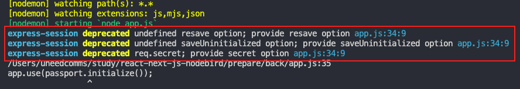
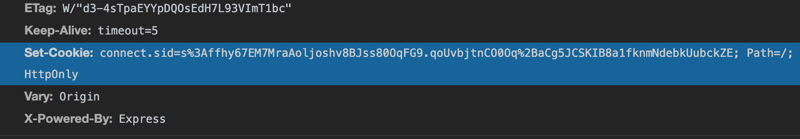

# 쿠키/세션과 전체 로그인 흐름

패스포트 설정이 아직 다 끝나지 않았다 😅

전체 로그인 흐름에 대해 한번 더 짚어보자. 먼저 사용자 화면에서 `dispatch(loginRequestAction({ email, password });` 실행 → Saga 액션에서 `axios.post('/user/login', data);` 실행 → Req body에 데이터가 실려 `passport.authenticate('local', (err, user, info) ⇒ {});` 가 실행 → local.js의 `LocalStrategy({ ... })` 실행 → 조건에 맞게 `res.status` or `res.json` 리턴 → front의 reducer 액션 정의에 따라 적절한 액션 수행 이라는 과정을 거친다..!

실제 back에서 passport로 로그인 처리를 해줬다면 해당 로그인 내용을 저장하고 있어야 한다. 이때 세션이라는 것을 사용하는데, 이것과 관련된 설정을 해보자! 먼저 세션 사용을 위해 express-session 라이브러리를 설치한다. 이후 사용을 위해 cookie-parser도 함께 설치해준다.

```bash
$ npm i express-session cookie-parser
```

그리고 `app.js`에서 app.use 메서드를 통해 express-session 미들웨어 설정을 해준다.

```jsx
const express = require("express");
const session = require("express-session");
const cookieParser = require("cookie-parser");
const app = express();

// codes..
app.use(cookieParser());
app.use(session());
app.use(passport.initialize());
app.use(passport.session());

// codes..
```

쿠키와 세션이 왜 필요할까? 로그인을 하면 서버와 브라우저는 같은 정보를 가지고 있어야 한다. 헌데 로그인을 했다고 해서 다른 도메인의 서버(3026과 3065)가 같은 정보를 가지고 있지 않은 상태이므로, 백엔드 서버는 프론트 서버나 브라우저에 누가 로그인 했는지에 대한 정보를 보내줘야 한다. 이때 로그인 정보 안에 있는 개인정보를 그대로 보내줬을 경우 보안에 취약하므로 랜덤한 토큰(임의로 생성된 문자열)을 보내주는데 이를 **쿠키**라고 한다. 또한 서버 쪽에서는 이 토큰과 서버를 연결을 시켜두는데 이를 **세션**이라고 한다.

로그인 이후에 유저가 글을 올리거나 하는 브라우저의 요청 시에는 쿠키에 반드시 해당 로그인 토큰을 함께 보내서 요청하며, 백엔드 서버는 이 로그인 토큰을 보고 어떤 유저의 행동인지를 알아낼 수 있는 것이다. 이게 쿠키와 세션의 필요성이다..!

정리하자면 req.login 시 `res.setHeader('Cookie', 'cxlhy');`와 같이 내부적으로 알아서 해당 토큰을 헤더에 실어 보내주는데 이를 **쿠키**라고 하며, 서버 쪽에서 토큰과 이어 유저 정보를 가지고 있는 것을 **세션**이라고 한다. 그런데 토큰과 이어진 유저 정보를 모두 가지고 있다면 운영 기능에 따라 유저 정보만으로도 매우 무거워질 수 있다. (모든 것이 메모리를 먹는 것이기 때문에) 따라서 메모리 사용을 줄이기 위해 유저 정보에 대한 id 값만 매칭해두고, 필요에 따라 해당 id으로 유저정보를 찾아 프론트로 전달해주도록 구성되어 있다.
(덧, 로그인 정보는 특히 해킹 등에 취약한 점이므로 나중에는 아예 세션 저장용 DB로 redis를 사용한다.)

`back/passport/index.js`

```jsx
const passport = require("passport");
const local = require("./local");
const { User } = require("../models");

module.exports = () => {
  // id 값을 매칭하여 세션 유지
  passport.serializeUser((user, done) => {
    done(null, user.id);
  });

  // 로그인 성공 후 deserializeUser가 매번 실행, 유저 정보를 DB에서 복구한다.
  // 실제 상세 데이터를 가져와야할 때 done(null, user.id)를 아래의 deserializeUser에서 처리
  passport.deserializeUser(async (id, none) => {
    try {
      const user = await User.findOne({ where: { id } });
      done(null, user); // req.user
    } catch (err) {
      console.error(err);
      done(err);
    }
  });

  local();
};
```

이제 백엔드 서버를 다시 구동시켜보자.



위 메시지는 바로 app.use에 기재한 session의 설정이 미비하다는 의미로 따라서 app.js 내 session, cookieParser 설정에서 해당 설정을 추가해준다.

```jsx
app.use(cookieParser("nodebirdsecret"));
app.use(
  session({
    saveUninitialized: false,
    resave: false,
    secret: "nodebirdsecret", // 쿠키에 데이터를 기반으로 한 만들어낸 문자의 근간이 된다.
  })
);
```

로그인 시 브라우저에 쿠키에 랜덤한 문자열을 보내준다고 했는데 해당 문자열은 우리 데이터를 기반으로 만들어진 문자이다. 위 secret값은 유출될 경우 데이터가 노출될 수 있다. 따라서 이 secret 정보는 꽁꽁 숨겨둬야 한다!
소스코드에 secret 정보가 있으면 소스코드가 해커에게 털릴 수 있고, 이렇게 되면 모든 정보를 다 날라갈 수 있다. 따라서 secret 값 등 보안을 해야하는 값에는 dotenv 라이브러리를 쓴다.

```bash
$ npm i dotenv
```

라이브러리 설치 후 dotenv를 사용하려면 back/.env라는 확장자명이 없는 파일을 생성해준다.  
그리고 아래와 같이 보안이 필요한 값을 세미콜론 없이 붙여준다.

```
COOKIE_SECRET = nodebirdsecret
DB_PASSWORD=Uneed3515!
```

위 값을 dotenv를 통해 호출해와서 기존에 사용하던 데이터 영역에 추가해준다.

```jsx
const dotenv = require("dotenv");

dotenv.config(); // dotenv 사용을 위해 디폴트 호출
const app = express();

app.use(cookieParser(process.env.COOKIE_SECRET));
app.use(
  session({
    saveUninitialized: false,
    resave: false,
    secret: process.env.COOKIE_SECRET,
  })
);
```

워크밴치에 로그인 비밀번호 정보가 저장되어 있는 config.json에도 수정해줘야 하는데, 알다시피 json 파일에는 env 환경변수를 사용하지 못하므로 js파일로 바꿔준다. (config.json → config.js)

```jsx
const dotenv = require("dotenv");
dotenv.config();

module.exports = {
  development: {
    username: "root",
    password: process.env.DB_PASSWORD,
    database: "react-nodebird",
    host: "127.0.0.1",
    dialect: "mysql",
  },
  // codes...
};
```

이렇게 하면 .env 파일만 별도로 특별히 보안을 지키면 다른 파일에서 secret 데이터 등의 유실로 인한 보안 문제를 걱정하지 않아도 된다. 이 파일은 깃헙 등에 업로드도 해선 안되며, 핵심 관리자들끼리만 가지고 있다가 프로젝트 실행할 때에만 잠깐 넣어서 실행한다. 소스코드 전체에 비밀 키가 흩어져 있으면 관리하기가 매우 어려운데, 이렇게 키를 하나의 파일에 모아 보관하면 .env를 통해 보안키를 관리할 수 있고, 나머지 소스 코드들은 유출되어도 큰 타격이 없게 되는 것이다.

이제 실제 로그인을 진행해보자! 로그인이 매우 잘된다.



실제 로그인 시 `passport/index.js` 에서 serializeUser를 통해 유저Id값을 가지고 세션을 유지하게 된다. 로그인 이후에는 deserializeUser가 매번 실행되어 유저 정보를 DB에서 복구한다. 해당 데이터는 req.user에 저장되어 각종 게시글 등록, 삭제, 팔로잉, 팔로워 등 회원 기능 동작에 사용되어지고, 이후 로그아웃 시에는 해당 세션과 쿠키를 모두 지워준 뒤 성공을 반환하면 로그아웃이 완료된다.

`back/routes/user.js`

```jsx
const express = require("express");
const bcrypt = require("bcrypt");
const passport = require("passport");
const { User } = require("../models"); // db.User를 가져옴
const router = express.Router();

// 로그아웃 라우터
router.post("/user/logout", (req, res, next) => {
  // 로그인 후 정보는 passport.deserializeUser를 통해 매번 재실행되어 담기므로 req.user에 데이터가 있다.
  req.logout();
  req.session.destroy();
  res.status(200).send("ok");
});
```

### 덧,

팔로잉, 팔로워 등의 데이터가 아직도 더미데이터로 노출되고 있는 것을 확인할 수 있다.  
reducer의 LOG_IN_SUCCESS에서 데이터 처리를 변경해주자.

```jsx
const reducer = (state = initialState, action) =>
  produce(state, (draft) => {
    switch (action.type) {
      case LOG_IN_SUCCESS:
        draft.logInLoading = false;
        draft.logInDone = true;
        draft.me = action.data; // dummyUser(action.data); 지워준다!
        break;
    }
  });
```

기존의 dummyUser로 맵핑해주던 것을 없애고 실제 action.data를 받아 처리해준다.  
백엔드에서 `res.status(200).json(user);` 와 같은 데이터를 콜백으로 내려주면 json내의 user 정보가 aciton.data가 되어 프론트에 반영되는 구조이다.
