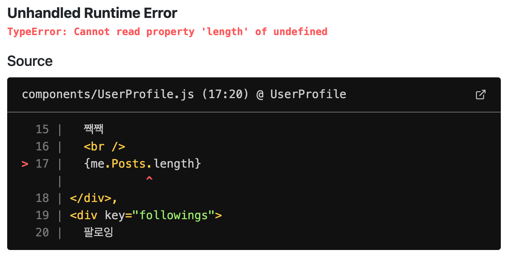
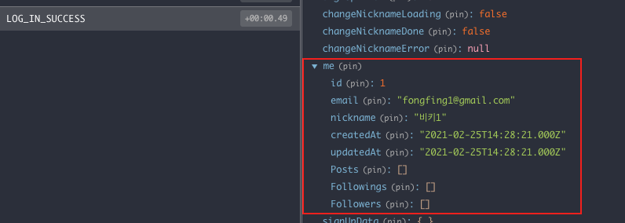

# 로그인 문제 해결하기

이제 로그인, 로그아웃에 대한 패스포트 설정을 완료했다.  
실제로 브라우저에서 로그인을 하면 에러가 발생하는데 이러한 에러들을 모두 해결해보자!



먼저 me.Posts.length가 없다고 뜬다. 리덕스를 통해 `LOG_IN_SUCCESS`액션에 대한 내용을 보면 me 프로퍼티 안에 Posts나 Followings, Followers에 대한 정보가 없어서 에러가 나는 것을 확인할 수 있다.

Posts(사용자 - 게시글 테이블 사이의 관계 테이블)나 Following, Followers(사용자 - 사용자 테이블 사이의 관계 테이블)의 경우 모두 User안에 있는 데이터가 아닌 관계 테이블에 있는 정보이다.

위의 데이터를 res.send 데이터에 추가하고, redux 내에 들어가는 정보 중 password 정보는 불필요하므로 res.send에서 삭제하는 로직을 구현해보자.

back의 login 동작에 대한 라우팅 영역 코드에 보내줄 코드를 추가 및 수정하는 로직을 아래와 같이 적어준다.

`/back/routes/user.js`

```jsx
const { User, Post } = require("../models"); // db.User, db.Post를 가져옴

router.post("/login", (req, res, next) => {
  passport.authenticate("local", (err, user, info) => {
    if (err) {
      console.err(err);
      return next(err);
    }
    if (info) {
      return res.status(401).send(info.reason);
    }
    return req.login(user, async (loginErr) => {
      if (loginErr) {
        console.error(loginErr);
        return next(loginErr);
      }

      const fullUserWithoutPassword = await User.findOne({
        where: { id: user.id },
        attributes: {
          exclude: ["password"], // 1. 데이터 제외 처리
        },
        include: [
          // 2. 관계 테이블 추가
          {
            model: Post, // 3. db.Post로 쓰는 이유
          },
          {
            model: User,
            as: "Followings",
          },
          {
            model: User,
            as: "Followers",
          },
        ],
      });

      return res.status(200).json(fullUserWithoutPassword);
    });
  })(req, res, next);
});
```

fullUserWithoutPassword 변수에 변경/추가할 내용을 적어주면 된다.

1. attributes에는 exclude 메서드를 사용해 제거하고 싶은 영역만을 제외시키는 방법으로 password를 제외시켜준다. (혹은 직접 넣고 싶은 데이터를 지정하여 처리할 수도 있다. attributes: ["id", "nickname", "email"]
2. include 메서드 안에 배열 객체로 추가로 넣어줄 관계 테이블의 데이터를 나열한다.
   시퀄라이즈는 다른 테이블과의 관계들을 아래와 같이 배열 객체로 모두 합쳐서 보내주므로 매우 편리하다!
3. User 테이블 설정 시 Post는 hasMany로 연결되어있으므로 model: Post 로 적어주면 자동으로 복수형이 되어 me.Posts가 된다..!

위와 같이 설정 후 로그인을 시도하면 또 다른 에러가 발생한다.

```bash
(node:15956) UnhandledPromiseRejectionWarning: SequelizeDatabaseError: Unknown column 'Followers->Follow.FollowingId' in 'field list'
(node:15956) UnhandledPromiseRejectionWarning: Unhandled promise rejection. This error originated either by throwing inside of an async function without a catch block, or by rejecting a promise which was not handled with .catch(). To terminate the node process on unhandled promise rejection, use the CLI flag `--unhandled-rejections=strict` (see https://nodejs.org/api/cli.html#cli_unhandled_rejections_mode). (rejection id: 1)
```

FollowingId 이라는 컬럼이 없다는 오류로 이런 경우 초기 테이블 관계 모델링 등을 할 때 오타로 인해 해당 컬럼이 생성되지 않아 생기는 이슈이다. 따라서 이럴 때에는 워크벤치에서 Follow 테이블을 drop한 뒤 다시 서버를 실행하여 테이블을 새로 생성해준다.

위의 에러를 모두 개선 후 로그인을 하면 비밀번호 삭제 후 Posts, Followings, Followers 데이터가 정상적으로 들어오는 것을 확인할 수 있다. 😅



이외에도 버그들이 몇 개 보인다.  
먼저 로그인이 실패했을 때 사유에 대한 정보를 UI로 구현해줘야 한다.

`/front/components/LoginForm.js`

```jsx
import React, { useEffect } from "react";

const LoginForm = () => {
  const { logInLoading, logInError } = useSelector((state) => state.user);

	// logInError에 대한 분기처리 추가
  useEffect(() => {
    if (logInError) {
      alert(logInError);
    }
  }, [logInError]);

	return (
		// codes...
	);
});
```

또한 로그인을 완료한 상태에도 회원가입 페이지에 접근이 가능하다.

`/front/components/signup.js`

```jsx
const Signup = () => {
  const dispatch = useDispatch();
  const { signUpLoading, signUpDone, signUpError, me } = useSelector((state) => state.user);

  useEffect(() => {
    if (me && me.id) {
      Router.replace("/"); // me 정보가 있을 때 노드버드 페이지로 반환
    }
  }, [me && me.id]);

	// codes..

  return (
		// codes..
	)
});
```

위와 같이 me state 정보를 확인하여 정보가 있을 경우 메인으로 replace 시키는데, 이때 push 메서드가 아닌 replace를 사용하는 이유는 뒤로가기 했을 때 replace 경우 이전 페이지를 기억하지 못하므로 해당 메서드를 이용한다.

### 이외의 사항들

1. Next.js에서 api routes 사용이 가능함. 어떨 때 사용하는가?

   보통 소규모의 앱일 경우에만 사용한다. 서비스의 규모가 커지면 분리해야 한다.

2. 카카오 로그인, 페이스북 로그인 등의 구현은 어떻게 하는가?

   각 sns 별 로그인을 위한 채널 내 어플리케이션을 디벨로퍼스 사이트에서 생성해야 한다.
   OAuth 서비스는 모두 비슷한 방식임. 어플리케이션 생성 이후 passport-kakao, passport-facebook 등의 문서를 이용해 로그인 정책을 추가하면 됨!

3. 자동 로그인 구현 방법?

   앱의 경우 jwt token을 통해, 웹의 경우 로컬 스토리지나 쿠키를 통해, 유효기간이 없는 토큰을 프론트에 심어놓고 그 토큰으로 로그인을 시키는 방법 등 다양한 방법이 있다. 보통 자동 로그인 설정 시 [신뢰할 수 있는 디바이스에서만 할 것]이라는 경고가 뜨는 이유도 이 유효기간이 없는 토큰에 대한 보안성 때문이다.
