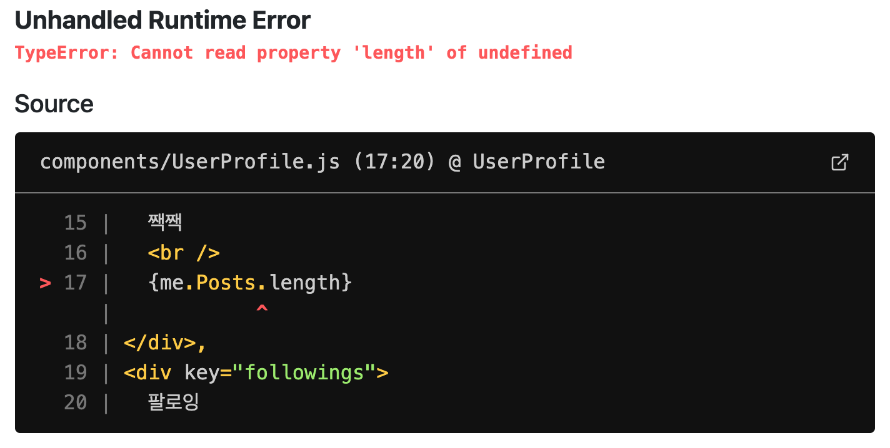
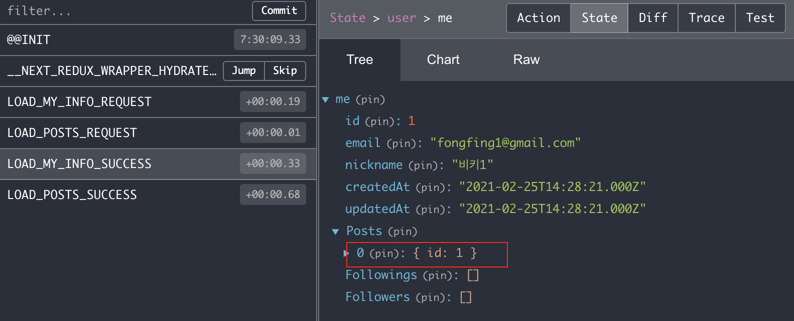

# 로그인 정보 매번 불러오기

로그인 후 페이지를 새로고침하면 로그인이 풀린다. 하지만 실제로는 로그인이 풀린게 아니다.  
왜냐하면 브라우저에 로그인시 심어놓은 connect.sid 쿠키가 남아있기 때문이다. 해당 쿠키값이 남아있는지 아닌지로 로그인 유/무를 판단하는데, 해당 값이 있으므로 로그인이 가능한 상태, 다만 해당 쿠키값이 페이지 이동 시 서버 쪽으로 함께 전달되지 않아 로그인이 안된 것처럼 보이는 것이다.

따라서 언제든지 서버 쪽에 로그인 정보에 대한 쿠키를 전달만 해주면 로그인 상태를 유지할 수 있게된다.
먼저 user.js routes에 매 페이지마다 실행될 GET /user API를 만들어준다. 해당 페이지는 로그인 유저 / 비로그인 유저 모두에게 동작하므로 반드시 req.user 정보가 있는지 확인한 뒤 다음 처리를 해준다.

`back/routes/user.js`

```jsx
// GET /user
router.get("/", async (req, res, next) => {
  try {
    if (req.user) {
      const user = await User.findOne({
        where: { id: req.user.id },
      });
      res.status(200).json(user); // 로그인 한 유저일 경우
    } else {
      res.status(200).json(null); // 로그인 하지 않은 유저일 경우
    }
  } catch (err) {
    console.error(err);
    next(error);
  }
});

// POST /user/login ...
```

그런 다음 해당 내용을 프론트에 반영한다. 우선 reducer에 유저정보를 가져오는 액션을 추가한다.

`front/reducers/user.js`

```jsx
import produce from "immer";
export const initialState = {
  loadMyInfoLoading: false, // 유저정보 가져오기 시도중
  loadMyInfoDone: false,
  loadMyInfoError: null,
};

export const LOAD_MY_INFO_REQUEST = "LOAD_MY_INFO_REQUEST";
export const LOAD_MY_INFO_SUCCESS = "LOAD_MY_INFO_SUCCESS";
export const LOAD_MY_INFO_FAILURE = "LOAD_MY_INFO_FAILURE";

const reducer = (state = initialState, action) =>
  produce(state, (draft) => {
    switch (action.type) {
      case LOAD_MY_INFO_REQUEST:
        draft.loadMyInfoLoading = true;
        draft.loadMyInfoDone = false;
        draft.loadMyInfoError = null;
        break;
      case LOAD_MY_INFO_SUCCESS:
        draft.loadMyInfoLoading = false;
        draft.loadMyInfoDone = true;
        draft.me = action.data;
        break;
      case LOAD_MY_INFO_FAILURE:
        draft.loadMyInfoLoading = false;
        draft.loadMyInfoError = action.error;
        break;
      default:
        break;
    }
  });

export default reducer;
```

`front/sagas/user.js`

```jsx
import { all, call, fork, delay, put, takeLatest } from "redux-saga/effects";
import { LOAD_MY_INFO_REQUEST, LOAD_MY_INFO_SUCCESS, LOAD_MY_INFO_FAILURE } from "../reducers/user";
import axios from "axios";

function loadMyInfoAPI() {
  return axios.get("/user");
}
function* loadMyInfo(action) {
  try {
    const result = yield call(loadMyInfoAPI, action.data);
    yield put({
      type: LOAD_MY_INFO_SUCCESS,
      data: result.data,
    });
  } catch (err) {
    yield put({
      type: LOAD_MY_INFO_FAILURE,
      error: err.response.data,
    });
  }
}

function* watchLoadMyInfo() {
  yield takeLatest(LOAD_MY_INFO_REQUEST, loadMyInfo);
}

export default function* userSaga() {
  yield all([fork(watchLoadMyInfo)]);
}
```

그런 다음 해당 액션을 pages/index.js에서 dispatch해준다면 유저정보를 가져올 수 있을 것이다!

`front/pages/index.js`

```jsx
import { useEffect } from "react";
import { useDispatch, useSelector } from "react-redux";
import { LOAD_MY_INFO_REQUEST } from "../reducers/user";

const Home = () => {
  const dispatch = useDispatch();

  useEffect(() => {
    dispatch({ type: LOAD_MY_INFO_REQUEST }); // 추가!
  }, []);

  return <AppLayout>{/* codes.. */}</AppLayout>;
};

export default Home;
```

이후 브라우저를 새로고침하면 아래와 같은 에러가 뜨게 되는데, 이는 이전 시간에 로그인 routes 구현 시 다른 데이터 정보가 없어서 발생했던 오류와 동일하다. 따라서 해당 routes에도 필요한 데이터를 추가하여 보내줄 수 있도록 `routes/user.js`를 고쳐보자



`back/routes/user.js`

```jsx
// GET /user
router.get("/", async (req, res, next) => {
  try {
    if (req.user) {
      const fullUserWithoutPassword = await User.findOne({
        where: { id: req.user.id },
        attributes: {
          exclude: ["password"],
        },
        include: [
          {
            model: Post,
            attributes: ["id"],
          },
          {
            model: User,
            as: "Followings",
            attributes: ["id"],
          },
          {
            model: User,
            as: "Followers",
            attributes: ["id"],
          },
        ],
      });
      res.status(200).json(fullUserWithoutPassword); // 로그인 한 유저일 경우
    } else {
      res.status(200).json(null); // 로그인 하지 않은 유저일 경우
    }
  } catch (err) {
    console.error(err);
    next(error);
  }
});

// POST /user/login ...
```

위와 같이 변경해주면 로그인 후 화면 새로고침 시에도 로그인을 유지해준다!

그런데 한가지 살펴볼 것이 있다. LOAD_MY_INFO 액션이 수행될 때 Redux를 통해 user.me에 들어오는 데이터를 보면 게시글의 경우 게시글의 데이터를 모두 가져오고 있다. 만약 게시글이 매우 많거나 팔로잉, 팔로워가 많은 유저일 경우 그 index마다 모두 정보를 가져오는 것은 메모리 용량을 많이 차지하며 페이지 로드에 지연을 일으키는 요인이 된다. (단순히 length만 필요하므로!)

따라서 가져오는 정보를 attributes 속성으로 id 값만 가져오게 처리하면 훨씬 효율적인 처리가 가능하므로 위 코드와 같이 각 model의 정보에 attribute를 지정하여 처리해준다. 이렇게 서버로부터 프론트에 필요한 정보만 내려주는 것은 매우 중요한 일이며 프로젝트 중간중간에 항상 검토해주는 것이 좋다.



### 덧붙여..

로그인을 하면 해당 페이지가 풀리지 않고 정상적으로 로그인 된 상태로 보여진다. 다만, 초기에 로그인 창이 잠깐 보였다가 로그인 후 화면으로 바뀌는 움찔거림이 존재하는데, 이는 CSR 상황에서는 어쩔 수 없다. 아직 Next에 SSR이 적용되지 않았으므로 먼저 CSR 로 화면이 렌더링 된 뒤 이후에 데이터를 요청해서 받아와 적용되므로 이후 next 에서 ssr을 적용하여 이 문제를 개선한다.
