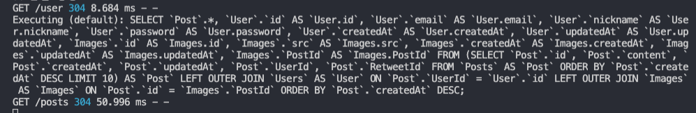

# 게시글 및 코멘트 불러오기

이제 게시글을 불러올 차례이다. 해당 기능은 `pages/index.js`에서 `dispatch({ type: LOAD_POSTS_REQUEST });` 에서부터 시작된다.

먼저 `sagas/post.js` 의 loadPosts 함수부터 조금 수정해주자.

```jsx
function loadPostsAPI(data) {
  return axios.get("/posts", data);
}
function* loadPosts(action) {
  try {
    const result = yield call(loadPostsAPI, action.data);
    yield put({
      type: LOAD_POSTS_SUCCESS,
      data: result.data,
    });
  } catch (err) {
    yield put({
      type: LOAD_POSTS_FAILURE,
      error: err.response.data,
    });
  }
}
```

현재는 게시글을 불러올 때 전달되는 데이터가 없는 상태이다. 원래 데이터가 있어야 한다. 어떤 데이터일까? 바로 지금까지 로드된 게시글의 수가 필요하다. 처음에 10개 호출, 그 다음 스크롤에 따른 10개 추가 호출.. 등의 작업을 위해서는 데이터가 반드시 필요하다.

데이터를 조절해주는 방법은 여러가지가지인데 먼저, Limit과 offset 방법이 있다. 이는 데이터베이스에서 제공해주는 방법인데 대해 실제 postsRouter를 만들어보며 자세히 알아보자. 작업을 위해 `back/routes/posts.js`를 추가한다.

(그런데 이미 postRouter가 있는데 왜 postsRouter를 만드나? 이는 프로그래밍 스타일인데, 단수, 복수에 따라 이벤트가 하는 일이 다르므로 이를 정확하게 분리하기 위해 postsRouter를 따로 만드는 것임)

`back/routes/posts.js`

```jsx
const express = require("express");
const { Post } = require("../models");
const router = express.Router();

// GET /posts
router.get("/", async (req, res, next) => {
  try {
    // 실무에서는 잘 쓰지 않는다.
    const posts = await Post.findAll({
      limit: 10, // 10개만 가져올 것
      offset: 0, // 1 ~ 10, 10: 11 ~ 20, 100: 101 ~ 110
      order: [["createdAt", "DESC"]], // default ASC
    });
    res.status(200).json(posts);
  } catch (err) {
    console.error(err);
    next(err);
  }
});

module.exports = router;
```

`Post.findAll` 메서드를 사용해 지정한 내의 조건 값들을 가져온다. 먼저 `limit`에는 가져올 게시글의 수를 정하고, `offset`은 지정하는 순서, 예를 들어 0일 경우 1 ~ 10개를 가져오고, 10일 경우 11 ~ 20, 100일 경우 101 ~ 110번째 게시글을 가져온다. 또한 `order`에서는 게시글 추출 시 정렬 순서를 지정하는데 sns의 경우 최신 데이터를 먼저 노출시키므로 createdAt을 DESC로 지정해준다. (default ASC)

위와 같은 방식으로 글을 프론트로 내려준다면 아무 문제가 없을 것 같다. 하지만 limit과 offset 방법은 실무에서 잘 쓰지 않는다. 왜냐면 중간에 게시글이 추가되거나 삭제될 경우 offset과 limit이 다 꼬여버리기 때문이다. (20 ~ 1번째 글을 가져올 때 21번째 글이 새로 생긴다거나 15번째 글이 삭제될 경우, 해당 글이 두번 호출되거나 호출되지 않는 글이 발생할 수 있다.)

따라서 실무에서는 limit과 offset 방식 대신에 limit과 lastId 방식을 많이 쓴다. lastId는 게시글의 id를 의미하는 것으로서 해당 id값을 가지고 있으면 그 id로부터 하위 10개의 글을 호출하면 중간에 삭제, 추가가 되어도 id에 따라서 값을 가져오므로 문제가 없다. 또한 프론트에서 페이지네이션을 구현할 때에도 limit과 lastId방식이 가장 효율적이다.

```jsx
// GET /posts
router.get("/", async (req, res, next) => {
  try {
    const posts = await Post.findAll({
      // where: { id: lastId }, // lastId 방식
      limit: 10,
      order: [["createdAt", "DESC"]],
      include: [
        {
          model: User,
        },
        {
          model: Image,
        },
        {
          model: Comment,
        },
      ],
    });
    res.status(200).json(posts);
  } catch (err) {
    console.error(err);
    next(err);
  }
});

module.exports = router;
```

우선 lastId를 제외한 나머지까지 적용하여 GET /posts를 완성해보자. 위와 같이 함께 포함되어야 하는 model을 include에 넣어준 뒤 서버를 재실행해보자..! 이때 화면에 이전 더미데이터가 계속 불려와지는 것이 확인되었다. 무엇이 문제일까? 실제 API가 정상적인 플로우를 타고 있는지 자세히 확인하려면 `morgan`이라는 라이브러리를 활용하면 좋다.

```bash
$ cd prepare/back
$ npm i morgan
```

해당 라이브러리 설치 후 `back/app.js` 에서 morgan 라이브러리를 추가해준다.

```jsx
const morgan = require("morgan");

app.use(morgan("dev"));
// codes..
```

그리고나서 서버를 재구동하여 프론트 화면을 새로고침하면 프론트에서 백엔드로 어떤 요청을 보냈는지 터미널에 아래와 같이 로그로 기록된다. 프론트에서 어떤 요청이 왔는지 확인할 수 있기 때문에 백엔드에서 디버깅용으로 사용하면 매우 편리하다.



위와같이 설정해주면 게시글이 정상적으로 호출되는 것을 확인할 수 있다. 다음으로는 게시글 내부의 댓글을 열어보자! 댓글을 보는 버튼을 클릭했을 때, 각종 데이터가 빠져있다는 에러가 발생하는 데 이는 필요한 데이터가 충분히 반환되지 않았기 때문이다. 따라서 아래와 같이 `back/routes/posts.js`를 보강해주자.

```jsx
// GET /posts
router.get("/", async (req, res, next) => {
  try {
    const posts = await Post.findAll({
      // where: { id: lastId }, // lastId 방식
      limit: 10,
      order: [
        ["createdAt", "DESC"], // 생성일로 내림차순 정렬
        [Comment, "createdAt", "DESC"], // 2. 댓글 생성일로 내림차순 정렬
      ],
      include: [
        {
          model: User,
          attributes: ["id", "nickname"],
        },
        {
          model: Image,
        },
        {
          model: Comment,
          include: [
            // 1. Comment 내부에서 유저정보를 내려줄 때
            {
              model: User,
              attributes: ["id", "nickname"],
            },
          ],
        },
      ],
    });
    res.status(200).json(posts);
  } catch (err) {
    console.error(err);
    next(err);
  }
});

module.exports = router;
```

1. 먼저 Comment 내부에 댓글 작성자 정보를 내려주기 위해서는 해당 모델 include 객체 안에서 추가로 include하여 추가해준다. 이때 id, nickname만 정보값이 들어가도록 설정하여, 불필요한 데이터가 같이 들어가지 않도록 하자
2. 댓글 또한 내림차순으로 정렬이 필요한데, 이는 order 메서드에 두번째 배열로 들어간다.  
   `[모델명, 정렬기준, 정렬순서]`로 기재하면 [댓글 생성일로 내림차순 정렬]이 구현 가능해진다.

또한 comment 작성 시에도 데이터 오류가 발생한다. 해당 오류는 saga 동작 등에 콘솔로 디버깅하면서 문제점을 찾고, 그 이후에 데이터 흐름을 redux에서 파악하여 문제점을 수정해준다.

`back/routes/post.js`

```jsx
// POST /post/1/comment
router.post("/:postId/comment", isLoggedIn, async (req, res, next) => {
  try {
    const post = await Post.findOne({
      where: { id: req.params.postId },
    });
    if (!post) {
      return res.status(403).send("존재하지 않는 게시글입니다.");
    }

    const comment = await Comment.create({
      content: req.body.content,
      PostId: parseInt(req.params.postId, 10), // string -> number로 변환하여 저장
      UserId: req.user.id,
    });

    // 유저정보 include
    const fullComment = await Comment.findOne({
      where: { id: comment.id },
      include: [
        {
          model: User,
          attributes: ["id", "nickname"],
        },
      ],
    });
    res.status(201).json(fullComment);
  } catch (err) {
    console.error(err);
    next(error);
  }
});
```

문제는 `ADD_COMMENT_REQUEST`가 성공했음에도 action.data.postId가 기존의 v.id값과 달라서 post.js의 리듀서가 data를 처리하지 못해 발생하는 문제였다. (addComment API 시 req.params.postId가 string 타입으로 저장되어 발생하는 오류) 또한, 필요한 필수 데이터 User가 comment 추가 시 전달되지 않아 발생하는 오류도 있으므로 해당 데이터도 include하여 내려준다.

그러면 댓글 작성이 생성일 기준 내림차순으로 정렬되어 정상적으로 노출된다!
