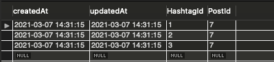

# 해시태그 등록하기

이번시간에는 해시태그를 등록하는 기능을 구현해본다.

먼저 해시태그를 content에서 뽑아내야 하는데 정규표현식과 match 함수를 이용하면 정규표현식에 맞는 문자열만 배열로 추출해준다. 예를 들자면 아래와 같다. 만약 맞는 문자열이 없을 경우에는 null을 반환한다.

```jsx
"#안녕 #리액트 #재미따 안녕하세요!".match(/#[^\s#]+/g); // ['#안녕', '#리액트', '#재미따']
```

위와 같은 정규표현식을 게시글 등록시에 추가해주는 코드를 라우터에 추가해보자.

`routes/posts.js`

```jsx
// POST /post
router.post("/", isLoggedIn, upload.none(), async (req, res, next) => {
  try {
    const hashtags = req.body.content.match(/#[^\s#]+/g); // 1. hashTag 가져오기

    if (hashtags) {
      // 2.hashtags 등록
      const result = await Promise.all(
        hashtags.map((tag) => Hashtag.findOrCreate({ where: { name: tag.slice(1).toLowerCase() } }))
      ); // 3. result는 2차 배열로 반환
      await post.addHashtags(result.map((v) => v[0])); // 4. v[0]을 넣어주는 이유
    }

    // codes...
  } catch (err) {
    console.error(err);
    next(error);
  }
});
```

1. 정규표현식과 match함수를 이용해 hashTags를 배열로 가져온다.
2. #을 slice로 빼고, toLowerCase 소문자로 저장해서 REACT, react 모두 검색되도록 한다. 또한, hashtag 등록 시, 이미 해당 단어가 DB에 등록되어 있으면 무시하고, 없는 해시태그일 경우에만 저장해야 중복된 데이터가 저장되지 않으므로 create메서드가 아닌 `findOrCreate`라는 메서드를 사용한다.
3. result는 각 findOrCreate라는 메서드를 사용해 없으면 저장하고, 있으면 그냥 넘어가므로 2차 배열로 반환된다. (ex. [[#노드, true], [#리액트, false]])
4. 따라서 2차원 배열의 첫번째 값이 v[0]을 값으로 밀어넣어주어야 한다.

위와 같이 설정 후 화면에 해시태그를 콘텐츠에 함께 등록하면 정상적으로 등록되는 것을 확인할 수 있다. 하지만 해당 정보가 DB에 잘 저장되었는지는 확인하고 넘어가야 한다. 따라서 워크벤치를 열어 확인해준다.




동일한 해시태그를 중복 사용하여 게시글을 올려도 중복없이 등록되는 것을 확인할 수 있다 :)


