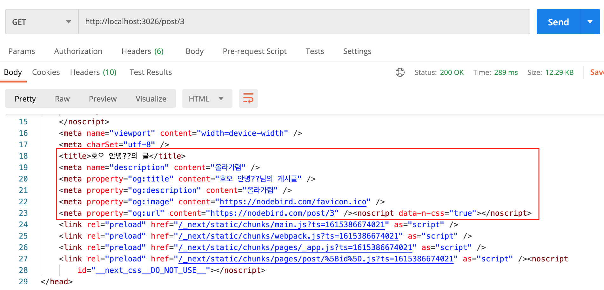

# 다이나믹 라우팅 구현

기존에는 다이나믹 라우팅을 express를 이용해 구현했으나 SSR 시 next에서 다이나믹 라우팅을 지원하므로 해당 기능을 이용하면 된다. 먼저 게시글에 대한 다이나믹 라우팅을 구현을 위해 front/pages라는 폴더에서 post라는 폴더를 새로 만든 뒤 그 안에 동적 라우팅용 페이지 [id].js를 만든다.

해당 파일은 게시글의 아이디가 무엇이던지 해당 아이디 값에 따라 동적으로 다이나믹 라우팅을 할 수 있도록 만들어주는 기능을 한다. 예를 들어 해당 [id].js 안에 아래와 같이 코드를 작성하고 localhost:3026/post/1로 접근하면 화면에 1번 게시글이라고 노출되는 것이다.

`pages/post/[id].js`

```jsx
import { useRouter } from "next/router";

const Post = () => {
  const router = useRouter();
  const { id } = router.query;

  return <div>{id}번 게시글</div>;
};

export default Post;
```

위는 연습이고 이제 실제 id에 따른 게시글 정보를 가져와야 한다. 이 페이지의 경우 getStaticProps를 쓸 수 있을까? 아니다. 왜냐하면 로그인 여부에 따라 노출될 정보가 달라져야하기 때문이다. 따라서 getServerSideProps를 사용해 해당 페이지를 구현해보자.

`pages/post/[id].js`

```jsx
const Post = () = {
  const router = useRouter();
  const { singlePost } = useSelector((state) => state.post);

  return (
    <AppLayout>
      <Head>
        <title>{singlePost.User.nickname}의 글</title>
        <meta name="description" content={singlePost.content} />
        <meta property="og:title" content={`${singlePost.User.nickname}님의 게시글`} />
        <meta property="og:description" content={singlePost.content} />
        <meta
          property="og:image"
          content={
            singlePost.Images[0] ? singlePost.Images[0].src : "https://nodebird.com/favicon.ico"
          }
        />
        <meta property="og:url" content={`https://nodebird.com/post/${id}`} />
      </Head>
      <PostCard post={singlePost} />
    </AppLayout>
  );
};

export const getServerSideProps = wrapper.getServerSideProps(async (context) => {
  const cookie = context.req ? context.req.headers.cookie : "";
  axios.defaults.headers.Cookie = "";
  if (context.req && cookie) {
    axios.defaults.headers.Cookie = cookie;
  }
  context.store.dispatch({
    type: LOAD_MY_INFO_REQUEST,
  });
  context.store.dispatch({
    type: LOAD_POST_REQUEST,
    data: context.params.id, // 혹은 context.query.id로 접근가능
  });
  context.store.dispatch(END);
  await context.store.sagaTask.toPromise();
});

export default Post;
```

위 코드를 보면 해당 페이지에 각 컨텐츠에 따라 데이터가 동적으로 돌아서 head 정보에 심기도록 구현해주었다. 해당 내용을 통해 브라우저에서 글을 로봇이 긁어가고, 이 내용이 검색엔진에 실리는 것등이 구현되는 것이다.

이와 별개로 아직 `LOAD_POST_REQUEST`가 구현되어있지 않으므로 해당 액션도 같이 구현해준다 : )

`reducers/post.js`

```jsx
import produce from "immer";

export const initialState = {
  singlePost: null,
  loadPostLoading: false,
  loadPostDone: false,
  loadPostError: null,
};

export const LOAD_POST_REQUEST = "LOAD_POST_REQUEST";
export const LOAD_POST_SUCCESS = "LOAD_POST_SUCCESS";
export const LOAD_POST_FAILURE = "LOAD_POST_FAILURE";

const reducer = (state = initialState, action) =>
  produce(state, (draft) => {
    switch (action.type) {
      case LOAD_POST_REQUEST:
        draft.loadPostLoading = true;
        draft.loadPostDone = false;
        draft.loadPostError = null;
        break;
      case LOAD_POST_SUCCESS:
        draft.loadPostLoading = false;
        draft.loadPostDone = true;
        draft.singlePost = action.data;
        break;
      case LOAD_POST_FAILURE:
        draft.loadPostLoading = false;
        draft.loadPostError = action.error;
        break;
      default:
        break;
    }
  });

export default reducer;
```

`sagas/post.js`

```jsx
import { LOAD_POST_REQUEST, LOAD_POST_SUCCESS, LOAD_POST_FAILURE } from "../reducers/post";

function loadPostAPI(data) {
  return axios.get(`/post/${data}`);
}
function* loadPost(action) {
  try {
    const result = yield call(loadPostAPI, action.data);
    console.log(result);
    yield put({
      type: LOAD_POST_SUCCESS,
      data: result.data,
    });
  } catch (err) {
    yield put({
      type: LOAD_POST_FAILURE,
      error: err.response.data,
    });
  }
}

function* watchLoadPost() {
  yield takeLatest(LOAD_POST_REQUEST, loadPost);
}

export default function* postSaga() {
  yield all([
    fork(watchLoadPost),
    // another forks...
  ]);
}
```

마지막으로 GET /post/:postId 라우터도 구현해준다..!

`routes/post.js`

```jsx
// GET /post/1
router.get("/:postId", async (req, res, next) => {
  try {
    const post = await Post.findOne({
      where: { id: req.params.postId },
    });
    if (!post) {
      return res.status(404).send("존재하지 않는 게시글입니다.");
    }

    const fullPost = await Post.findOne({
      where: {
        id: post.id,
      },
      include: [
        {
          model: Post,
          as: "Retweet",
          include: [
            {
              model: User,
              attributes: ["id", "nickname"],
            },
            { model: Image },
          ],
        },
        {
          model: User,
          attributes: ["id", "nickname"],
        },
        {
          model: Image,
        },
        {
          model: User,
          as: "Likers",
          attributes: ["id", "nickname"],
        },
        {
          model: Comment,
          include: [
            {
              model: User,
              attributes: ["id", "nickname"],
            },
          ],
        },
      ],
    });
    console.log(fullPost);
    res.status(200).json(fullPost);
  } catch (err) {
    console.error(err);
    next(error);
  }
});
```

위와 같이 설정하면 문제없이 해당 페이지가 렌더링되는 것을 확인할 수 있다 : ) 또한, 로봇이 사이트의 정보를 잘 긁어가는지 확인을 위해 Postman으로 해당 페이지를 GET으로 쳐보면 아래 이미지와 같이 동적으로 데이터가 맵핑되어 잘 노출되고 있는 것을 확인할 수 있다!



- Favicon.io 렌더링 하는 법!

  브라우저의 대표 이미지인 favicon은 간단히 front 폴더 내 public에 favicon.ico를 추가한 후 페이지를 새로고침하면 반영된다!
