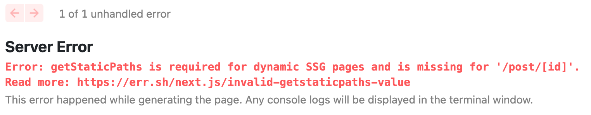

# getStaticPaths

`getStaticPaths`는 `getStaticProps`와 같이 사용한다. 해당 메서드는 주로 다이나믹 라우팅 페이지에서 많이 사용하는데, 해당 메서드 적용을 확인해보기 위해 먼저 기존에 작업해뒀던 다이나믹 라우팅 페이지인 `post/[id].js` 페이지에 getServerSideProp를 getStaticProps로 변경하여 적용해보자.

그러면 아래와 같은 에러가 발생한다.



getStaticPaths is Required for dynamic SSG page.(다이나믹 Static Site Generation 페이지는 getStaticPaths가 필요합니다.) 이는 즉, 다이나믹 라우팅일 때 getStaticProps를 쓰면 무조건 getStaticPaths 를 설정해줘야 한다는 의미이다.

`getStaticProps`를 사용하여 화면을 구현해 줄 경우 빌드를 해줄 때 아예 정적인 HTML 파일로 빌드해준다는 것을 지난 시간에 배웠었다. ([getStaticProps 적용](https://www.notion.so/getStaticProps-e5c445c461524055ade4d14f40600253)) 하지만 다이나믹 라우팅 페이지의 경우 어떤 데이터로 미리 만들어야 할지 Next에서 알지못하므로 해당 내용을 getStaticPaths에 설정해줘야 한다.

`post/[id].js`

```jsx
const Post = () => {
  return {
    /* code.. */
  };
};

// 아래 설정에 따라 1번 게시글이 미리 빌드가 된다.
export async function getStaticPaths() {
  return {
    paths: [{ params: { id: "3" } }, { params: { id: "5" } }, { params: { id: "6" } }],
    fallback: false,
  };
}

export const getStaticProps = wrapper.getStaticProps(async (context) => {
  // 아래 코드는 동일
});

export default Post;
```

위와 같이 미리 빌드해둘 페이지를 설정해두면 3, 5, 6번 게시글이 미리 빌드되어 준비되므로 localhost:3026/post/3에 접근하면 해당 게시글에 접근이 잘된다. 하지만 만약 localhost:3026/post/7로 진입한다면 어떻게 될까? 미리 빌드해 둔 페이지가 없으므로 An unexpected error has occurred 라는 에러 메시지가 나온다.

이러한 점을 개선하기 위해서는 getStaticPaths 함수 내에 axios로 post/list를 받아 해당 리스트를 정적페이지로 생성해주는 방법이 있으나, 총 post 수가 얼마나 될지 모르는 상태에서 위와 같은 방식으로 할 경우 매우 비효율적인 상황이 된다. 따라서 getStaticProps와 getStaticPaths는 어느정도 수의 제한이 있는 페이지에서만 사용하는 것이 바람직하다.

`post/[id].js`

```jsx
const Post = () => {
  if (router.isFallback) {
    return <div>로딩중...</div>;
  }
  return {
    /* code.. */
  };
};

export async function getStaticPaths() {
  return {
    paths: [{ params: { id: "3" } }, { params: { id: "5" } }, { params: { id: "6" } }],
    fallback: true,
  };
}

export const getStaticProps = wrapper.getStaticProps(async (context) => {
  // 아래 코드는 동일
});

export default Post;
```

해당 하는 페이지가 없을 때 getStaticPaths의 fallback 메서드를 true로 설정한 뒤 상단에 `router.isFallback` 설정을 해두면 먼저 정보를 찾아올 때까지 로딩중.. 이라는 돔을 노출하다가 접근한 params의 id 값을 직접 찾아 서버사이드렌더링하여 하위 컴포넌트를 렌더링하도록 처리해줄 수 있다. (이 방법은 좀 더 찾아봐야할 것으로 보임..)

사용법이 다소 어렵지만 해당 방법으로 사용해 미리 HTML을 빌드해두면 서빙 속도가 매우 빨라지므로 더 나은 UX를 제공할 수 있다. 그러므로 적용이 가능한 경우에는 해당 방법을 적용해보는 것이 좋다.
