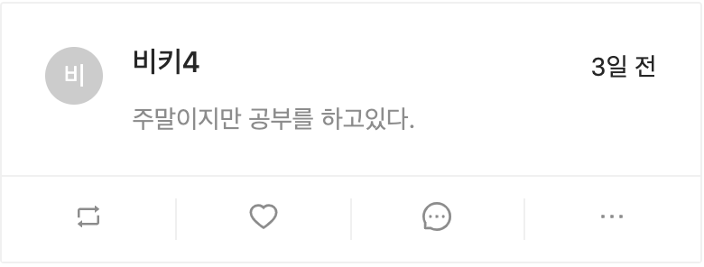
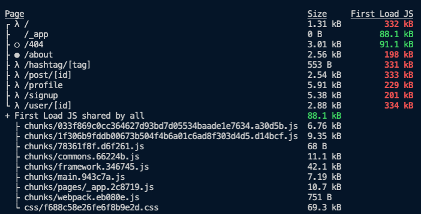
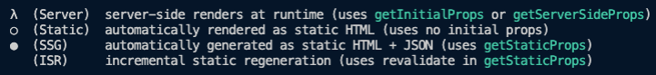

# moment와 next 빌드

포스트 레이아웃에 작성한 날짜를 추가로 노출해보려고 한다. moment 라이브러리를 사용해서 구현해보자
날짜 관련 라이브러리는 moment나 요즘 주목받는 것으로는 dayjs가 있다. dayjs가 유명한 이유는 용량 때문이다. moment의 용량이 70KB인데 반해 dayjs는 2KB로 구현이 가능하다. 사용방법이 둘 다 비슷하므로 모두 테스트 해보면 좋다.

```bash
$ npm i moment
```

다운받은 라이브러리를 PostCard 컴포넌트에 추가해준다.

`components/PostCard.js`

```jsx
import moment from 'moment';

moment.locale('ko'); // 기본이 영어이므로 한글로 바꾼다.

const PostCard = ({ post }) => {
  return (
    <div>
      <Card
        {/* codes.. */}
      >
        {post.RetweetId && post.Retweet ? (
          <Card {/* codes.. */}>
						{/* 날짜 노출 영역 추가 */}
						<div style={{ float: 'right' }}>{moment(post.createdAt).fromNow()}</div>
            <Card.Meta
              {/* codes.. */}
            />
          </Card>
        ) : (
          <>
						{/* 날짜 노출 영역 추가 */}
						<div style={{ float: 'right' }}>{moment(post.createdAt).fromNow()}</div>
            <Card.Meta
              {/* codes.. */}
            />
          </>
        )}
      </Card>
			{/* codes.. */}
    </div>
  );
};

export default PostCard;
```

위와 같이 설정하면 카드에 게시글을 등록한 날짜가 우측에 잘 노출되는 것을 볼 수 있다 :)
현재 fromNow() 메서드를 사용하여 n일 전이라고 계산되어 노출되는데 `moment(post.createdAt).format('YYYY.MM.DD')` 해당 설정을 이용하면 `2021.03.13` 와 같이YYYY.MM.DD형식으로 노출할 수 있다.



moment 라이브러리 사용법을 간단히 익혀보았다. 추가적으로 moment 라이브러리를 설치한 이유는 moment가 배포과정에서 다양한 문제를 발생시키기 때문인데, 이 부분을 같이 개선해보도록 하자

배포라는 것은 실제 서버에 배포하는 것이고, 배포를 하기 전에 빌드 과정을 거쳐야 한다.
우리는 개발과정을 거치면서 redux-devtools나 hot reloader, codesplitting 등에 대해 미리 준비하는 과정이 필요한데 이 과정을 빌드라고 한다! 빌드를 하면 최종적으로 html, js, css 파일이 반환되는데 그 반환코드를 모아서 서버에 올려두면 해당 결과들이 사용자에게 전달되는 과정을 거친다.

이번에 진행해볼 것은 빌드 과정을 통해 개발에 필요한 것들만 제외하고 실제 브라우저 동작에 필요한 데이터를 남겨서 빌드해보는 과정을 다뤄본다. 현재 개발서버는 리로드 시에 매우 느리기 때문에 해당 작업만으로도 브라우저 속도가 훨씬 개선될 것이다.

보통 현업에서는 프로젝트에 수정사항이 발생할 경우 해당 변경사항에 대한 배포를 CI/CD 도구를 이용한다. CI/CD는 코드에 대한 테스트와 빌드를 해주고, 이후 웹 서버에 해당 소스를 배포해주는 툴이다. 빌드나 배포시 에러가 있으면 알려주기도 한다. CI/CD 툴을 이용하기 위해서는 프로젝트 깃헙 내에 CI/CD를 연결하는 과정이 필요하다. 유명한 CI/CD 툴로는 zenkins, travisCI 등이 있다. 물론 프로젝트에서 CI/CD 툴을 적용해보진 않겠지만 해당 툴이 있다는 것정도는 알고 넘어가자!

이제 먼저 작업파일을 빌드해줘야 한다. package.json에 script 동작 객체에 build 프로퍼티를 추가해준다.

```json
"scripts": {
    "dev": "next -p 3026",
    "build": "next build"
  },
```

그리고 npm run build를 실행시키면 파일이 빌드되기 시작하며 완료 시 터미널에 완료된 내역을 요약해준다.


총 빌드된 파일의 용량이 그리 크지 않다. 한국에서 서비스를 위해서 만들어진 빌드파일의 경우 각 페이지 별로 1MB만 넘지 않으면 양호하다고 판단되어진다. 만약 만들 페이지의 용량이 1MB가 넘어갈 경우에는 코드 스플리팅을 적용해서 React.lazy나 Suspense 기능으로 용량을 잘게 쪼개어 사용하는 것이 좋다.



하위에는 세가지 문양(람다, 하얀동그라미, 검정동그라미)이 있는데, 페이지별 타입을 얘기해주는 것이다.  
먼저 람다(λ)의 경우 SSR 하는 페이지, getServerSideProps를 사용하는 페이지이고, 검정 동그라미(⚫️)의 경우 getStaticProps를 사용하는 정적페이지, 하얀 동그라미(◯)는 404페이지로 에러를 노출하는 정적인 페이지를 의미한다. 결국 람다와 검정 동그라미에 속하는 페이지의 경우 SSR을 한번씩 하는 것이라고 보면 된다.

만약 404페이지를 바꾸고 싶다면 NEXT 공식문서의 [Customizing The 404 Page](https://nextjs.org/docs/advanced-features/custom-error-page#customizing-the-404-page)를 참고하면 되는데 `page/404.js`에 노출하고자 하는 컴포넌트를 구성하면 해당 내용으로 반영된다. 500페이지, 즉 서버 에러에 대한 것도 커스텀이 가능한데 이 부분은 `pages/_error.js`로 생성하여 커스텀이 가능하다.

에러페이지를 만들 때에는 에러에 대한 내용을 노출하기 보다는 해결 방법을 위주로 노출하는 것이 좋다.
"잠시 후에 다시 시도해보세요" 나 "고객센터에 문의해주세요" 등의 가이드를 제공하는 것이 UX관점에서 훨씬 더 좋다. 또한 해커들이 해당 메시지를 보고 해킹을 시도할 수도 있기 때문에 해당 내용은 가려서 제공하는 것이 좋다.

> 프로젝트를 떠나서 Next 공식문서는 반드시 정독해보자!
> 실제 다뤄보지 않은 기능들이 많이 존재하므로 아는 것과 모르는 것은 큰 차이가 있다.

위의 빌드된 파일에 정보 중 First Load JS의 데이터 용량에 빨간 색으로 노출되는 것은 비교적 큰 용량이니 splitting을 하거나 줄이라는 의미이다. 그렇다면 어디에서 용량을 많이 차지하는지 어떻게 알 수 있을까? 바로 Next에서 제공하는 `bundle-analyzer`를 사용하면 자세한 로그를 확인할 수 있다! 해당 패키지를 설치해보자

```bash
$ npm i @next/bundle-analyzer
```
