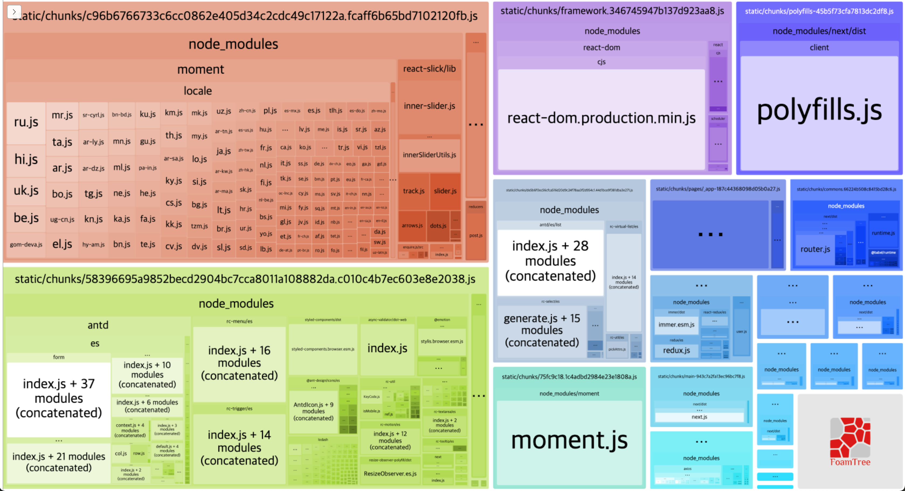
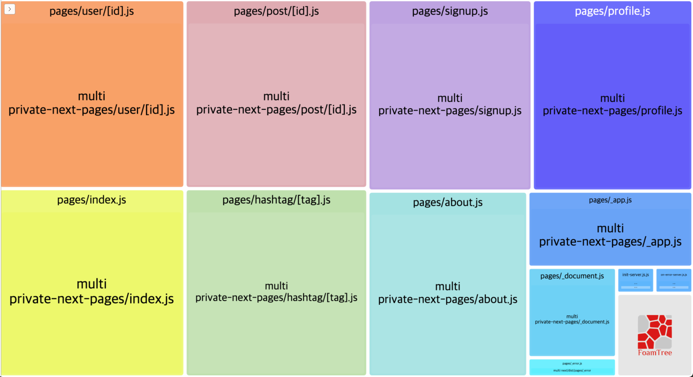

# 커스텀 웹팩, bundle-analyzer

빌드 설정을 위해 웹팩도 커스텀해준다. 우선 웹팩 설정을 위해 front 디렉토리 하위에 `next.config.js` 파일을 하나 생성해준다. next에는 웹팩 빌드를 위한 설정이 기본적으로 되어있으므로 커스텀 시 기존 설정인 config를 덮어주는 방식으로 해주어야 한다..! 우선 설정을 위해 필요한 번들러인 bundle-analyzer를 설치해준다.

```bash
$ npm i @next/bundle-analyzer
```

`front/next.config.js`

```jsx
// 1. ANALYZE라는 환경변수가 활성화되어야 실행된다.
const withBundleAnalyzer = require('@next/bundle-analyzer')({
  enabled: process.env.ANALYZE === 'true',
});

module.exports = withBundleAnalyzer({
  // 2. gzip 압축
  compress: true,
  webpack(config, { webpack }) {
    const prod = process.env.NODE_ENV === 'production';
    const plugins = [...config.plugins];
    return {
      ...config,
      mode: prod ? 'production' : 'development',
      devtool: prod ? 'hidden-source-map' : 'eval', // 3. hidden-source-map
      plugins,
      // 4. 불변성을 지켜줘야 함
      /* module: {
        ...config.module,
        rules: [
          ...config.module,
          rules: [
            ...config.module.rules,
            {

            }
          ]
        ]
      } */
    };
  },
});
```

1. bundle-analyzer 사용을 위해서는 위와 같이 설정하며, process 환경변수의 `ANALYZE`가 true여야 실행된다. 해당 메서드는 npm run build 시에 해당 config.js가 실행되기 전에 추가해주어야 함!
2. compress 옵션은 기존 compresion-webpack-plugin이 내장형으로 포함된 메서드로 해당 옵션을 통해 빌드파일을 gzip로 압축해줄 수 있다. 브라우저는 해당 압축파일을 알아서 풀어서 사용자에게 보여줄 수 있다.
   js, css 파일이 있으면 무조건 해당 메서드를 사용해서 파일을 줄여주는 것이 좋다.
3. `hidden-source-map` 설정을 하지 않으면 개발에서 소스코드가 모두 노출된다. 배포모드에서는 반드시 해당 옵션을 넣어줄 것. `eval`은 개발 시 빠르게 devtool이 실행되도록 해준다.
4. 커스텀 해야할 것들이 많아지면 하위 설정에 불변성을 지키는 것이 매우 번거로워지므로 immer를 사용해서 불변성을 간편하게 지켜주는 것도 좋다. 복잡하다고 느끼면 `immer를 해당 js에 적용하여 불변성`을 지켜주도록 하자!

이렇게 한 뒤 1번 bundle-analyzer 설정에 대해 이야기했던 부분을 다시 보자. process 환경변수가 ANALYZE ture가 되어야 한다. 해당 방법을 구현하는 방법 중에 node의 dotenv를 활용할 수도 있는데, 해당 방법은 적용이 될 수도 있고 안될 수도 있으므로 아래와 같이 적용해주는 방법이 있다.

`front/package.json`

```json
"scripts": {
    "dev": "next -p 3026",
    "build": "ANALYZE=true NODE_ENV=production next build"
},
```

build 시 `next build` 메서드 앞에 `ANALYZE=true`와 `NODE_ENV=production` 옵션이 추가되었다.  
next가 읽히기 전에 선언해준 것이다! 그런데 이 부분이 문제가 있다. 바로 IE에서 적용이 안된다..🤢 (리눅스랑 맥에서는 잘 동작한다)

따라서 해당 이슈를 개선하고 process 환경변수를 선언해주기 위해 `cross-env`라는 라이브러리를 설치한 뒤 위 build 설정에 cross-env를 붙여주면 끝난다!

`cross-env ANALYZE=true NODE_ENV=production next build`

```bash
$ npm i cross-env
```

위와 같이 설정 후 다시 `npm run build`를 실행해본다.





그렇게 하면 next가 빌드를 진행하면서 위와 같은 화면을 노출시켜준다. 빌드파일이 어떻게 생성되는지 구조로 보여주는 것이다. 먼저 server쪽의 내용보다는 client쪽의 내용이 더욱 중요하므로 해당 페이지를 잘 살펴본다.

- 박스 중에 concatenated라는 문구가 적힌 박스가 있다. 합쳐져있는 모듈들인데, 이미 합쳐져 있어서 분리를 하기는 무리이다. 따라서 해당 라이브러리를 다른 것으로 교체하거나 아예 쓰지 않는 방법등으로 개선해나가야 한다. 실제 client.html에 보면 moment.js의 경우 파일 용량이 큰 편인데, 이거 대신에 dayjs를 사용하면 1/35로 줄어든다.
- 또 client의 좌측 상단의 node_modules를 보면 moment가 굉장히 큰데 내용을 보면 각국 언어별 moment 스크립트 파일이 들어있는 것을 볼 수 있다. (아랍어, 영국어 등 언어팩 다 들어있음) 이런 불필요한 것들을 제외하면 영역이 많이 줄어들 것이다. 그럼 어떻게 줄여줄 수 있을까?

  바로 구글에 `moment locale tree shaking`이라고 검색하면 해당 부분에 대한 개선방법에 대한 글들을 볼 수 있다. 해당 방식 중 new webpack.ContextReplacementPlugin 설정을 이용해 해당 부분을 개선해준다.

`front/next.config.js`

```jsx
const withBundleAnalyzer = require('@next/bundle-analyzer')({
  enabled: process.env.ANALYZE === 'true',
});

module.exports = withBundleAnalyzer({
  compress: true,
  webpack(config, { webpack }) {
    const prod = process.env.NODE_ENV === 'production';
    return {
      ...config,
      mode: prod ? 'production' : 'development',
      devtool: prod ? 'hidden-source-map' : 'eval',
      // plugins에 ContextReplacementPlugin으로 ko언어팩만 빌드하도록 설정
      plugins: [
        ...config.plugins,
        new webpack.ContextReplacementPlugin(/moment[/\\]locale$/, /^\.\ko$/),
      ],
    };
  },
});
```

위와 같이 moment 빌드 모듈을 커스텀 설정 한 뒤 재 빌드를 실행하면 기존 `moment`가 차지하던 비율이 확연히 줄어든 것을 확인할 수 있다. (아래 이미지와 위의 이미지를 비교해보자!) 이런 방법으로 용량을 줄여나가면 된다.


그렇지만 이 과정에 너무 집착하지는 말자. 1MB만 넘지않는 수준으로 작업해준다 : )

> 해당 과정은 어플리케이션의 개발이 완료된 후에 진행해야 한다.
> 수정 후 bundle-analyzer로 재확인해야하므로 프로젝트가 완료되고 한번에 처리한다.
