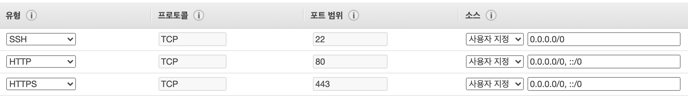
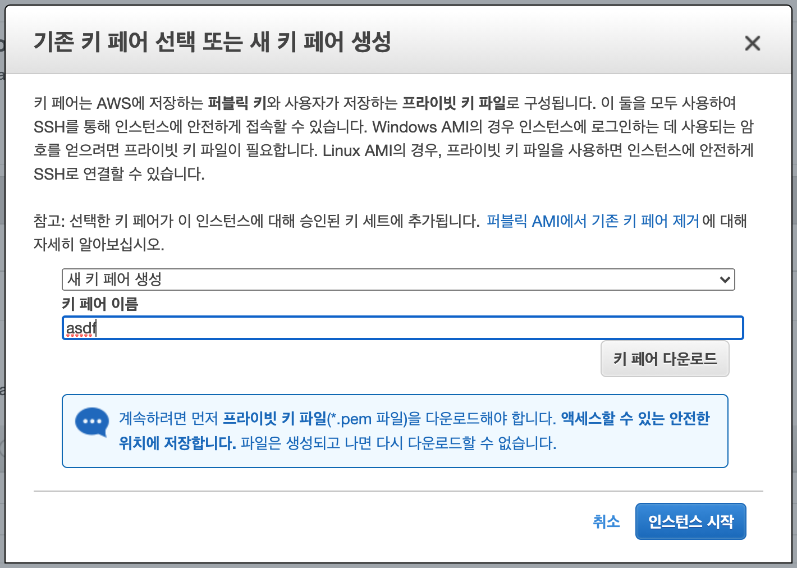
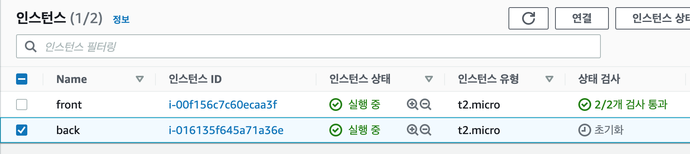

# EC2 생성하기

### EC2 인스턴스 생성

이제 aws에 서버를 배포해볼 차례이다!  
실제 서비스는 사용자들이 언제 들어올지 모르기때문에 24시간 켜져있어야 한다.
내 컴퓨터를 이용하면 하드웨어가 고장이나거나 일시적인 오류때문에 꺼질 수도 있고, 유지보수의 어려움이 있기 때문에 내 컴퓨터를 굳이 이용하지 않고 AWS의 서버를 이용한다. 참고로 AWS는 99.99%의 가동률을 약관으로 보장해준다. 또한 AWS는 메모리를 늘리고, 줄이는 조절이 쉽게 처리가 가능하다.

먼저 aws에 계정을 생성해준 뒤 AWS Management Console에서 우측 메뉴를 열어 나의 지역을 `아시아 태평양 (서울)`로 바꿔준다. 서울로 해야 주 유저인 대한민국 사람들의 접근이 가장 효율적이고 빠를 것이다.

이제 서버를 2개 만들어야 한다. 프론트 서버 1개와 백엔드 서버 1개이다.  
`EC2 시작하기` 클릭 → 1단계 Amazon Machine Image(AMI) 선택 창이 나온다.

해당 창에 선택가능한 서버들이 리스트처럼 나오는데 [프리 티어 사용 가능]이라고 쓰여 있는 것이 공짜서버로 이용 가능한 것이므로 그 중에 우분투 서버를 선택해준다..! 그러면 인스턴스 유형이 나온다. vCPUs와 메모리가 1G짜리인 프리티어 서버가 선택된다. 월 750시간 무료인 서버로 12개월 동안 무료로 사용할 수 있다.

이렇게 설정 후 [3. 인스턴스 구성]에서 모니터링 - CloudWatch 세부 모니터링 활성화 옵션을 켜준 뒤 [6. 보안 그룹 구성] 메뉴에서 [규칙 추가]를 클릭해 HTTP, HTTPS를 추가해준다.



SSH는 터미널을 통한 접근을 의미하는데 개인 프로젝트이므로 사용자 지정 → 내 IP로 설정해준다.

마지막 [시작하기]를 누르면 키페어를 생성할 수 있는 팝업창이 뜬다. 여기에서 새로운 키 페어를 생성해주는데 키 페어는 원하는대로 입력한 뒤 [키 페어 다운로드]를 눌러 pem 파일을 다운로드 받는다.



해당 파일은 프로젝트 파일의 prepare 폴더 위치에 옮겨둔다. 반드시 .gitignore에 pem 파일을 추가하여 해당 파일이 공유되지 않도록 주의하자. 이제 인스턴스 시작을 누르고 실제 인스턴스를 시작해준다.

그러면 ES2 → [인스턴스]에서 실행 중인 나의 서버가 보인다. Name을 front로 바꿔준 뒤 우측 메뉴의 [작업]을 눌러 back 서버도 똑같은 걸로 만들어주자! [작업] → 이미지 및 템플릿 → [이런 방식으로 더 많이 시작] 클릭

그러면 아까와 동일하게 키 페어 선택 팝업이 뜨는데, 이 때 기존 키 페어(pem)를 바라보도록 설정 후 인스턴스 시작을 눌러준다. 이렇게 되면 back 서버까지 모두 생성된다. 무료기간이 끝나면 서버당 비용이 발생하므로 프로젝트가 종료되면 인스턴스 상태를 중지, 혹은 종료를 만들어주도록 하자.



### 인스턴스와 git repo 연결

AWS에 코드를 보내줄 때 사용하는 여러 방법 중에 git 레퍼지토리를 이용해 업로드하므로 만약 프로젝트가 git 레퍼지토리에 업로드가 되어있지 않다면 올려주도록 한다. (나는 이미지 내 깃헙에서 작업하고 있으므로 별도 작업은 하지 않는당) 이제 인스턴스를 연결하는 단계인데, 우선 front 서버를 연결해보자. aws 화면에 front 서버를 선택한 뒤 [연결]을 클릭 → [SSH 클라이언트] 하단 [ssh 클라이언트 사용을 위한 명령어ssh -i ~~]를 복사한 후 내 프로젝트의 pem 파일이 있는 prepare 에서 복사한 명령어를 실행시킨다.

이 방법은 ssh(secure shell)로 AWS EC2에 접속하는 방법이다. 그런데 복사한 명령어를 실행시키면 아래와 같은 에러가 터미널에서 발생하고, 실제 ubuntu 서버에 연결되지 않는다.

```bash
@@@@@@@@@@@@@@@@@@@@@@@@@@@@@@@@@@@@@@@@@@@@@@@@@@@@@@@@@@@
@         WARNING: UNPROTECTED PRIVATE KEY FILE!          @
@@@@@@@@@@@@@@@@@@@@@@@@@@@@@@@@@@@@@@@@@@@@@@@@@@@@@@@@@@@
Permissions 0644 for 'xxx.pem' are too open.
It is recommended that your private key files are NOT accessible by others.
This private key will be ignored.
bad permissions: ignore key: xxx.pem
Permission denied (publickey).
```

pem 파일 권한(Permissions) 문제의 에러인데, 대부분 최초 접속 시 AWS EC2의 pem 파일 권한 변경을 하지 않아서 생기는 에러이다. 이때는 해당 pem 파일 경로로 간 뒤 `chmod 400 xxx.pem` 을 클릭하여 파일 권한을 변경해준 뒤 접속한다. 그러면 정상적으로 ubuntu shell에 접속할 수 있다.

이제 내 깃헙 레포지토리를 clone 해준다! 알아서 해당 프로젝트 파일을 다운로드 받는다 :)

```bash
ubuntu@ip-172-31-4-195:~$ git clone https://github.com/wonieeVicky/react-next-js-nodebird
Cloning into 'react-next-js-nodebird'...
remote: Enumerating objects: 893, done.
remote: Counting objects: 100% (893/893), done.
remote: Compressing objects: 100% (504/504), done.
remote: Total 893 (delta 523), reused 685 (delta 321), pack-reused 0
Receiving objects: 100% (893/893), 466.86 KiB | 20.30 MiB/s, done.
Resolving deltas: 100% (523/523), done.
ubuntu@ip-172-31-4-195:~$
```

이제 해당 프로젝트가 모두 준비되었다..! 우분투는 별도 gui를 사용하지않고 폴더로 이동하여 서버를 구동하는 방식으로 주로 이용한다. 기존 터미널 이용방식이 모두 동일하게 적용된다. 프로젝트 서버에 변경된 사항을 반영할 때에는 반드시 `git pull`이라는 명령어로 변경된 사항을 가져와서 새롭게 배포해줘야 하니 참고하자!
