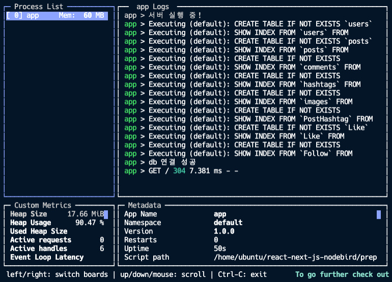

# ubuntu에 pm2 사용하기

### 백엔드 서버에서 pm2 설정하기

AWS할 때 조심해야할 점이 원격으로 접속한 shell을 꺼버리면 서버가 멈춰버린다. 이유는 노드를 node app으로 실행했기 때문인데, node app이 `foreground process` 방식이기 때문이다!.`foreground process`를 사용하면 shell을 종료했을 때 같이 꺼져버린다. 이러한 이슈 대응을 위해 `pm2`를 사용하여 background process 방식으로 변경해보자.

`root@ip-172-31-8-91:/home/ubuntu/react-next-js-nodebird/prepare/back#`

```bash
$ npm i pm2
```

설치가 완료되면 vim 명령어를 사용해 package.json 내 start script 방식을 `pm2`를 사용하도록 수정해준다.

```bash
$ vim package.json

"scripts": {
  "start": "pm2 start app.js"
},

$ sudo su
$ npm start && npx pm2 monit
```

위와 같이 scripts start 메서드에 pm2를 적용하고 npm start를 하면 서버가 pm2로 시작된다. (반드시 Root 권한에서 작업해야 한다)



npx pm2 monit을 함께 실행하면 shell에 위와 같이 로깅도 함께 해준다. 만약 서버가 어떠한 이유로 죽어버리면, 자동으로 다시 서버를 되살려준다.

그 외 몇가지 pm2 명령어를 정리해본다.

- `npx pm2 list` 명령어를 실행하면 실행 리스트를 다시 볼 수 있다.
- `npx pm2 kill` 명령어는 pm2로 실행된 서버를 종료하는 메서드
- `npx pm2 reload all`을 실행하면 해당 서버가 다시 재실행, list 내부의 reload 숫자도 1이 증가한다.
- `npx pm2 logs` 명령어는 로그만 보고싶을 경우 사용
- `npx pm2 logs —error` 에러 로그만 보고싶다면 —error를 붙여 실행한다.

### 백엔드 서버에서 배포용 설정하기

다시 로컬 환경으로 돌아와서 백엔드 서버에 배포를 위한 설정을 추가해준다.  
해당 설정을 위해서는 몇가지 라이브러리 설치가 필요하다.

```bash
$ npm i cross-env pm2 helmet hpp
```

`back/app.js`

```jsx
const hpp = require('hpp');
const helmet = require('helmet');

// codes..

// 배포용 설정 추가
if (process.env.NODE_ENV === 'production') {
  app.use(morgan('combined')); // combined를 사용하면 더 자세한 로그를 볼 수 있다.
  app.use(hpp()); // 필수
  app.use(helmet()); // 필수
} else {
  app.use(morgan('dev'));
}

app.use(
  cors({
    origin: ['http://localhost:3026', 'nodebird.com'], // nodebird.com 추가
    credentials: true,
  })
);

// codes..
```

위와 같이 설정해 준 뒤 package.json의 start scripts를 조금 수정해준다.

```json
{
  // settings..
  "scripts": {
    "dev": "nodemon app",
    "start": "cross-env NODE_ENV=production pm2 start app.js"
  }
}
```

위와 같이 저장 후 git push로 변경사항을 올린 뒤 ubuntu에 원격 접속, root 계정으로 git pull 하여 변경사항을 가져온다! 그런데, Aborting이 감지된다. (ubuntu에 `vim` 명령어로 작업한 것들과의 충돌로 느껴진다) 이때는 `git reset --hard`를 명렁어로 실행하여 해당 사항을 reset 시켜준 뒤 다시 git pull하면 정상적으로 내용이 불러와지는 것을 확인할 수 있다.

이후 root 계정으로 `npm start && npx pm2 monit`을 실행시키면 각종 로깅이 성공적으로 이루어지는 것을 확인할 수 있다. (사실 이 단계에서 mysql 접근이 제한되어 500 server error가 발생하는 이슈가 있었는데, .env 파일이 로컬환경과 ubuntu 환경의 데이터가 달라서 발생. 이후 git pull로 변경사항 업데이트 시 해당 내용을 매번 바꿔줘야할 수도 있다. 그럴 때는 [우분투에 MySQL 설치](https://www.notion.so/MySQL-3f00efdc489744f4bcaea5df48a9c9e8) 포스팅을 참고하여 처리해주자)
