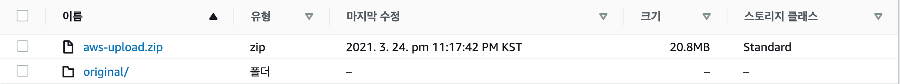

# Lambda로 이미지 리사이징 구현

이미지 업로드 후 노출되는 이미지에 대해 람다를 이용해 사이즈별로 이미지 리사이징을 진행해본다.
이미지 리사이징은 왜 필요할까? 만약 모바일 환경에서 접근했을 경우 배경화면 해상도의 이미지를 노출하는 것은 불필요한 데이터 낭비일 수 있기 때문이다. 따라서 디바이스별 보이는 이미지를 최적화해주는 작업이 필요하다.

이미지 리사이징이라는 작업은 성능적으로 굉장히 무리가 많이 가는 요청이다. 현재 백엔드 서버의 경우 포스트 게시, 좋아요, 팔로잉, 팔로워 등의 다양한 요청에 대한 처리를 함께 해야하므로 이 작업을 함께 하면 무리를 줄 수 있다. 보통 이런 작업을 위한 방법으로, 서버를 분리해서 이미지 리사이징 용으로만 사용하는 방법이 있다. 그런데 서버는 아무리 작은 사이즈라도 비용이 나간다. 이미지 리사이징만을 위한 서버를 별도로 두는 건 부담스러운 것이다.

이때 사용하는 것이 AWS에서 제공하는 Lambda이다. 작은 함수를 만드는 건데 이미지 업로드 시 만들어 둔 함수로 이미지를 압축하여 저장하도록 만드는 것이다. (어떤 사람은 이런 람다와 s3만을 활용해서 서버없이(serverless) 서비스를 구축하는 경우도 있다.)

먼저 lambda를 이용하기 위해 프로젝트 prepare에 lambda 폴더를 생성해 준 뒤 npm init 을 해준다.

`prepare/lambda`

```jsx
$ npm i aws-sdk sharp
```

sharp는 효율적인 이미지 리사이징을 할 수 있도록 하는 라이브러리이다. 그리고 이미지리사이징 코드를 작성해준다.

`prepare/lambda/index.js`

```jsx
const AWS = require('aws-sdk');
const sharp = require('sharp');

// 별도로 AWS.config.update({}) 미실행 :
// lambda는 AWS 소스코드를 업로드 후 사용되므로 알아서 내 사용자 정보를 가져온다.
// 백엔드 서비스는 EC2에서 돌아가므로 넣어줘야 함
const s3 = new AWS.S3();

exports.handler = async (event, context, callback) => {
  const Bucket = event.Records[0].s3.bucket.name; // vicky-nodebird-s3
  const Key = decodeURIComponent(event.Records[0].s3.object.key); // original/123123_abc.png
  console.log(Bucket, key);

  const filename = Key.split('/')[Key.split('/').length - 1];
  const ext = Key.split('.')[Key.split('.').length - 1].toLowerCase();
  const requiredFormat = ext === 'jpg' ? 'jpeg' : ext;
  console.log('filename', filename, 'ext', ext);

  try {
    const s3Object = await s3.getObject({ Bucket, Key }).promise();
    console.log('original', s3Object.Body.length);
    const resizedImage = await sharp(s3Object.Body)
      .resize(400, 400, { fit: 'inside' })
      .toFormat(requiredFormat)
      .toBuffer();
    await s3
      .putObject({
        Bucket,
        Key: `thumb/${filename}`,
        Body: resizedImage,
      })
      .promise();
    console.log('put', resizedImage.length);
    return callback(null, `thumb/${filename}`);
  } catch (err) {
    console.error(err);
    return callback(err);
  }
};
```

위와 같은 사용방법의 경우 [sharp 공식문서](https://sharp.pixelplumbing.com/api-resize)나 [aws-sdk 공식문서](https://docs.aws.amazon.com/AWSJavaScriptSDK/v3/latest/index.html)들에서 참고하여 만들어준다.

해당 내용을 `git commit` 한 뒤 백엔드 ubuntu에서 `git pull` 해 온 다음 lambda 폴더에 설치한 패키지를 인스톨해준다. 그 다음 리눅스 환경에서 lambda폴더를 압축해서 묶어줘야 하는데 아래와 같이 따라해보자.

`ubuntu@ip-112-12-12-1:~/react-next-js-nodebird/prepare/lambda`

```bash
$ zip -r aws-upload.zip ./*
$ sudo apt install zip // 만약 'zip' not found라면..
$ zip -r aws-upload.zip ./*
$ ls
aws-upload.zip  index.js  node_modules  package-lock.json  package.json
```

`aws-upload.zip`와 같이 zip파일이 잘 생성된 것을 확인할 수 있다! 그런 다음 aws에 올릴 수 있도록 awscliv2.zip으로 압축해주자.

```bash
$ sudo curl "https://awscli.amazonaws.com/awscli-exe-linux-x86_64.zip" -o "awscliv2.zip"
$ ls
aws-upload.zip  awscliv2.zip  index.js  node_modules  package-lock.json  package.json

$ sudo unzip awscliv2.zip
$ sudo ./aws/install
$ aws
To see helo text..
$ aws configure
AWS Access Key ID [None]: ***
AWS Secret Access Key [None]: ***
Default region name [None]: ap-northeast-2
Default output format [None]: json

$ aws s3 cp "aws-upload.zip" s3://vicky-nodebird-s3
upload: ./aws-upload.zip to s3://vicky-nodebird-s3/aws-upload.zip
```

위와 같이 aws-upload.zip 파일을 잘 업로드하면, AWS S3 객체 테이블에 해당 `aws-upload.zip`파일이 잘 올라간 것을 확인할 수 있다!



위와 같이 설정 후 AWS Lambda로 와서 `[함수생성]` → 함수 코드에서 `[Amazon S3에서 파일 업로드]` 클릭 → `https://vicky-nodebird-s3.s3.ap-northeast-2.amazonaws.com/aws-upload.zip` 기입 후 저장하면 해당 함수가 잘 등록된다. [image-resize"Lambda 함수" 의 배포 패키지가 너무 커서 인라인 코드 편집을 활성화할 수 없습니다. 그러나 함수를 호출할 수 있습니다.] 라고 뜨면 성공한 것임

다음으로 각종 설정을 추가해준다.

[구성] → [일반구성] → 메모리: 256MB, 제한시간 30초, AWS 정책 탬플릿에서 새역할 생성 → S3 객체 읽기 전용 권한 선택 → [저장]

[트리거 추가] → S3 선택 → 버킷: vicky-nodebird-s3 → 이벤트 유형: 모든 객체 생성 이벤트 → 접두사: original/ → 재귀호출 체크박스 선택 → [추가]

위와 같이 작업해준 뒤 만약 lambda에 오타 등으로 인한 수정사항이 발생했을 경우에는 다시 아래와 같이 명령어로 다시 zip을 만들어 s3로 업로드해준다.

```bash
$ rm aws-upload.zip
$ rm aws-cliv2.zip // 남아있다면 삭제
$ rm aws // 남아있다면 삭제

$ zip -r aws-upload.zip ./* // 다시 zip 생성
$ aws s3 cp "aws-upload.zip" s3://vicky-nodebird-s3
```

다음으로 AWS Lambda → 함수 코드에서 `[Amazon S3에서 파일 업로드]` 클릭 → `https://vicky-nodebird-s3.s3.ap-northeast-2.amazonaws.com/aws-upload.zip` 기입 후 저장하면 이미지 업로드가 정상적으로 실행된다!

남은 것은 현재 프론트 화면에 노출되는 정보가 original 경로로 되어있는 부분이다. 이 점을 고쳐주자

`back/routes/post.js`

아래와 같이 경로를 thumb로 보내주면 사이즈가 작은 이미지 주소가 front에 뿌려진다.

```jsx
// POST /post/images
router.post('/images', isLoggedIn, upload.array('image'), async (req, res, next) => {
  try {
    res.json(req.files.map((v) => v.location.replace(/\/original\//, '/thumb/')));
  } catch (err) {
    console.error(err);
    next(err);
  }
});
```

`front/components/ImageZoom/index.js`

이미지 크게 보기를 눌렀을 때에는 기존 original 경로의 이미지를 보여준다.

```jsx
const ImagesZoom = ({ images, onClose }) => {
  return (
    <Overlay>
      {images.map((v) => (
        <ImgWrapper key={v.src}>
          
        </ImgWrapper>
      ))}
    </Overlay>
  );
};

export default ImagesZoom;
```

`front/components/postForm.js`

이미지 업로드 시 리사이징 동작에 따른 로드 지연이 발생하여 기존 original 경로의 이미지로 노출한다

```jsx
const PostForm = () => {
  return (
    <Form style={{ margin: '10px 0 20px' }} encType="multipart/form-data" onFinish={onSubmit}>
      {/* codes.. */}
      <div>
        ****
        {imagePaths.map((v, i) => (
          <div key={v} style={{ display: 'inline-block' }}>
            
          </div>
        ))}
      </div>
    </Form>
  );
};

export default PostForm;
```

위와 같이 변경 후 재빌드를 하여 기능을 동작시키면 문제없이 동작하는 것을 확인할 수 있다!! 🤪
