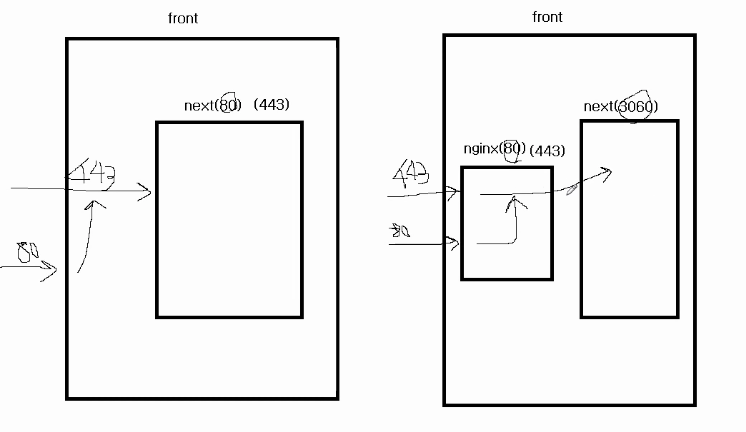

# nginx + https 적용

이번에는 EC2의 nginx로 https를 적용해본다. nginx도 웹서버의 일종인데, https 붙이는 것도 있지만 리다이렉팅, 정적파일 제공 등의 이점도 있어서 노드랑 같이 쓰면 좋다. 실제 nginx의 기능은 Node로도 구현이 가능하지만 nginx가 더 빠른 점이 있고, 앞이 nginx가 붙고 뒤에 Node가 붙는데, 서버가 2개 쓰는 불편함보다 nginx을 도입함으로서 얻는 장점이 더 크다고 생각되어서 nginx을 도입하기로 결정했다.

nginx가 next를 리버스 프록시하는 개념이며, 구조는 아래와 같다.



위 구조도와 같이 nginx를 next 앞에 두면 nginx가 캐싱, 정적파일 제공, 리다이렉션, https 등을 다 할 수 있다. 이런 것들을 nginx에 남기고 데이터베이스와 관련된 것만 next에 남겨서 역할을 분리하는 개념이다.

먼저 설치를 위해 ubuntu front에서 `nginx`를 설치해준다.

```bash
$ sudo apt-get install nginx
$ vim /etc/nginx/nginx.conf
```

`nginx.conf` 파일 안에 server 설정을 추가해주는데 아래와 같이 설정해준다.

```
{
	server {
		server_name vickydev.com;
		listen 80;
		location / {
			proxy_set_header HOST $host;
			proxy_pass http://127.0.0.1:3060;
			proxy_redirect off;
		}
	}
}
```

이제 3개월짜리 https 무료인증서를 발급해주는 let's encrypt를 이용해 https를 적용해보자. 먼저 해당 인증서를 발급받을 수 있도록 도와주는 `certbot-auto`를 깔아준다.

```bash
$ wget https://dl.eff.org/certbot-auto
$ chmod a+x certbot-auto //certbot-auto에 모든 권한을 준다.

Skipping bootstrap because certbot-auto is deprecated on this system.
WARNING: couldn't find Python 2.7+ to check for updates.
Your system is not supported by certbot-auto anymore.
Certbot cannot be installed.
Please visit https://certbot.eff.org/ to check for other alternatives.
```

요렇게 하니 Python을 찾을 수 없다며 에러가 발생.. 그래서 snap과 nginx를 통해 설치함

```bash
$ sudo snap install certbot --classic
$ sudo apt-get install nginx

$ sudo certbot --nginx
```

위와 같이 설치하면 메일주소와 약관의 동의 후 원하는 도메인을 입력하면 인증서가 발급되는데, 중간에 이미 80번 포트를 next에서 사용하고 있는 때문에 에러가 발생함. 이때는 서버를 끄고 재실행 해준다.

```bash
$ sudo lsof -i tcp:80
kill -9 PID
```

위 방법으로 80포트를 꺼줬는데도 계속 살아있는 현상이 있어서 아예 pm2를 종료해줬다.

```bash
$ sudo npx pm2 kill
$ sudo certbot --nginx // 재실행
```

이후 정상적으로 https 등록되었음..! `vim /etc/nginx/nginx.conf` 으로 가서 certbot이 적어둔 소스를 예쁘게 tabIndex로 맞춰준 뒤 nginx.conf가 수정되었으므로 아래와 같이 실행

```bash
$ sudo service nginx reload

nginx.service - A high performance web server and a reverse proxy server
     Loaded: loaded (/lib/systemd/system/nginx.service; enabled; vendor preset: enabled)
     Active: failed (Result: exit-code) since Fri 2021-03-26 01:54:43 UTC; 12min ago
       Docs: man:nginx(8)
    Process: 51790 ExecStartPre=/usr/sbin/nginx -t -q -g daemon on; master_process on; (code=exited, status=0/SUCCESS)
    Process: 51801 ExecStart=/usr/sbin/nginx -g daemon on; master_process on; (code=exited, status=1/FAILURE)

Mar 26 01:54:42 ip-172-31-4-195 nginx[51801]: nginx: [emerg] bind() to 0.0.0.0:80 failed (98: Address already in use)
Mar 26 01:54:42 ip-172-31-4-195 nginx[51801]: nginx: [emerg] bind() to [::]:80 failed (98: Address already in use)
Mar 26 01:54:42 ip-172-31-4-195 nginx[51801]: nginx: [emerg] bind() to 0.0.0.0:443 failed (98: Address already in use)
Mar 26 01:54:42 ip-172-31-4-195 nginx[51801]: nginx: [emerg] bind() to 0.0.0.0:80 failed (98: Address already in use)
Mar 26 01:54:42 ip-172-31-4-195 nginx[51801]: nginx: [emerg] bind() to [::]:80 failed (98: Address already in use)
Mar 26 01:54:42 ip-172-31-4-195 nginx[51801]: nginx: [emerg] bind() to 0.0.0.0:443 failed (98: Address already in use)
Mar 26 01:54:43 ip-172-31-4-195 nginx[51801]: nginx: [emerg] still could not bind()
Mar 26 01:54:43 ip-172-31-4-195 systemd[1]: nginx.service: Control process exited, code=exited, status=1/FAILURE
Mar 26 01:54:43 ip-172-31-4-195 systemd[1]: nginx.service: Failed with result 'exit-code'.
Mar 26 01:54:43 ip-172-31-4-195 systemd[1]: Failed to start A high performance web server and a reverse proxy server.
```

해주면 에러가 난다 😂 이미 80번 포트 혹은 다른 Address가 이미 사용 중이라는 의미로 확인 되어 기존의 nginx로 돌아가던 80포트도 모두 종료해주었다.

```bash
lsof -i tcp:80 // 또는 443

nginx   52173     root    6u  IPv4 123445      0t0  TCP *:http (LISTEN)
nginx   52173     root    7u  IPv6 123445      0t0  TCP *:http (LISTEN)
nginx   52179 www-data    6u  IPv4 123445      0t0  TCP *:http (LISTEN)
nginx   52179 www-data    7u  IPv6 123445      0t0  TCP *:http (LISTEN)

kill -9 프로세스아이디
```

이후 다시 nginx를 재시작해주었음!

```bash
$ sudo service nginx restart
$ sudo systemctl restart nginx
$ sudo /etc/init.d/nginx restart
```

### 자동 갱신하기

letsencrypt를 자동갱신하는 방법을 알아본다.

```bash
$ vim /etc/cron.d/certbot
```

아래 설정을 추가해주면 매일 두 번씩 갱신을 시도한다.

```bash
SHELL=/bin/sh
PATH=/usr/local/sbin:/usr/local/bin:/sbin:/bin:/usr/sbin:/usr/bin
0 */12 * * * root certbot -q renew --nginx --renew-hook 'service nginx reload'
```

---

아래는 nginx 관련 명령어.. 참고하자

```bash
// 시작
$ sudo service nginx start
$ sudo systemctl start nginx
$ sudo /etc/init.d/nginx start

// 재시작
$ sudo service nginx restart
$ sudo systemctl restart nginx
$ sudo /etc/init.d/nginx restart

// 중지
$ sudo service nginx stop
$ sudo systemctl stop nginx
$ sudo /etc/init.d/nginx stop

// 상태
$ sudo service nginx status
$ sudo systemctl status nginx

// 설정 reload
$ sudo service nginx reload
$ sudo systemctl reload nginx
$ sudo nginx -s reload

// 설정파일 문법 체크
$ sudo nginx -t
```
